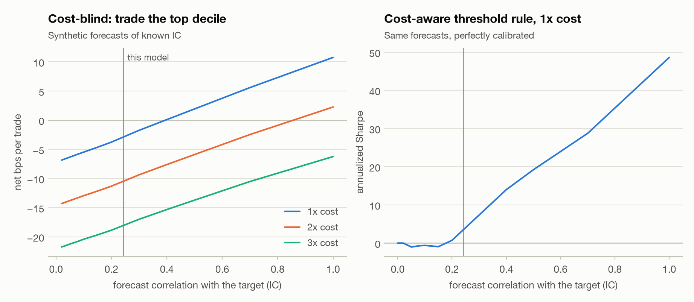
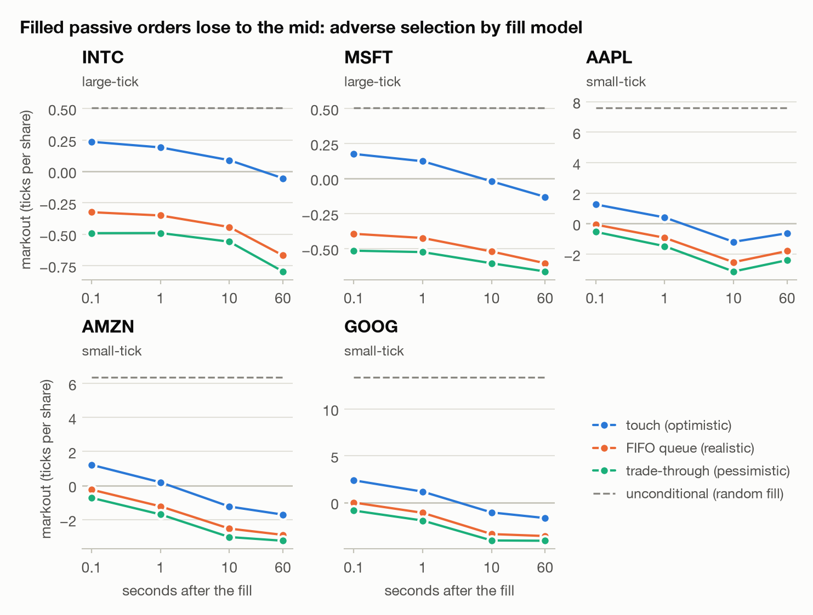
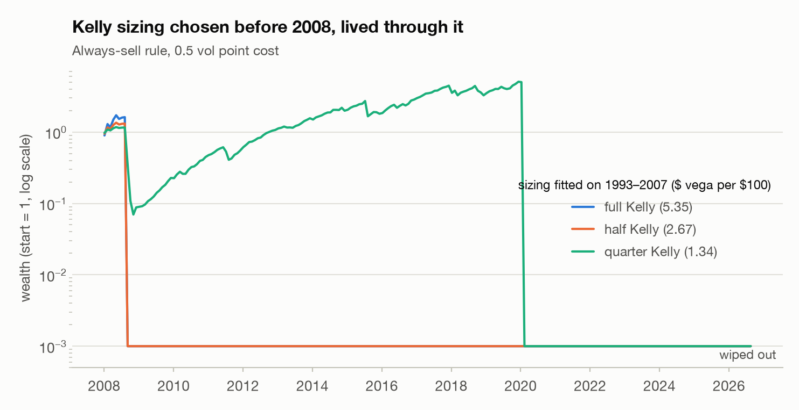
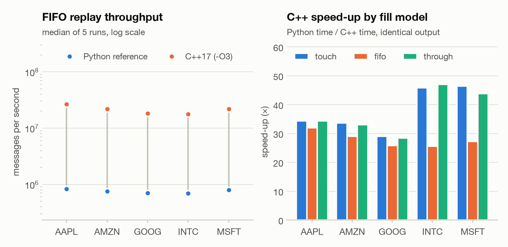
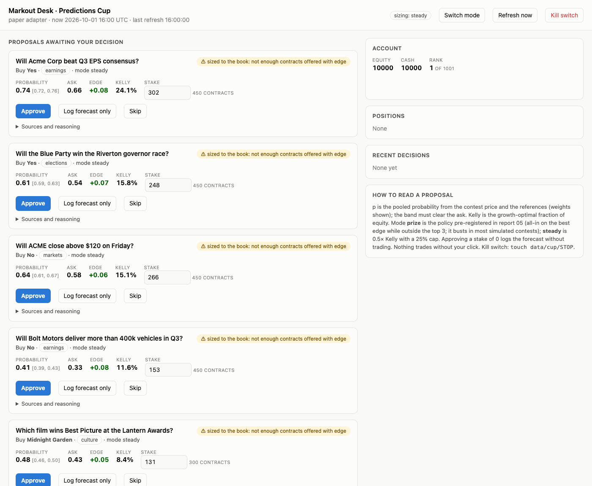

# Markout

[](https://github.com/tanaymihani/markout/actions/workflows/tests.yml)

Does a short-horizon trading edge survive the spread, realistic fills, competing traders, and the bias that comes from trying many strategies? This repo is my attempt to find out, step by step, on real market data where I could get it.

**Site:** [tanaymihani.github.io/markout](https://tanaymihani.github.io/markout/) has the main findings and a playable market-making game.

The name comes from the *markout*, the price move right after a trade, which market makers use to check whether they got picked off. The same trap shows up at every stage here: the best of many backtests looks better than it is, and so do the order that happened to get filled and the bet where you disagree most with the market. Each part tries to measure that gap and correct for it.

## Contents

| Part | Question | Data |
|---|---|---|
| [01 Closing auction](reports/01_auction.md) | Can a model predict 60-second moves in the NASDAQ closing auction well enough to pay the spread? | Optiver *Trading at the Close* (Kaggle): 200 stocks, 481 days |
| [02 Microstructure](reports/02_microstructure.md) | Does an order-book signal survive realistic queue-position fills? | LOBSTER sample: five NASDAQ stocks, one day, every order |
| [03 Arena](reports/03_arena.md) | What does competition between market makers do to spreads and profits? | Simulated markets: Glosten–Milgrom, Kyle, a market-making tournament, Kuhn poker |
| [04 Options](reports/04_options.md) | What does delta hedging actually earn, and how often should you hedge? | Simulation, plus one SPY option chain |
| [05 Predictions Cup](reports/05_predictions_cup.md) | How should you size bets when only the top three places get paid? | Simulation of SIG's student contest |
| [06 Volatility premium](reports/06_vol_premium.md) | How big is the premium in S&P options, when does selling it blow up, and how much should you sell? | S&P 500, VIX and VIX3M daily closes, 1990 onward |

There is also a trading desk for SIG's Predictions Cup, and a C++ version of the order-book replay from part 02.

## Results

The paragraphs below are copied from the reports.

**01 · Closing auction.** The best model (lgbm[all, 63 leaves]) cuts out-of-sample MAE by 2.18% versus the per-stock median (IC 0.184; Diebold–Mariano p < 0.001). Turned into trades at 1x cost, the selected policy's research-period PnL is positive and its 95% bootstrap CI excludes zero: annualized Sharpe 4.81 (95% CI 3.34 to 6.28), 22.3 trades a day, 2.27 bps net per trade. The edge is about one spread wide: at 2x cost the same rule's Sharpe is -0.209 and it stops paying. It is also small: the displayed-depth cap binds on 99.5% of trades, the average trade is $1,683, and the research period nets $2,041 in total. Deflated for 18 effective trials (of 32), the Deflated Sharpe Ratio is 0.853 and PBO is 0.059: suggestive, but below the usual 0.95 bar once the search is accounted for. On the holdout (days 421–480, scored once), the same frozen policy nets $1,101 over 60 days (annualized Sharpe 4.74).

<picture>
  <source media="(prefers-color-scheme: dark)" srcset="reports/figures/b_voi_dark.png">
  
</picture>

**02 · Microstructure.** Queue imbalance predicts the next price move, but does trading on it pay once fills follow queue priority? No. Chosen before 12:45 and scored after, the best post-or-cross rule under FIFO fills earns AAPL -0.192, AMZN -0.051, GOOG -0.158, INTC +0.002 and MSFT +0.003 ticks per decision: reliably negative for GOOG; indistinguishable from zero for AAPL, AMZN and MSFT; positive for INTC only because it trades on 1% of decisions for +0.25 ticks each, which a 0.3-tick taker fee wipes out. Touch fills would have said yes: INTC +0.069 ticks per decision, confidence interval above zero.

<picture>
  <source media="(prefers-color-scheme: dark)" srcset="reports/figures/d_markouts_dark.png">
  
</picture>

**03 · Arena.** Competition takes away the market maker's rents, but not the cost of adverse selection. In a Glosten–Milgrom market with elastic noise demand, a lone Bayesian undercutter quotes a time-average spread of 124 ticks and earns 22.7 dollars per episode. One identical rival brings the spread down to 13.8 ticks, 0.8 ticks above the zero-profit spread at the same beliefs. Maker profit falls from 55.9 to 0.4 ticks per trade, and noise-trader welfare rises from 0.112 to 0.429 dollars per period. A naive fixed tight quote loses 1.31 dollars per episode alone and 3.51 in the free-for-all. There it wins 98.2% of the fills in the first 10 periods, while V is still uncertain. Each of those fills carries 18.3 ticks of adverse selection against its 5.44-tick edge: the quote that wins the flow is the one that was too cheap. The round-robin winner is the undercutter.

<picture>
  <source media="(prefers-color-scheme: dark)" srcset="reports/figures/e_arena_competition_dark.png">
  
</picture>

**04 · Options.**

- Pricing engine: put–call parity holds to 4e-16 of the strike, Greeks match finite differences to 2e-06 relative, and IVs round-trip to 2e-10.
- Short 30-day ATM call sold at σ_imp = 20% and hedged every 5 min with σ_real = 15%: mean PnL +$0.6856 ± 0.0016 vs C(σ_imp) − C(σ_real) = +$0.6841. Short gamma earns when realized < implied.
- Hedging-error std falls like N^-0.49 (theory: 1/√N) while turnover grows like N^0.52. The best frequency for cost + 1 × std moves from 5 min (κ = 0 bp) to 1 day (κ = 10 bp).
- The gamma–theta attribution explains 99.98% of hedged-PnL variance path by path at 5 min hedging (corr 0.9999).
- SPY (yfinance, 2026-09-29 16:15 ET): ATM IV 12.0% at 7 days, 13.4% at 31 days, 14.1% at 93 days. Parity 'fails' for 367 of 370 strike pairs at mids, 64 after crossing the spread, and 6 against the American band.

**05 · Predictions Cup sizing.** The winning bankroll has a median of 92× the start (10th–90th percentile 19×–691×), and third place needs a median 35×. 31% of contests were won by a field player going all-in every round, and 2% by one of the sharp players. Your median at 0.75× Kelly is 1.40×, and at 1× Kelly you reach the top 3 in none of the 10,000 simulated contests. In a 1,000-player field over 40 markets, forecasting skill does not move you up the ranking; variance does.

**06 · Volatility premium.** From 1990 to 2026, VIX exceeded the volatility the S&P then realized over the next 21 trading days 85.9% of the time, by 4.10 vol points on average (median 4.71). Selling one month of variance every month since 2006 earned an annualized Sharpe of 0.551 with a skew of -4.36: its worst month (2008-10-01) lost 66.6 per $1 of vega, against an average gain of 1.56. The best of 5 timing rules, *har + contango*, raises the Sharpe to 1.07 (95% CI 0.408 to 2.30) and cuts the maximum drawdown from 136 to 60.9, and it survives the deflation for the 5 rules tried (Deflated Sharpe 0.965). Sizing matters more than timing: the textbook Kelly fraction mu/sigma^2 asks for 2.96x the growth-optimal size on these fat-tailed outcomes, 2.55x the size at which the worst month wipes out the account. Collected with a delta-hedged straddle instead, the worst month of 1993–2026 loses 41.1 rather than 78.9 per $1 of vega, because the straddle's exposure fades once the index leaves the strike. But at-the-money options trade below VIX, and at a 2-point discount the straddle's Sharpe (0.752) is below the variance swap's over the same months (0.898).

<picture>
  <source media="(prefers-color-scheme: dark)" srcset="reports/figures/h_kelly_dark.png">
  
</picture>

**C++.** The order-book replay and queue simulator from part 02 is sequential and keeps state, so it was the one piece worth porting. `cpp/queue_sim.cpp` (C++17 with pybind11) runs 26–47× faster than the Python version and gives identical output, checked on all five stocks and on randomized event streams.

<picture>
  <source media="(prefers-color-scheme: dark)" srcset="reports/figures/g_throughput_dark.png">
  
</picture>

## The Predictions Cup desk

SIG runs a free prediction-market contest for students (Oct 1 to Nov 4, 2026), and its rules allow bots as long as each person keeps one account and stays within the platform's limits. The desk is my bot for it. It runs on a laptop, uses only free public data, and never trades without a click.

- It looks up reference prices for each contest market: real-money prices from Polymarket and Kalshi, option-implied probabilities for stock-price questions, and earnings-beat history. Every suggested match between a contest market and a reference has to be confirmed by hand, because matching is where things quietly go wrong.
- It pools those references with the contest's own price in log-odds, so it never treats a single reference as the truth.
- It proposes a trade only when the whole uncertainty band clears the ask. Size comes from Kelly as a target exposure (either the pre-registered contest policy from part 05, or a steadier half-Kelly), capped by what the order book can fill right now. Nothing is left resting on the book.
- Every decision, including the ones I skip, goes into a journal that scores my forecasts against the market once the questions resolve.



The [demo](docs/demo/DEMO.md) runs the whole loop offline on made-up markets (`make demo`); `make desk` starts it on a paper contest at http://127.0.0.1:8765. The [matcher dry run](docs/demo/DRYRUN.md) tests the matching against live Polymarket and Kalshi questions. Its first version mostly suggested look-alikes (the other team, another stat line, a different threshold); those cases are now tests.

## How I tried to keep it honest

- 369 tests (`make test`). One of them corrupts every future row of the auction data and checks that no feature of the past changes; a deliberately leaky feature fails it, so the test does catch leaks.
- Walk-forward splits by day, never random rows. Labels never cross a day, so there is nothing to purge; `src/markout/auction/cv.py` explains why.
- Every variant I tried is logged with its git commit and config, including the losers, so the Deflated Sharpe and PBO count all of the searching.
- The auction holdout sits behind a guard that refuses a second look (it has been opened 1 time).
- Replications are checked against known answers: the worked example in the Deflated Sharpe paper, the Glosten–Milgrom spread, Kyle's λ, the value of Kuhn poker, put–call parity and the Greeks.
- `make report` regenerates every report and figure from fixed seeds, so the numbers in the text are never typed by hand.

## Running it

```bash
make install     # editable install into .venv
make lobster     # LOBSTER sample day (5 stocks, 10 levels)
make optiver     # Optiver data (needs a Kaggle login and the competition rules accepted)
make vol         # S&P 500 and VIX history for report 06
make cpp         # C++ extension (optional; there is a pure-Python fallback)
make test
make report      # regenerate every report, figure and results file
make demo        # the desk's offline demo
make desk        # the desk on a paper contest, http://127.0.0.1:8765
```

Also: `python -m markout.backtest.report` prints the daily PnL of the chosen auction strategy, `python -m markout.games.cardgame` is a market-making practice game, and `python -m markout.decision.journal init|add|score` manages the contest journal.

## Layout

```
src/markout/auction/     closing-auction data, audit, features, walk-forward models, report 01
src/markout/backtest/    costs, decision rule, sizing, daily PnL
src/markout/decision/    calibration, value of information, Kelly, contest study, journal
src/markout/evaluation/  trial registry, Deflated Sharpe, PBO, bootstrap, holdout guard, Diebold–Mariano
src/markout/lob/         LOBSTER parser, order-flow imbalance, fill simulator, markouts, report 02
src/markout/games/       Glosten–Milgrom, Kyle, market-making arena, Kuhn CFR, card game, report 03
src/markout/options/     Black–Scholes, delta hedging, SPY smile, report 04
src/markout/vol/         S&P 500 / VIX data, variance risk premium, HAR forecast, sizing, hedged straddles, report 06
src/markout/cup/         Predictions Cup desk: sources, matcher, estimates, sizing, paper exchange, web page
cpp/                     C++17 queue simulator and pybind11 bindings
reports/                 generated reports, figures (light and dark) and results
tests/                   pytest suite
```

## Data

- **Optiver *Trading at the Close*** (Kaggle). Kaggle's rules don't allow redistributing it, so it is downloaded by `make optiver` and never committed.
- **LOBSTER sample files** for AAPL, AMZN, GOOG, INTC and MSFT on 2012-06-21. The official download links stopped working when lobsterdata.com was rebuilt, so the script tries them first and otherwise uses a pinned, hash-checked mirror. A replay that checks every message against the book is the authenticity check. Not committed.
- **One SPY option chain**, saved with yfinance on 2026-09-29 after the close.
- **S&P 500, VIX and VIX3M daily closes** from Yahoo Finance (`make vol`). Not committed.

## Limitations

Each report ends with its own. The main ones: the auction target is measured against a synthetic index, so the PnL assumes a hedge I can't observe; the microstructure study is a single day from 2012 and my own orders have no market impact; the arena is a stylized dealer market where everyone shares one belief; and the contest study has to assume the field size and the number of markets.

