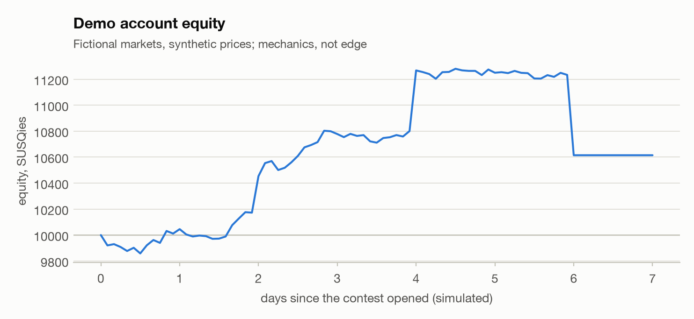

# Markout Desk: demo walkthrough

> Fictional markets and synthetic prices (`configs/cup_demo_scenario.json`), a simulated clock and a scripted reviewer. It shows how the desk works end to end; it says nothing about real edge.

## What the desk does

- Pulls every open contest market and its order book (here: a paper exchange; live: the Predictions Cup API).
- Finds reference prices for each contract in free, public sources (Polymarket and Kalshi prices, option-implied probabilities for price questions, earnings-beat history), and proposes a mapping that a human must confirm.
- Pools the references with the contest's own price in log-odds (explicit weights, printed on every proposal), and proposes a trade only when the whole uncertainty band clears the ask by at least 3 points.
- Sizes it with Kelly: the pre-registered prize policy from report 05, or a steady 0.5x Kelly mode.
- Trades only after an explicit click, with a last look at a fresh book; a kill switch stops everything.
- Writes every decision, including forecasts it did not trade, to the decision journal, which scores the beliefs against the market when markets resolve (Brier and log score, calibration).

## The desk

  
[Open the read-only snapshot](desk.html) in a browser to click around.

## This demo run

| what | value |
|---|---|
| simulated days | 7 |
| markets | 8 |
| proposals decided | 44 |
| trades placed | 23 |
| forecasts logged without trading | 21 |
| final equity (start 10,000) | 10,615 |
| journal rows / resolved | 44 / 44 |
| Brier: bot vs contest price at entry | 0.151 vs 0.153 |

<picture>
  <source media="(prefers-color-scheme: dark)" srcset="cup_demo_equity_dark.png">
  
</picture>

Decisions, in order:

| t | market | contract | p | ask | edge | stake | result |
|---|---|---|---|---|---|---|---|
| 2026-10-01T16:00+00:00 | Will Acme Corp beat Q3 EPS consensus? | Yes | 0.74 | 0.66 | +0.08 | 302 | order filled: 450 @ 0.67 |
| 2026-10-01T16:00+00:00 | Will the Blue Party win the Riverton governor race? | Yes | 0.61 | 0.54 | +0.07 | 248 | order filled: 449 @ 0.55 |
| 2026-10-01T16:00+00:00 | Will ACME close above $120 on Friday? | No | 0.64 | 0.58 | +0.06 | 266 | order filled: 450 @ 0.59 |
| 2026-10-01T16:00+00:00 | Will Bolt Motors deliver more than 400k vehicles in Q3? | No | 0.41 | 0.33 | +0.08 | 153 | order filled: 450 @ 0.34 |
| 2026-10-01T16:00+00:00 | Which film wins Best Picture at the Lantern Awards? | Midnight Garden | 0.48 | 0.43 | +0.05 | 0 | forecast logged (no order) |
| 2026-10-01T16:00+00:00 | Will the Harbor City Hawks win on Sunday? | No | 0.59 | 0.56 | +0.03 | 0 | forecast logged (no order) |
| 2026-10-01T20:00+00:00 | Will Bolt Motors deliver more than 400k vehicles in Q3? | No | 0.40 | 0.30 | +0.10 | 138 | order filled: 450 @ 0.31 |
| 2026-10-01T20:00+00:00 | Will the Blue Party win the Riverton governor race? | Yes | 0.62 | 0.59 | +0.03 | 0 | forecast logged (no order) |
| 2026-10-01T22:00+00:00 | Will Acme Corp beat Q3 EPS consensus? | Yes | 0.75 | 0.68 | +0.06 | 313 | order filled: 449 @ 0.69 |
| 2026-10-01T22:00+00:00 | Will ACME close above $120 on Friday? | No | 0.64 | 0.55 | +0.09 | 253 | order filled: 450 @ 0.56 |
| 2026-10-02T02:00+00:00 | Will Bolt Motors deliver more than 400k vehicles in Q3? | No | 0.40 | 0.30 | +0.10 | 140 | order filled: 450 @ 0.31 |
| 2026-10-02T02:00+00:00 | Will the Blue Party win the Riverton governor race? | Yes | 0.62 | 0.59 | +0.03 | 0 | forecast logged (no order) |
| 2026-10-02T04:00+00:00 | Will ACME close above $120 on Friday? | No | 0.64 | 0.54 | +0.10 | 246 | order filled: 450 @ 0.55 |
| 2026-10-02T04:00+00:00 | Will Acme Corp beat Q3 EPS consensus? | Yes | 0.75 | 0.70 | +0.05 | 0 | forecast logged (no order) |
| 2026-10-02T08:00+00:00 | Will ACME close above $120 on Friday? | No | 0.64 | 0.58 | +0.07 | 15 | order filled: 26 @ 0.58 |
| 2026-10-02T08:00+00:00 | Will Bolt Motors deliver more than 400k vehicles in Q3? | No | 0.41 | 0.35 | +0.06 | 8 | order filled: 24 @ 0.35 |
| 2026-10-02T08:00+00:00 | Will the Blue Party win the Riverton governor race? | Yes | 0.62 | 0.58 | +0.04 | 0 | forecast logged (no order) |
| 2026-10-02T10:00+00:00 | Will the Blue Party win the Riverton governor race? | Yes | 0.61 | 0.55 | +0.07 | 251 | order filled: 449 @ 0.56 |
| 2026-10-02T10:00+00:00 | Will Acme Corp beat Q3 EPS consensus? | Yes | 0.75 | 0.72 | +0.03 | 0 | forecast logged (no order) |
| 2026-10-02T14:00+00:00 | Will ACME close above $120 on Friday? | No | 0.64 | 0.58 | +0.07 | 0 | forecast logged (no order) |
| 2026-10-02T14:00+00:00 | Will Bolt Motors deliver more than 400k vehicles in Q3? | No | 0.42 | 0.38 | +0.03 | 0 | forecast logged (no order) |
| 2026-10-02T16:00+00:00 | Will the Blue Party win the Riverton governor race? | Yes | 0.62 | 0.58 | +0.04 | 0 | forecast logged (no order) |
| 2026-10-02T16:00+00:00 | Will the Riverton turnout exceed 55%? | Yes | 0.47 | 0.43 | +0.04 | 0 | forecast logged (no order) |
| 2026-10-02T18:00+00:00 | Will Acme Corp beat Q3 EPS consensus? | Yes | 0.75 | 0.72 | +0.03 | 0 | forecast logged (no order) |
| 2026-10-02T20:00+00:00 | Will ACME close above $120 on Friday? | No | 0.65 | 0.61 | +0.04 | 0 | forecast logged (no order) |
| 2026-10-02T20:00+00:00 | Will Bolt Motors deliver more than 400k vehicles in Q3? | No | 0.41 | 0.34 | +0.07 | 26 | order filled: 76 @ 0.34 |
| 2026-10-02T22:00+00:00 | Will the Blue Party win the Riverton governor race? | Yes | 0.62 | 0.56 | +0.06 | 135 | order filled: 239 @ 0.56 |
| 2026-10-02T22:00+00:00 | Will the Riverton turnout exceed 55%? | Yes | 0.46 | 0.41 | +0.06 | 188 | order filled: 450 @ 0.42 |
| 2026-10-03T00:00+00:00 | Will Acme Corp beat Q3 EPS consensus? | Yes | 0.75 | 0.70 | +0.05 | 0 | forecast logged (no order) |
| 2026-10-03T02:00+00:00 | Will the Blue Party win the Riverton governor race? | Yes | 0.61 | 0.49 | +0.11 | 227 | order filled: 450 @ 0.50 |
| 2026-10-03T04:00+00:00 | Will the Riverton turnout exceed 55%? | Yes | 0.45 | 0.37 | +0.08 | 171 | order filled: 450 @ 0.38 |
| 2026-10-03T04:00+00:00 | Will Bolt Motors deliver more than 400k vehicles in Q3? | No | 0.42 | 0.39 | +0.03 | 0 | forecast logged (no order) |
| 2026-10-03T06:00+00:00 | Will Acme Corp beat Q3 EPS consensus? | Yes | 0.75 | 0.72 | +0.03 | 0 | forecast logged (no order) |
| 2026-10-03T08:00+00:00 | Will the Blue Party win the Riverton governor race? | Yes | 0.61 | 0.50 | +0.11 | 228 | order filled: 450 @ 0.51 |
| 2026-10-03T10:00+00:00 | Will the Blue Party win the Riverton governor race? | Yes | 0.61 | 0.54 | +0.08 | 0 | forecast logged (no order) |
| 2026-10-03T10:00+00:00 | Will the Riverton turnout exceed 55%? | Yes | 0.45 | 0.37 | +0.08 | 171 | order filled: 450 @ 0.38 |
| 2026-10-03T12:00+00:00 | Will Acme Corp beat Q3 EPS consensus? | Yes | 0.75 | 0.71 | +0.04 | 0 | forecast logged (no order) |
| 2026-10-03T14:00+00:00 | Will the Blue Party win the Riverton governor race? | Yes | 0.62 | 0.58 | +0.04 | 0 | forecast logged (no order) |
| 2026-10-03T16:00+00:00 | Will the Riverton turnout exceed 55%? | Yes | 0.44 | 0.34 | +0.11 | 155 | order filled: 450 @ 0.35 |
| 2026-10-03T20:00+00:00 | Will the Riverton turnout exceed 55%? | Yes | 0.45 | 0.37 | +0.08 | 31 | order filled: 84 @ 0.37 |
| 2026-10-03T20:00+00:00 | Will Bolt Motors deliver more than 400k vehicles in Q3? | No | 0.42 | 0.39 | +0.03 | 0 | forecast logged (no order) |
| 2026-10-04T00:00+00:00 | Will Bolt Motors deliver more than 400k vehicles in Q3? | No | 0.41 | 0.36 | +0.06 | 0 | forecast logged (no order) |
| 2026-10-04T02:00+00:00 | Will the Riverton turnout exceed 55%? | Yes | 0.45 | 0.37 | +0.08 | 9 | order filled: 25 @ 0.37 |
| 2026-10-04T08:00+00:00 | Will the Riverton turnout exceed 55%? | Yes | 0.45 | 0.37 | +0.09 | 25 | order filled: 68 @ 0.37 |

## Run it

```bash
python -m markout.cup demo                       # this page (offline, deterministic)
python -m markout.cup serve --paper              # the desk on a paper contest: http://127.0.0.1:8765
python -m markout.cup serve --paper --live-refs  # paper contest, live Polymarket/Kalshi references
python -m markout.cup serve --live               # the real contest, once the Oct 1 adapter exists
```

The live adapter is written against the platform's API reference, which is only visible after registering. The contest's rules allow bots (one account, individual participation, the platform's rate and position limits).
