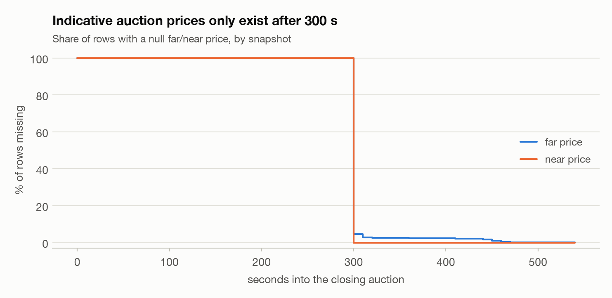
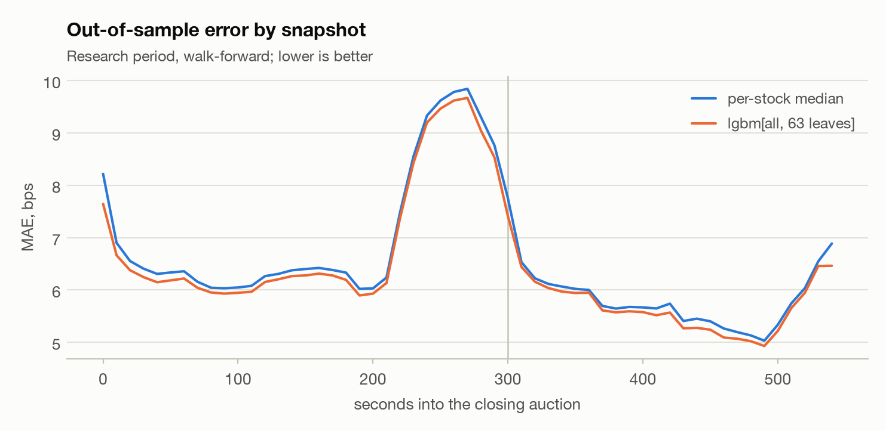
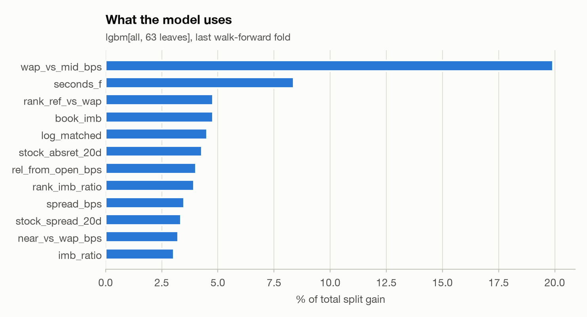
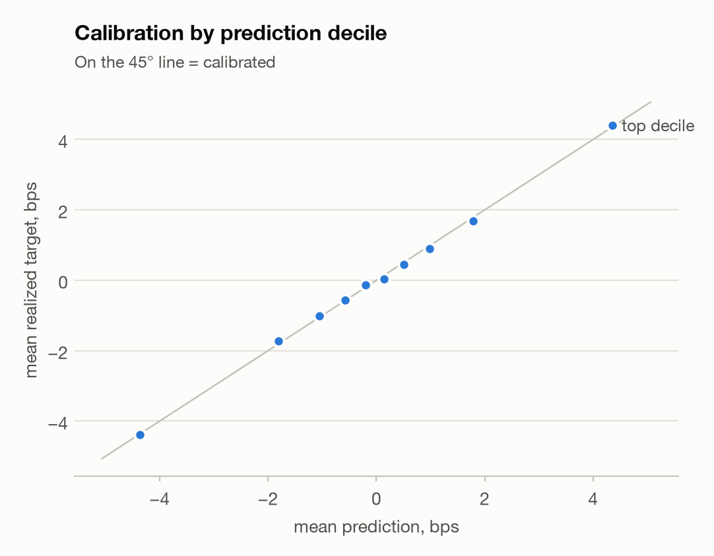
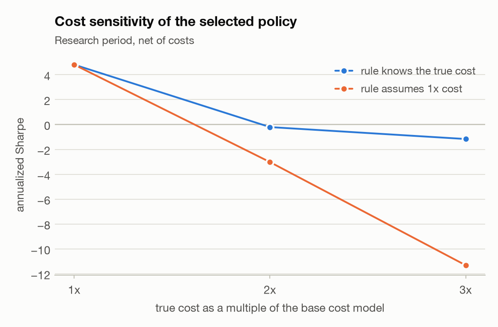
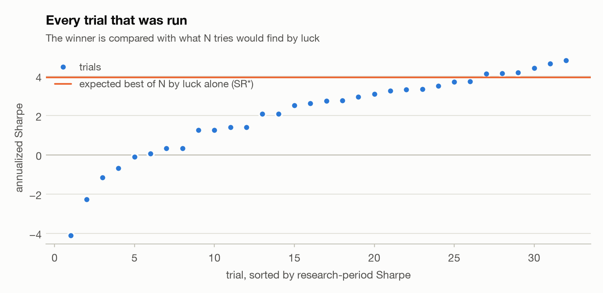
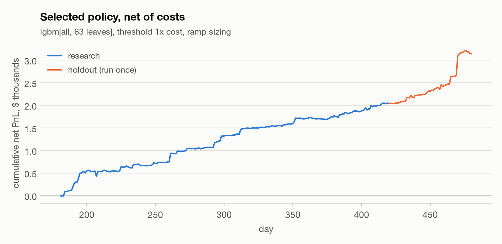

# 01 · Closing-auction alpha: does it survive costs?


**Question.** A model can forecast 60-second index-relative returns in the NASDAQ closing auction better than a baseline. Is that edge still there after paying the spread, fees and the index hedge, and after correcting for how many variants were tried?

**Answer.** The best model (lgbm[all, 63 leaves]) cuts out-of-sample MAE by 2.18% versus the per-stock median (IC 0.184; Diebold–Mariano p < 0.001). Turned into trades at 1x cost, the selected policy's research-period PnL is positive and its 95% bootstrap CI excludes zero: annualized Sharpe 4.81 (95% CI 3.34 to 6.28), 22.3 trades a day, 2.27 bps net per trade. The edge is about one spread wide: at 2x cost the same rule's Sharpe is -0.209 and it stops paying. It is also small: the displayed-depth cap binds on 99.5% of trades, the average trade is $1,683, and the research period nets $2,041 in total. Deflated for 18 effective trials (of 32), the Deflated Sharpe Ratio is 0.853 and PBO is 0.059: suggestive, but below the usual 0.95 bar once the search is accounted for. On the holdout (days 421–480, scored once), the same frozen policy nets $1,101 over 60 days (annualized Sharpe 4.74).

## 1. Data audit

- 5,237,980 rows: 200 stocks × 481 days × 55 snapshots (0–540 s). Stocks per day: 191–200; incomplete stock-days: 0.
- Far/near indicative prices are null in 100% of rows before 300 s and 1.57% after: Nasdaq publishes them from 3:55 pm, so the auction changes regime halfway through.
- Target: std 9.45 bps, mean |target| 6.41 bps (the MAE of predicting zero), excess kurtosis 22.6; 4.19% of targets exceed 20 bps in size.
- Quoted spread: median 3.69 bps (5th–95th percentile 1.08–14.6). A 60 s round trip pays about one full spread.
- Target reconstruction: stock WAP return − target is the same number for every stock at an instant (median cross-stock std 0.00502 bps vs 8.44 bps for raw returns), so the target really is "stock minus a fixed index".
- Index weights recovered by least squares on days 0–120 (least squares, R² > 0.999, weights sum to 1.00). Stocks 79 (first trades on day 181), 102 (first trades on day 295), 135 (first trades on day 191) only appear after the weight window, so their weights are unknown and set to zero rather than estimated from test days.

<picture>
  <source media="(prefers-color-scheme: dark)" srcset="figures/a_missing_by_second_dark.png">
  
</picture>

## 2. Forecasts (walk-forward, research period)

Four expanding walk-forward blocks of 60 days cover days 181–420 (240 out-of-sample days); a fifth, earlier block exists only to calibrate the first. Every feature passes a perturbation test (corrupt the future, the past must not change). Predictions are neutralized to an index-weighted mean of zero at each instant.

| model | MAE (bps) | vs median | IC (Spearman) | IC t-stat (daily) |
|---|---|---|---|---|
| zero | 6.5280 | -0.02% | +0.0000 | 0.0 |
| median | 6.5294 | +0.00% | +0.0083 | 2.9 |
| ridge | 6.4446 | -1.30% | +0.1449 | 80.8 |
| lgbm[book+auction+dynamics, 63 leaves] | 6.3891 | -2.15% | +0.1820 | 124.4 |
| lgbm[all, 63 leaves] | 6.3868 | -2.18% | +0.1840 | 121.2 |
| lgbm[all, 255 leaves] | 6.3892 | -2.15% | +0.1837 | 120.0 |

Diebold–Mariano test on daily MAE, lgbm[all, 63 leaves] vs median: statistic -32.8, p < 0.001; the model has lower MAE on 100% of days.

The error is not uniform: the baseline's MAE peaks at 9.85 bps at 270 s, 1.63× its typical level, for snapshots whose 60 s window crosses 300 s, when Nasdaq starts publishing the indicative prices.

<picture>
  <source media="(prefers-color-scheme: dark)" srcset="figures/a_mae_by_second_dark.png">
  
</picture>

<picture>
  <source media="(prefers-color-scheme: dark)" srcset="figures/a_importance_dark.png">
  
</picture>

## 3. From forecasts to trades

Every 60 s (0, 60, …, 540 s) the rule trades a stock only if its calibrated edge exceeds 1× the round-trip cost, holds it 60 s, and pays half the entry spread plus half the exit spread (both from the data), 0.5 bp fees per side and 0.5 bp for the index hedge. Size is a ramp reaching full size when the edge is 2× cost, capped at $100,000 and 10.0% of the displayed touch; gross is capped at $5,000,000 per instant. The 32 (model, policy) trials below were all logged; this one had the best research-period Sharpe at 1× cost.

| metric | value |
|---|---|
| annualized Sharpe | 4.81 |
| total net PnL | $2,041 |
| trades per day | 22.3 |
| hit rate (net > 0) | 51.9% |
| predicted edge, bps (notional-weighted) | 5.17 |
| realized edge before costs, bps | 5.77 |
| net per trade, bps | 2.27 |
| costs as % of gross PnL | 60.7% |
| max drawdown | -$133 |

**Calibration.** Expanding-window slopes of realized on predicted target, by block: 1: 1.05, 2: 1.01, 3: 0.979, 4: 0.972. A slope below 1 means raw forecasts overstate the edge.

<picture>
  <source media="(prefers-color-scheme: dark)" srcset="figures/b_calibration_dark.png">
  
</picture>

**Cost sensitivity.** "Adapted" re-decides with the true cost; "unadapted" keeps deciding with the 1× estimate while paying more, which is what an underestimated cost model does to you. The oracle knows every target: it is the ceiling for any model under this cost model.

| cost | adapted Sharpe | adapted PnL $ | unadapted Sharpe | unadapted PnL $ | oracle net bps/trade |
|---|---|---|---|---|---|
| 1x | 4.81 | 2,041 | 4.81 | 2,041 | 7.37 |
| 2x | -0.21 | -18 | -3.02 | -1,116 | 8.70 |
| 3x | -1.17 | -24 | -11.31 | -4,273 | 10.30 |

<picture>
  <source media="(prefers-color-scheme: dark)" srcset="figures/b_cost_dark.png">
  
</picture>

**Value of information.** Synthetic forecasts with a chosen IC (perfectly calibrated) go through the same rule. A cost-blind rule (trade the top decile every instant) breaks even at IC 0.394 (1x), 0.856 (2x), > 1 (3x); this model's IC at decision times is 0.243.

<picture>
  <source media="(prefers-color-scheme: dark)" srcset="figures/b_voi_dark.png">
  
</picture>

**Sizing: risk or liquidity?** Kelly leverage on this PnL stream, relative to the peak capital actually deployed ($108,108 at one instant), is 1,165×. Capital is at risk for only 60 s per trade, so risk never binds. Liquidity does: the depth cap (10.0% of the displayed touch, median touch $31,864) is below the $100,000 per-trade cap on 99.5% of trades, and the average trade is $1,683. The decision that matters is which trades to take, not how much leverage to use.

## 4. Honest evaluation

- Trials run: 32 (32 ever traded); effective independent trials after clustering near-duplicates: 18.
- Selected daily Sharpe 0.303 over T = 240 days (skew 2.09, kurtosis 12.9); PSR vs 0: > 0.999.
- Expected best daily Sharpe from 18 tries of pure luck: SR* = 0.248. Deflated Sharpe Ratio: 0.853, the probability that the true Sharpe beats SR*.
- PBO (CSCV, 16 blocks) = 0.0585: how often the in-sample winner lands in the bottom half out of sample.
- Stationary-bootstrap 95% CI for the annualized Sharpe: 3.34 to 6.28 (block length 1.76 days).

<picture>
  <source media="(prefers-color-scheme: dark)" srcset="figures/c_trials_dark.png">
  
</picture>

## 5. Holdout: days 421–480

Scored once through `HoldoutGuard` (accesses recorded: 1), with the frozen model, policy and a calibration slope of 0.971 fitted on research predictions only.

| cost | adapted Sharpe | adapted PnL $ | unadapted PnL $ | trades/day |
|---|---|---|---|---|
| 1x | 4.74 | 1,101 | 1,101 | 26.4 |
| 2x | 3.75 | 37 | -108 | 0.8 |
| 3x | 2.64 | 1 | -1,316 | 0.1 |

Holdout MAE: model 5.69 vs median 5.82 bps (-2.16%). For reference, a public repo using the same holdout days reports 5.815 (median) and 5.708 (gradient boosting) ([source](https://github.com/andrew-somerset/optiver-trading-at-the-close)); the matching baseline is an independent check that the data and the split agree. At 2x and 3x cost the adapted rule barely trades (0.8 and 0.0667 a day), so its Sharpe there rests on a handful of trades; the unadapted column is the informative one. Bootstrap 95% CI for the holdout annualized Sharpe: 2.84 to 8.07.

<picture>
  <source media="(prefers-color-scheme: dark)" srcset="figures/b_equity_dark.png">
  
</picture>

## 6. What didn't work

- 5 of 32 trials lost money after costs; 0 never traded because no calibrated edge cleared their threshold.
- Ramp vs flat sizing: mean annualized Sharpe 2.22 vs 1.90.
- Models that did not beat the per-stock median on MAE: none.

## 7. Limitations

- The target is relative to a synthetic index, so PnL assumes a hedge whose cost is an assumption here.
- Fills are at the touch with no queue, no latency and no market impact from our own orders; depth caps limit size but do not model impact. Module D measures what realistic fills do to a signal.
- The closing cross itself (4:00 pm) is not traded: positions opened at 540 s are marked to the 600 s WAP that the target uses.
- The holdout is 60 days, so its Sharpe CI is wide.
- The data is anonymized (no tickers), so no sector, event or corporate-action checks are possible.
- Stocks that first trade after the index-weight window get zero index weight, a small error in the index-relative features and in the neutralization on the days they trade.

## Reproduce

```bash
make optiver                        # download + convert (Kaggle login needed)
python -m markout.auction.report    # this report (cached forecasts make re-runs fast)
python -m markout.backtest.report   # the daily PnL report of the selected policy
```
