# 02 · Microstructure lab: does a short-horizon signal survive realistic fills?

**Question.** Queue imbalance at the best quotes predicts the next mid-price move, most strongly in large-tick stocks. Can a trader monetise that prediction once fills are simulated from order-level queue positions, instead of assuming a fill whenever the price touches the order?

**Answer.** **No.** Chosen before 12:45 and scored after, the best post-or-cross rule under FIFO fills earns AAPL -0.192, AMZN -0.051, GOOG -0.158, INTC +0.002 and MSFT +0.003 ticks per decision: reliably negative for GOOG; indistinguishable from zero for AAPL, AMZN and MSFT; positive for INTC only because it trades on 1% of decisions for +0.25 ticks each, which a 0.3-tick taker fee wipes out. Touch fills would have said yes: INTC +0.069 ticks per decision, confidence interval above zero.

## Data and method

- **Data.** LOBSTER sample files (Nasdaq TotalView-ITCH), downloaded by scripts/download_lobster.py from a hash-pinned Hugging Face mirror (totalorganfailure/lobster-data) because the official lobsterdata.com links no longer serve the zips; the consistency replay below is the authenticity check. AAPL, AMZN, GOOG, INTC and MSFT on 2012-06-21, 10 levels: every order-book event with its order id, and the book after it.
- **Trimmed session.** The first and last 5 minutes are dropped from every analysis (09:35–15:55). Book statistics are time-weighted: each state counts for the seconds it was in effect.
- **Train/test split.** Anything fitted or chosen uses data before 12:45 and is scored on data after it; labels that straddle 12:45 are dropped.
- **Contemporaneous is not predictive.** The Cont–Kukanov–Stoikov (CKS, 2014) regression explains the mid change over a 10 s bucket with the order-flow imbalance (OFI) of the *same* bucket; you only know that OFI once the move has happened, so its R² says nothing about forecasting. The predictive tests are separate: lagged OFI → next bucket's mid change, and queue imbalance → direction of the next mid move (Gould & Bonart 2016), both scored out of sample.
- **Hypothetical orders.** 100 shares at the best bid and at the best ask every 5 s, each cancelled after 60 s or when its price leaves the 10 visible levels (LOBSTER records nothing deeper). Each order is replayed alone against the real messages, so it has no market impact.
- **Fill models.** *Touch* (optimistic): filled by any print at our price. *FIFO queue* (realistic): we join behind the displayed depth; later arrivals (tracked by order id) queue behind us; cancels of anyone else shrink the queue ahead; visible executions consume the queue ahead first and the rest fills us; hidden executions are ignored because displayed orders have priority at the same price. *Trade-through* (pessimistic): we are last in line behind everyone, so only a print strictly beyond our price reaches us. In all three a print through our price or the opposite quote reaching it fills the order. The spec's extra trade-through trigger, "the whole level is executed away", was dropped: when an aggressor exactly clears the level, FIFO leaves us first in line but unfilled, so that trigger made the pessimistic model fill *more* often than FIFO for the small-tick stocks. Without it, trade-through ⊆ FIFO ⊆ touch holds order by order, and a test checks it.
- **Decision rule.** Every 5 s, follow the sign of the queue imbalance I: either cross (take the opposite quote) or post at our best quote, marked to the mid 30 s after the decision. Fees and rebates are excluded.

## Results

### 1. The message and book files agree

For every submission, cancel, delete and visible execution whose price is in view before and after it, the displayed size at that price must change by exactly ± the message size. The pass rate is 100.0000% for every stock, and every eligible message could be checked, because LOBSTER only writes events inside the requested 10 levels. The first message of each file has no book before it and is skipped; hidden executions do not touch displayed depth.

| ticker | messages | checked | passed | pass rate |
|---|---|---|---|---|
| AAPL | 400,391 | 389,058 | 389,058 | 100.0000% |
| AMZN | 269,748 | 267,303 | 267,303 | 100.0000% |
| GOOG | 147,916 | 144,002 | 144,002 | 100.0000% |
| INTC | 624,040 | 620,480 | 620,480 | 100.0000% |
| MSFT | 668,765 | 665,148 | 665,148 | 100.0000% |

### 2. Two tick-size regimes

A stock is classed *large-tick* when its spread is exactly one tick more than 50% of the time. INTC and MSFT (one tick = 3.7 and 3.3 bps) sit at a one-tick spread 99.0% and 99.2% of the time, with 13,632 and 11,313 shares at the best. AAPL, AMZN and GOOG (one tick = 0.17, 0.45 and 0.18 bps) quote spreads of 15.1, 12.7 and 26.7 ticks on average with only 152, 178 and 155 shares at the best. Everything below splits along this line. Trade signs are strongly persistent in both regimes: lag-1 autocorrelation of 0.63, 0.63, 0.65, 0.68 and 0.63, still 0.13, 0.08, 0.04, 0.19 and 0.11 at lag 10. Visible executions sharing a timestamp and side are grouped into one trade, so the lag-1 figure isn't just one order sweeping several resting orders.

<picture>
  <source media="(prefers-color-scheme: dark)" srcset="figures/d_tick_regimes_dark.png">
  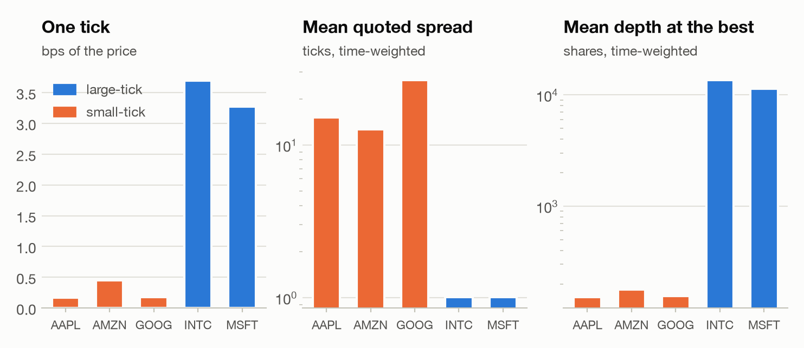
</picture>

| ticker | price $ | tick (bps) | spread (ticks) | spread (bps) | 1-tick share | depth at best | messages | visible execs | hidden execs | trades | class |
|---|---|---|---|---|---|---|---|---|---|---|---|
| AAPL | 583.53 | 0.17 | 15.09 | 2.58 | 0.1% | 152 | 381,542 | 21,415 | 10,492 | 16,565 | small-tick |
| AMZN | 222.77 | 0.45 | 12.70 | 5.70 | 0.2% | 178 | 260,590 | 8,111 | 2,102 | 5,923 | small-tick |
| GOOG | 570.66 | 0.18 | 26.69 | 4.67 | 0.0% | 155 | 142,145 | 6,859 | 3,379 | 5,431 | small-tick |
| INTC | 27.03 | 3.70 | 1.01 | 3.73 | 99.0% | 13,632 | 577,778 | 26,219 | 2,956 | 7,000 | large-tick |
| MSFT | 30.55 | 3.27 | 1.01 | 3.30 | 99.2% | 11,313 | 636,086 | 27,258 | 3,069 | 7,289 | large-tick |

<picture>
  <source media="(prefers-color-scheme: dark)" srcset="figures/d_sign_acf_dark.png">
  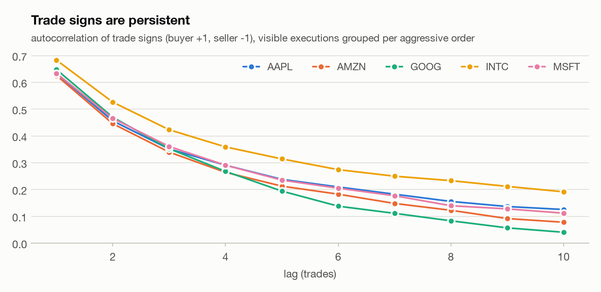
</picture>

| ticker | lag 1 | lag 2 | lag 3 | lag 4 | lag 5 | lag 6 | lag 7 | lag 8 | lag 9 | lag 10 |
|---|---|---|---|---|---|---|---|---|---|---|
| AAPL | 0.632 | 0.456 | 0.351 | 0.291 | 0.238 | 0.210 | 0.183 | 0.156 | 0.137 | 0.125 |
| AMZN | 0.626 | 0.446 | 0.340 | 0.264 | 0.213 | 0.183 | 0.148 | 0.123 | 0.092 | 0.078 |
| GOOG | 0.648 | 0.470 | 0.352 | 0.268 | 0.194 | 0.138 | 0.111 | 0.083 | 0.057 | 0.041 |
| INTC | 0.683 | 0.526 | 0.423 | 0.359 | 0.314 | 0.274 | 0.250 | 0.233 | 0.212 | 0.191 |
| MSFT | 0.634 | 0.465 | 0.361 | 0.291 | 0.235 | 0.205 | 0.177 | 0.140 | 0.128 | 0.112 |

### 3. CKS replication (contemporaneous)

OFI summed over 10 s buckets explains the same bucket's mid change. The mean R² across the 13 half-hour windows is 0.51 (AAPL), 0.53 (AMZN), 0.41 (GOOG), 0.85 (INTC) and 0.87 (MSFT), higher for the large-tick stocks, where almost every price change is a queue being depleted. The lowest window R² is 0.0002 (GOOG, 09:35–10:00). That window contains buckets with up to 22,100 shares of OFI (about 142× the mean depth at the best) and no matching price move. Reading the messages shows a quote flickering between the first two bid levels: level-1 OFI counts every re-post at the best, but not the cancel one level deeper, so the imbalance piles up. This is a real blind spot of the level-1 measure.

Across windows and stocks, log β on log mean depth has a slope of **-1.27** (95% CI -1.34 to -1.20, HC3, n = 65). That interval lies below CKS's −1. The pooled slope mostly compares stocks, which differ in more than depth. Within stocks (one intercept per ticker) the slope is -0.90 (95% CI -1.36 to -0.45), consistent with −1.

<picture>
  <source media="(prefers-color-scheme: dark)" srcset="figures/d_cks_scatter_dark.png">
  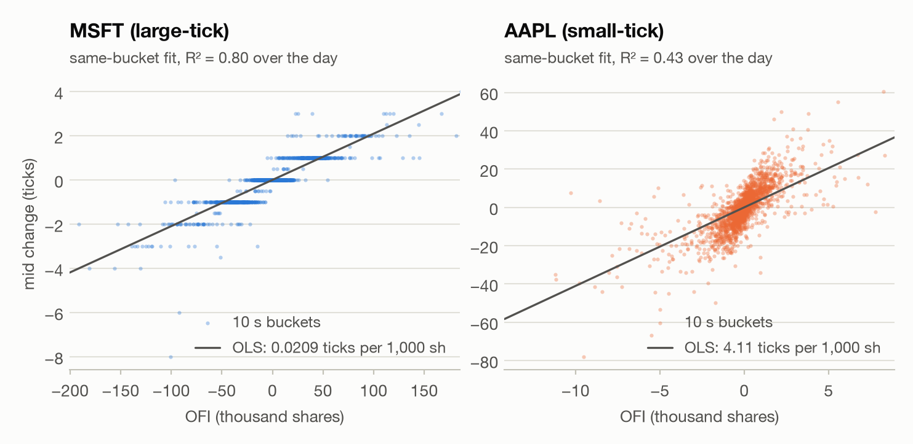
</picture>

| ticker | mean R² (windows) | median R² | min R² | full-day β (ticks per 1,000 sh) | full-day R² | buckets |
|---|---|---|---|---|---|---|
| AAPL | 0.509 | 0.555 | 0.154 | 4.105 | 0.427 | 2280 |
| AMZN | 0.532 | 0.569 | 0.227 | 2.501 | 0.331 | 2280 |
| GOOG | 0.407 | 0.429 | 0.000 | 5.295 | 0.171 | 2280 |
| INTC | 0.852 | 0.860 | 0.733 | 0.02013 | 0.742 | 2280 |
| MSFT | 0.867 | 0.883 | 0.644 | 0.02093 | 0.795 | 2280 |

<picture>
  <source media="(prefers-color-scheme: dark)" srcset="figures/d_cks_beta_depth_dark.png">
  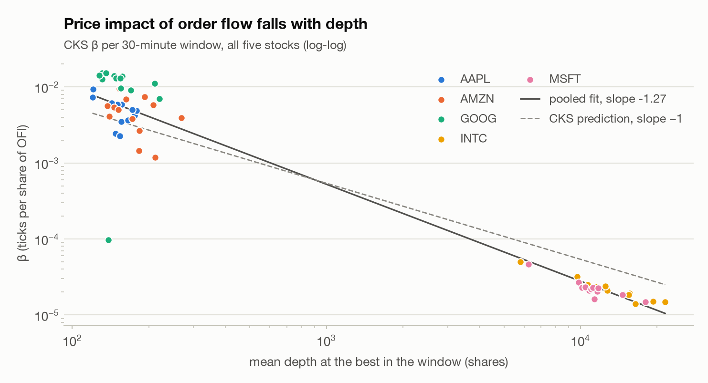
</picture>

<details><summary>Window-level β and depth (the points in the figure)</summary>

| ticker | window | buckets | β (ticks per 1,000 sh) | R² | mean depth |
|---|---|---|---|---|---|
| AAPL | 09:35 | 150 | 2.415 | 0.154 | 148 |
| AAPL | 10:00 | 180 | 4.211 | 0.439 | 176 |
| AAPL | 10:30 | 180 | 3.476 | 0.387 | 156 |
| AAPL | 11:00 | 180 | 5.84 | 0.555 | 141 |
| AAPL | 11:30 | 180 | 4.894 | 0.451 | 179 |
| AAPL | 12:00 | 180 | 5.838 | 0.623 | 157 |
| AAPL | 12:30 | 180 | 7.293 | 0.644 | 120 |
| AAPL | 13:00 | 180 | 5.858 | 0.573 | 151 |
| AAPL | 13:30 | 180 | 9.293 | 0.711 | 121 |
| AAPL | 14:00 | 180 | 3.654 | 0.504 | 166 |
| AAPL | 14:30 | 180 | 6.167 | 0.556 | 143 |
| AAPL | 15:00 | 180 | 2.26 | 0.341 | 154 |
| AAPL | 15:30 | 150 | 5.029 | 0.682 | 172 |
| AMZN | 09:35 | 150 | 6.876 | 0.453 | 163 |
| AMZN | 10:00 | 180 | 9.393 | 0.651 | 153 |
| AMZN | 10:30 | 180 | 4.07 | 0.535 | 140 |
| AMZN | 11:00 | 180 | 1.178 | 0.227 | 212 |
| AMZN | 11:30 | 180 | 7.41 | 0.625 | 193 |
| AMZN | 12:00 | 180 | 5.592 | 0.637 | 137 |
| AMZN | 12:30 | 180 | 5.76 | 0.619 | 208 |
| AMZN | 13:00 | 180 | 3.904 | 0.598 | 269 |
| AMZN | 13:30 | 180 | 3.792 | 0.542 | 172 |
| AMZN | 14:00 | 180 | 5.359 | 0.603 | 146 |
| AMZN | 14:30 | 180 | 5.025 | 0.569 | 152 |
| AMZN | 15:00 | 180 | 1.449 | 0.415 | 183 |
| AMZN | 15:30 | 150 | 2.633 | 0.443 | 184 |
| GOOG | 09:35 | 150 | 0.09648 | 0.000 | 139 |
| GOOG | 10:00 | 180 | 12.56 | 0.373 | 131 |
| GOOG | 10:30 | 180 | 15.28 | 0.477 | 131 |
| GOOG | 11:00 | 180 | 9.051 | 0.402 | 170 |
| GOOG | 11:30 | 180 | 14.01 | 0.347 | 146 |
| GOOG | 12:00 | 180 | 14.14 | 0.421 | 128 |
| GOOG | 12:30 | 180 | 13.83 | 0.479 | 157 |
| GOOG | 13:00 | 180 | 12.89 | 0.489 | 149 |
| GOOG | 13:30 | 180 | 15.25 | 0.450 | 136 |
| GOOG | 14:00 | 180 | 9.628 | 0.469 | 155 |
| GOOG | 14:30 | 180 | 12.91 | 0.429 | 154 |
| GOOG | 15:00 | 180 | 11.13 | 0.530 | 211 |
| GOOG | 15:30 | 150 | 6.941 | 0.428 | 220 |
| INTC | 09:35 | 150 | 0.05012 | 0.845 | 5,800 |
| INTC | 10:00 | 180 | 0.03174 | 0.828 | 9,720 |
| INTC | 10:30 | 180 | 0.0236 | 0.891 | 11,463 |
| INTC | 11:00 | 180 | 0.02346 | 0.808 | 11,095 |
| INTC | 11:30 | 180 | 0.02099 | 0.782 | 12,761 |
| INTC | 12:00 | 180 | 0.02482 | 0.901 | 10,659 |
| INTC | 12:30 | 180 | 0.02395 | 0.864 | 12,557 |
| INTC | 13:00 | 180 | 0.01907 | 0.860 | 14,733 |
| INTC | 13:30 | 180 | 0.01913 | 0.913 | 15,619 |
| INTC | 14:00 | 180 | 0.01503 | 0.853 | 19,300 |
| INTC | 14:30 | 180 | 0.01838 | 0.884 | 15,493 |
| INTC | 15:00 | 180 | 0.01408 | 0.733 | 16,477 |
| INTC | 15:30 | 150 | 0.01478 | 0.914 | 21,557 |
| MSFT | 09:35 | 150 | 0.04617 | 0.777 | 6,240 |
| MSFT | 10:00 | 180 | 0.02701 | 0.804 | 9,846 |
| MSFT | 10:30 | 180 | 0.01622 | 0.644 | 11,333 |
| MSFT | 11:00 | 180 | 0.02339 | 0.934 | 10,286 |
| MSFT | 11:30 | 180 | 0.02284 | 0.921 | 10,136 |
| MSFT | 12:00 | 180 | 0.021 | 0.876 | 10,804 |
| MSFT | 12:30 | 180 | 0.02338 | 0.925 | 10,442 |
| MSFT | 13:00 | 180 | 0.02187 | 0.918 | 11,021 |
| MSFT | 13:30 | 180 | 0.02028 | 0.918 | 11,624 |
| MSFT | 14:00 | 180 | 0.02276 | 0.865 | 11,193 |
| MSFT | 14:30 | 180 | 0.02253 | 0.937 | 11,745 |
| MSFT | 15:00 | 180 | 0.01843 | 0.883 | 14,664 |
| MSFT | 15:30 | 150 | 0.01476 | 0.865 | 18,009 |

</details>

**Bridge to module E (Kyle's λ).** The full-day CKS β is saved under `kyle_bridge` in `reports/results/microstructure.json`: AAPL 4.11, AMZN 2.5, GOOG 5.29, INTC 0.0201 and MSFT 0.0209 ticks per 1,000 shares of OFI. It is a cousin of Kyle's λ, not the same object: OFI counts limit-order arrivals and cancels at the best as well as trades.

### 4. Predictive tests (the ones a trader could use)

Fitted before 12:45 and scored after, the *contemporaneous* CKS regression keeps an out-of-sample R² of 0.49, 0.36, 0.24, 0.40 and 0.77. The same OFI used to forecast the *next* bucket scores +0.0001, -0.0124, -0.0030, +0.0068 and +0.0014 (out-of-sample R² against the training mean; zero or below means no forecasting value). That gap is why a high CKS R² is not an alpha.

Queue imbalance does carry information about the next mid move. Out-of-sample AUC is 0.569 (AAPL), 0.550 (AMZN), 0.531 (GOOG), 0.661 (INTC) and 0.652 (MSFT). Every large-tick stock beats every small-tick one (0.652 vs at most 0.569), as Gould & Bonart report: long queues deplete slowly and visibly, while thin small-tick queues are constantly replaced and say little. The logistic slope on I is 0.35, 0.23, 0.32, 1.12 and 1.33. Samples are taken every 1 s; the label is the direction of the next mid change.

<picture>
  <source media="(prefers-color-scheme: dark)" srcset="figures/d_contemp_vs_lagged_dark.png">
  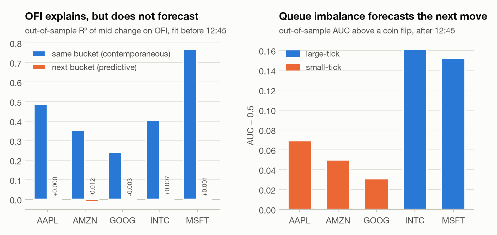
</picture>

| ticker | contemp. R² (OOS) | lagged R² (OOS) | lagged R² vs zero | imbalance AUC (OOS) | AUC (train) | logit slope | Brier (model) | Brier (base rate) | test samples |
|---|---|---|---|---|---|---|---|---|---|
| AAPL | 0.488 | +0.0001 | +0.0014 | 0.569 | 0.562 | 0.35 | 0.2467 | 0.2497 | 11400 |
| AMZN | 0.355 | -0.0124 | -0.0118 | 0.550 | 0.540 | 0.23 | 0.2484 | 0.2500 | 11399 |
| GOOG | 0.241 | -0.0030 | -0.0018 | 0.531 | 0.558 | 0.32 | 0.2493 | 0.2495 | 11399 |
| INTC | 0.404 | +0.0068 | +0.0071 | 0.661 | 0.610 | 1.12 | 0.2332 | 0.2500 | 11396 |
| MSFT | 0.769 | +0.0014 | +0.0032 | 0.652 | 0.632 | 1.33 | 0.2295 | 0.2505 | 11381 |

<picture>
  <source media="(prefers-color-scheme: dark)" srcset="figures/d_imbalance_curve_dark.png">
  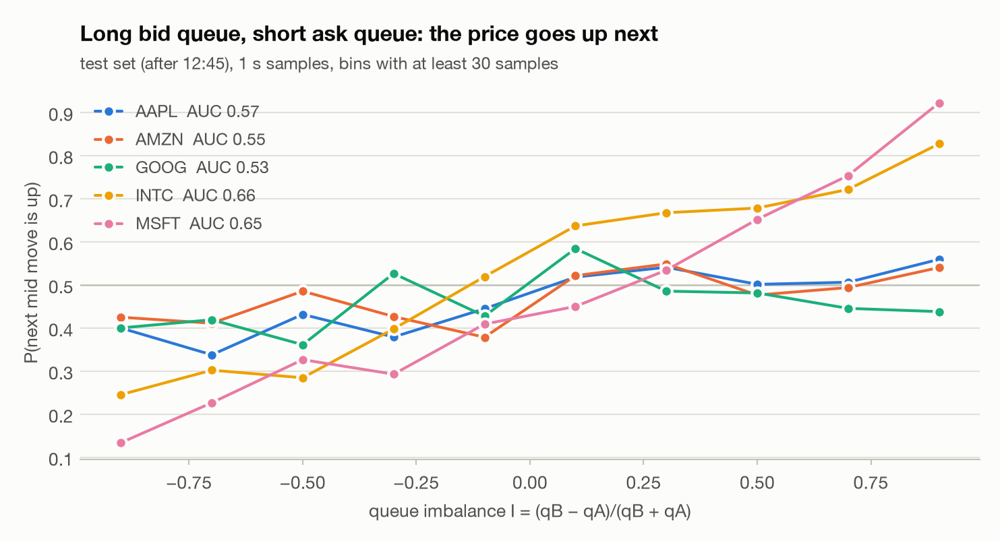
</picture>

<details><summary>P(next move up) by imbalance bin, test set (the points in the figure)</summary>

| I bin | AAPL | AMZN | GOOG | INTC | MSFT |
|---|---|---|---|---|---|
| -1.0 to -0.8 | 0.40 (n=788) | 0.42 (n=798) | 0.40 (n=1905) | 0.25 (n=102) | 0.13 (n=277) |
| -0.8 to -0.6 | 0.34 (n=545) | 0.41 (n=735) | 0.42 (n=506) | 0.30 (n=424) | 0.23 (n=601) |
| -0.6 to -0.4 | 0.43 (n=714) | 0.49 (n=577) | 0.36 (n=734) | 0.28 (n=946) | 0.33 (n=1333) |
| -0.4 to -0.2 | 0.38 (n=1127) | 0.43 (n=1060) | 0.53 (n=1619) | 0.40 (n=1539) | 0.29 (n=2293) |
| -0.2 to +0.0 | 0.44 (n=1388) | 0.38 (n=1147) | 0.43 (n=1385) | 0.52 (n=1973) | 0.41 (n=2426) |
| +0.0 to +0.2 | 0.52 (n=1840) | 0.52 (n=1788) | 0.58 (n=1890) | 0.64 (n=2450) | 0.45 (n=1812) |
| +0.2 to +0.4 | 0.54 (n=1115) | 0.55 (n=1176) | 0.49 (n=1125) | 0.67 (n=2158) | 0.53 (n=1410) |
| +0.4 to +0.6 | 0.50 (n=868) | 0.48 (n=884) | 0.48 (n=848) | 0.68 (n=1134) | 0.65 (n=790) |
| +0.6 to +0.8 | 0.51 (n=1089) | 0.49 (n=1029) | 0.45 (n=631) | 0.72 (n=560) | 0.75 (n=349) |
| +0.8 to +1.0 | 0.56 (n=1926) | 0.54 (n=2205) | 0.44 (n=756) | 0.83 (n=110) | 0.92 (n=90) |

</details>

### 5. Fill probability and markouts by fill model

Across 9,074 hypothetical orders per stock, FIFO fills 66% (AAPL), 51% (AMZN), 49% (GOOG), 48% (INTC) and 54% (MSFT) of them within 60 s, against 69%, 56%, 54%, 68% and 71% under touch and 64%, 49%, 47%, 45% and 52% under trade-through. The gap is largest for the large-tick stocks, where queues are long: INTC 20% and MSFT 17% of orders are 'filled' by touch but not by the queue.

A random fill would earn the half-spread, and the *unconditional* markout (7.59, 6.37, 13.39, 0.50 and 0.50 ticks) is exactly that, because both sides are quoted at every decision time and the mid move cancels. Filled orders earn less under every model. At 10 s the FIFO markout is -2.53, -2.53, -3.37, -0.44 and -0.52 ticks, touch -1.20, -1.24, -1.06, +0.09 and -0.02, trade-through -3.14, -3.03, -4.06, -0.56 and -0.60. Touch fills keep a positive 10 s markout in INTC, where FIFO fills lose money. The passive edge that touch fills show does not survive a realistic queue. This is adverse selection, the passive trader's winner's curse. The fills a queue actually gives you are the ones where the price is about to move through your level.

<picture>
  <source media="(prefers-color-scheme: dark)" srcset="figures/d_fill_prob_dark.png">
  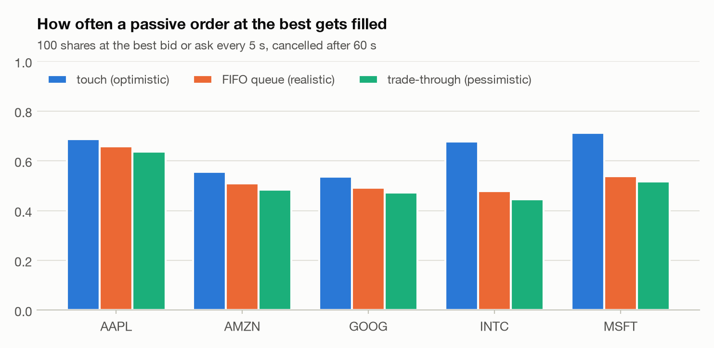
</picture>

<picture>
  <source media="(prefers-color-scheme: dark)" srcset="figures/d_markouts_dark.png">
  
</picture>

Markouts in ticks per share (quantity-weighted over filled orders), side × (mid − fill price):

| ticker | model | P(fill) | 0.1 s | 1 s | 10 s | 60 s | 10 s (bps) | uncond. (ticks) | partial fills |
|---|---|---|---|---|---|---|---|---|---|
| AAPL | touch | 0.688 | +1.257 | +0.403 | -1.199 | -0.634 | -0.205 | 7.589 | 0 |
| AAPL | fifo | 0.659 | -0.068 | -0.932 | -2.533 | -1.801 | -0.434 | 7.589 | 75 |
| AAPL | through | 0.636 | -0.545 | -1.484 | -3.144 | -2.402 | -0.539 | 7.589 | 0 |
| AMZN | touch | 0.557 | +1.213 | +0.188 | -1.237 | -1.713 | -0.555 | 6.366 | 0 |
| AMZN | fifo | 0.510 | -0.245 | -1.226 | -2.534 | -2.905 | -1.137 | 6.366 | 64 |
| AMZN | through | 0.485 | -0.726 | -1.701 | -3.032 | -3.250 | -1.361 | 6.366 | 0 |
| GOOG | touch | 0.537 | +2.371 | +1.162 | -1.061 | -1.663 | -0.187 | 13.385 | 0 |
| GOOG | fifo | 0.491 | -0.006 | -1.103 | -3.372 | -3.581 | -0.591 | 13.385 | 44 |
| GOOG | through | 0.472 | -0.861 | -1.928 | -4.055 | -4.087 | -0.711 | 13.385 | 0 |
| INTC | touch | 0.677 | +0.235 | +0.191 | +0.089 | -0.055 | +0.330 | 0.504 | 0 |
| INTC | fifo | 0.478 | -0.325 | -0.351 | -0.443 | -0.669 | -1.637 | 0.504 | 10 |
| INTC | through | 0.446 | -0.491 | -0.490 | -0.559 | -0.796 | -2.068 | 0.504 | 0 |
| MSFT | touch | 0.713 | +0.176 | +0.124 | -0.020 | -0.131 | -0.064 | 0.504 | 0 |
| MSFT | fifo | 0.539 | -0.394 | -0.424 | -0.521 | -0.605 | -1.705 | 0.504 | 9 |
| MSFT | through | 0.518 | -0.515 | -0.525 | -0.605 | -0.663 | -1.980 | 0.504 | 0 |

How orders ended (touch / FIFO / trade-through):

| ticker | filled | level_exit | timeout |
|---|---|---|---|
| AAPL | 6,246 / 5,902 / 5,773 | 2,140 / 2,337 / 2,403 | 688 / 835 / 898 |
| AMZN | 5,050 / 4,563 / 4,401 | 1,857 / 1,952 / 1,965 | 2,167 / 2,559 / 2,708 |
| GOOG | 4,874 / 4,415 / 4,286 | 1,457 / 1,523 / 1,537 | 2,743 / 3,136 / 3,251 |
| INTC | 6,145 / 4,327 / 4,043 | 8 / 11 / 11 | 2,921 / 4,736 / 5,020 |
| MSFT | 6,468 / 4,881 / 4,700 | 6 / 7 / 7 | 2,600 / 4,186 / 4,367 |

From the shortest to the longest queue bucket, P(fill) falls in INTC and MSFT (INTC 74% → 30% and MSFT 72% → 46%) but not in AAPL, AMZN and GOOG, whose queues at the best are a few round lots. The 10 s markout of filled orders is worse at the back of a long queue in AAPL, AMZN, GOOG, INTC and MSFT (AAPL -2.27 → -2.88, AMZN -1.30 → -3.15, GOOG -2.02 → -4.10, INTC -0.42 → -0.77 and MSFT -0.47 → -0.73): waiting longer in line does not buy a better fill, because the fills that do arrive are the ones where the price moves through the level.

<picture>
  <source media="(prefers-color-scheme: dark)" srcset="figures/d_queue_buckets_dark.png">
  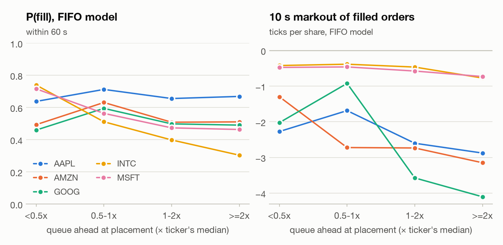
</picture>

| ticker | queue ahead | median queue (sh) | orders | P(fill) | 10 s markout (ticks) |
|---|---|---|---|---|---|
| AAPL | <0.5x | 12.0 | 2,101 | 0.638 | -2.273 |
| AAPL | 0.5-1x | 59.0 | 564 | 0.713 | -1.686 |
| AAPL | 1-2x | 100 | 4,226 | 0.656 | -2.601 |
| AAPL | >=2x | 230 | 2,183 | 0.669 | -2.877 |
| AMZN | <0.5x | 16.0 | 2,118 | 0.494 | -1.298 |
| AMZN | 0.5-1x | 75.0 | 285 | 0.632 | -2.722 |
| AMZN | 1-2x | 100 | 3,975 | 0.509 | -2.734 |
| AMZN | >=2x | 270 | 2,696 | 0.511 | -3.149 |
| GOOG | <0.5x | 10.0 | 1,754 | 0.460 | -2.024 |
| GOOG | 0.5-1x | 68.0 | 242 | 0.595 | -0.923 |
| GOOG | 1-2x | 100 | 4,257 | 0.499 | -3.574 |
| GOOG | >=2x | 217 | 2,821 | 0.491 | -4.104 |
| INTC | <0.5x | 4,100 | 1,264 | 0.740 | -0.421 |
| INTC | 0.5-1x | 9,207 | 3,271 | 0.512 | -0.384 |
| INTC | 1-2x | 16,072 | 3,674 | 0.399 | -0.464 |
| INTC | >=2x | 28,856 | 865 | 0.304 | -0.772 |
| MSFT | <0.5x | 3,200 | 1,223 | 0.716 | -0.475 |
| MSFT | 0.5-1x | 8,276 | 3,314 | 0.564 | -0.460 |
| MSFT | 1-2x | 13,800 | 4,054 | 0.474 | -0.576 |
| MSFT | >=2x | 24,591 | 483 | 0.464 | -0.730 |

### 6. Effective spread = realized spread + price impact

On the file's own trades (visible executions grouped per aggressive order, share-weighted), the effective spread is 1.76, 4.34, 3.31, 3.77 and 3.36 bps. At 60 s the price impact is 1.90, 7.17, 3.07, 7.61 and 6.08 bps and the realized spread, what liquidity providers keep, is -0.14, -2.83, +0.24, -3.84 and -2.72 bps. Liquidity providers lose before rebates in AAPL, AMZN, INTC and MSFT.

<picture>
  <source media="(prefers-color-scheme: dark)" srcset="figures/d_spread_decomp_dark.png">
  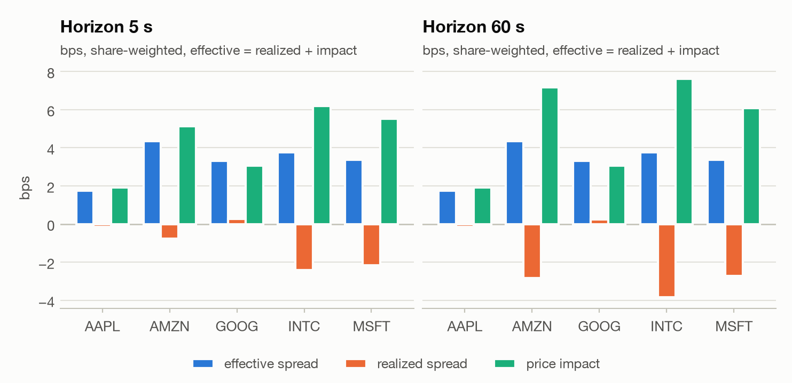
</picture>

| ticker | horizon (s) | trades | effective (ticks) | realized (ticks) | impact (ticks) | effective (bps) | realized (bps) | impact (bps) |
|---|---|---|---|---|---|---|---|---|
| AAPL | 5 | 16437 | 10.266 | -0.940 | 11.206 | 1.760 | -0.162 | 1.921 |
| AAPL | 60 | 16437 | 10.266 | -0.824 | 11.091 | 1.760 | -0.143 | 1.903 |
| AMZN | 5 | 5886 | 9.675 | -1.719 | 11.394 | 4.344 | -0.772 | 5.116 |
| AMZN | 60 | 5886 | 9.675 | -6.334 | 16.009 | 4.344 | -2.831 | 7.174 |
| GOOG | 5 | 5381 | 18.862 | +1.456 | 17.406 | 3.308 | +0.256 | 3.052 |
| GOOG | 60 | 5381 | 18.862 | +1.354 | 17.508 | 3.308 | +0.238 | 3.070 |
| INTC | 5 | 6945 | 1.018 | -0.653 | 1.671 | 3.770 | -2.421 | 6.191 |
| INTC | 60 | 6945 | 1.018 | -1.036 | 2.054 | 3.770 | -3.844 | 7.613 |
| MSFT | 5 | 7251 | 1.024 | -0.659 | 1.684 | 3.355 | -2.162 | 5.518 |
| MSFT | 60 | 7251 | 1.024 | -0.833 | 1.857 | 3.355 | -2.723 | 6.078 |

### 7. Post or cross?

At each decision the trader follows sign(I). EV(cross) = s·(mid(t+30 s) − opposite quote) and EV(post) = filled fraction × s·(mid(t+H) − our quote), in ticks per share, where s = +1 for a buy. The heatmaps show EV(post) − EV(cross) by signal strength |I| and by queue ahead (in multiples of the stock's median queue). Blue cells favour posting, red cells favour crossing, and empty cells have fewer than 20 decisions.

**Large-tick (INTC and MSFT).** Crossing pays half the spread (1.01 and 1.01 ticks on average), and the signal's average move over 30 s is +0.18 and +0.17 ticks, so EV(cross) averages -0.32 and -0.33 ticks. Under FIFO, posting averages -0.13 and -0.18 ticks against +0.06 and +0.02 under touch. Crossing wins in 6 (INTC) and 6 (MSFT) of the 20 FIFO cells, against 2 and 2 under touch. 10 of the 12 cells where crossing wins have |I| above 0.4, and posts there fill 21% of the time under FIFO, against 29% in the cells where posting wins: a strong signal means the queue on our side is long relative to the other side, and the price tends to leave without us.

<picture>
  <source media="(prefers-color-scheme: dark)" srcset="figures/d_post_vs_cross_dark.png">
  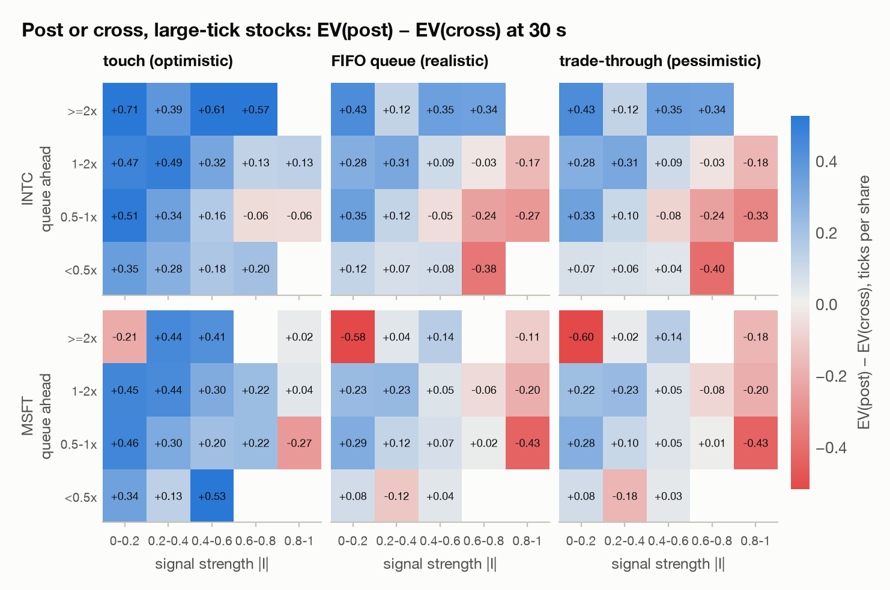
</picture>

**Small-tick (AAPL, AMZN and GOOG).** Crossing a 15.2, 12.9 and 27.1-tick spread costs far more than the signal moves (+0.45, +0.16 and +0.69 ticks), so EV(cross) is -7.2, -6.3 and -12.8 ticks. Posting beats crossing in every cell under every fill model (smallest FIFO advantage +4.6, +2.9 and +6.6 ticks), so there is no boundary to draw. Posting still loses on average: -0.98, -1.07 and -1.23 ticks under FIFO.

<picture>
  <source media="(prefers-color-scheme: dark)" srcset="figures/d_post_vs_cross_small_dark.png">
  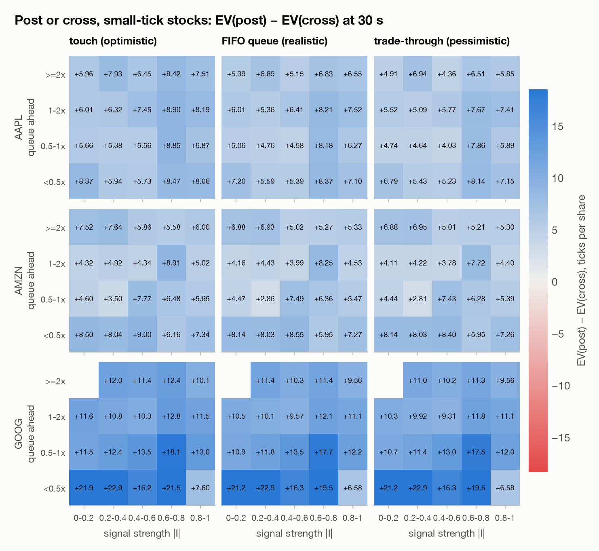
</picture>

Mean EV per decision (all cells):

| ticker | model | P(fill) | EV(post) ticks | EV(cross) ticks | EV(post) bps | EV(cross) bps | decisions |
|---|---|---|---|---|---|---|---|
| AAPL | touch | 0.605 | -0.213 | -7.165 | -0.036 | -1.227 | 4,082 |
| AAPL | fifo | 0.558 | -0.985 | -7.165 | -0.169 | -1.227 | 4,082 |
| AAPL | through | 0.528 | -1.342 | -7.165 | -0.230 | -1.227 | 4,082 |
| AMZN | touch | 0.410 | -0.704 | -6.289 | -0.316 | -2.822 | 4,059 |
| AMZN | fifo | 0.350 | -1.065 | -6.289 | -0.478 | -2.822 | 4,059 |
| AMZN | through | 0.325 | -1.163 | -6.289 | -0.522 | -2.822 | 4,059 |
| GOOG | touch | 0.389 | -0.534 | -12.832 | -0.094 | -2.246 | 3,956 |
| GOOG | fifo | 0.329 | -1.234 | -12.832 | -0.216 | -2.246 | 3,956 |
| GOOG | through | 0.304 | -1.402 | -12.832 | -0.246 | -2.246 | 3,956 |
| INTC | touch | 0.442 | +0.063 | -0.320 | +0.236 | -1.186 | 4,554 |
| INTC | fifo | 0.242 | -0.132 | -0.320 | -0.489 | -1.186 | 4,554 |
| INTC | through | 0.229 | -0.142 | -0.320 | -0.526 | -1.186 | 4,554 |
| MSFT | touch | 0.505 | +0.025 | -0.332 | +0.082 | -1.088 | 4,555 |
| MSFT | fifo | 0.322 | -0.181 | -0.332 | -0.594 | -1.088 | 4,555 |
| MSFT | through | 0.309 | -0.192 | -0.332 | -0.630 | -1.088 | 4,555 |

<details><summary>Every heatmap cell (the numbers in the figures)</summary>

| ticker | model | queue ahead | |I| | n | P(fill) | EV(post) | EV(cross) | diff |
|---|---|---|---|---|---|---|---|---|
| AAPL | touch | <0.5x | 0-0.2 | 42 | 0.69 | +2.643 | -5.726 | +8.369 |
| AAPL | touch | <0.5x | 0.2-0.4 | 48 | 0.52 | -0.760 | -6.698 | +5.938 |
| AAPL | touch | <0.5x | 0.4-0.6 | 70 | 0.59 | +0.314 | -5.414 | +5.729 |
| AAPL | touch | <0.5x | 0.6-0.8 | 45 | 0.62 | -2.456 | -10.922 | +8.467 |
| AAPL | touch | <0.5x | 0.8-1 | 79 | 0.57 | -2.171 | -10.228 | +8.057 |
| AAPL | touch | 0.5-1x | 0-0.2 | 538 | 0.57 | +0.417 | -5.238 | +5.655 |
| AAPL | touch | 0.5-1x | 0.2-0.4 | 187 | 0.55 | -1.086 | -6.465 | +5.380 |
| AAPL | touch | 0.5-1x | 0.4-0.6 | 186 | 0.52 | +0.723 | -4.833 | +5.556 |
| AAPL | touch | 0.5-1x | 0.6-0.8 | 348 | 0.62 | -0.928 | -9.780 | +8.852 |
| AAPL | touch | 0.5-1x | 0.8-1 | 498 | 0.57 | -0.369 | -7.236 | +6.866 |
| AAPL | touch | 1-2x | 0-0.2 | 178 | 0.56 | -0.228 | -6.236 | +6.008 |
| AAPL | touch | 1-2x | 0.2-0.4 | 570 | 0.61 | +0.470 | -5.847 | +6.318 |
| AAPL | touch | 1-2x | 0.4-0.6 | 215 | 0.68 | -1.267 | -8.721 | +7.453 |
| AAPL | touch | 1-2x | 0.6-0.8 | 109 | 0.65 | +3.220 | -5.683 | +8.904 |
| AAPL | touch | 1-2x | 0.8-1 | 326 | 0.60 | -0.110 | -8.298 | +8.187 |
| AAPL | touch | >=2x | 0-0.2 | 23 | 0.61 | -1.435 | -7.391 | +5.957 |
| AAPL | touch | >=2x | 0.2-0.4 | 59 | 0.71 | -2.186 | -10.119 | +7.932 |
| AAPL | touch | >=2x | 0.4-0.6 | 138 | 0.63 | -2.989 | -9.438 | +6.449 |
| AAPL | touch | >=2x | 0.6-0.8 | 172 | 0.68 | +0.201 | -8.221 | +8.422 |
| AAPL | touch | >=2x | 0.8-1 | 251 | 0.69 | -0.247 | -7.755 | +7.508 |
| AAPL | fifo | <0.5x | 0-0.2 | 42 | 0.64 | +1.477 | -5.726 | +7.203 |
| AAPL | fifo | <0.5x | 0.2-0.4 | 48 | 0.50 | -1.110 | -6.698 | +5.588 |
| AAPL | fifo | <0.5x | 0.4-0.6 | 70 | 0.57 | -0.029 | -5.414 | +5.386 |
| AAPL | fifo | <0.5x | 0.6-0.8 | 45 | 0.60 | -2.556 | -10.922 | +8.367 |
| AAPL | fifo | <0.5x | 0.8-1 | 79 | 0.51 | -3.127 | -10.228 | +7.101 |
| AAPL | fifo | 0.5-1x | 0-0.2 | 538 | 0.53 | -0.182 | -5.238 | +5.056 |
| AAPL | fifo | 0.5-1x | 0.2-0.4 | 187 | 0.53 | -1.704 | -6.465 | +4.761 |
| AAPL | fifo | 0.5-1x | 0.4-0.6 | 186 | 0.49 | -0.254 | -4.833 | +4.579 |
| AAPL | fifo | 0.5-1x | 0.6-0.8 | 348 | 0.59 | -1.602 | -9.780 | +8.178 |
| AAPL | fifo | 0.5-1x | 0.8-1 | 498 | 0.53 | -0.967 | -7.236 | +6.269 |
| AAPL | fifo | 1-2x | 0-0.2 | 178 | 0.56 | -0.228 | -6.236 | +6.008 |
| AAPL | fifo | 1-2x | 0.2-0.4 | 570 | 0.56 | -0.484 | -5.847 | +5.363 |
| AAPL | fifo | 1-2x | 0.4-0.6 | 215 | 0.60 | -2.312 | -8.721 | +6.409 |
| AAPL | fifo | 1-2x | 0.6-0.8 | 109 | 0.61 | +2.523 | -5.683 | +8.206 |
| AAPL | fifo | 1-2x | 0.8-1 | 326 | 0.56 | -0.773 | -8.298 | +7.524 |
| AAPL | fifo | >=2x | 0-0.2 | 23 | 0.52 | -2.000 | -7.391 | +5.391 |
| AAPL | fifo | >=2x | 0.2-0.4 | 59 | 0.66 | -3.224 | -10.119 | +6.894 |
| AAPL | fifo | >=2x | 0.4-0.6 | 138 | 0.54 | -4.290 | -9.438 | +5.149 |
| AAPL | fifo | >=2x | 0.6-0.8 | 172 | 0.58 | -1.389 | -8.221 | +6.832 |
| AAPL | fifo | >=2x | 0.8-1 | 251 | 0.60 | -1.209 | -7.755 | +6.546 |
| AAPL | through | <0.5x | 0-0.2 | 42 | 0.57 | +1.060 | -5.726 | +6.786 |
| AAPL | through | <0.5x | 0.2-0.4 | 48 | 0.46 | -1.271 | -6.698 | +5.427 |
| AAPL | through | <0.5x | 0.4-0.6 | 70 | 0.54 | -0.186 | -5.414 | +5.229 |
| AAPL | through | <0.5x | 0.6-0.8 | 45 | 0.56 | -2.778 | -10.922 | +8.144 |
| AAPL | through | <0.5x | 0.8-1 | 79 | 0.49 | -3.076 | -10.228 | +7.152 |
| AAPL | through | 0.5-1x | 0-0.2 | 538 | 0.51 | -0.501 | -5.238 | +4.737 |
| AAPL | through | 0.5-1x | 0.2-0.4 | 187 | 0.50 | -1.829 | -6.465 | +4.636 |
| AAPL | through | 0.5-1x | 0.4-0.6 | 186 | 0.46 | -0.801 | -4.833 | +4.032 |
| AAPL | through | 0.5-1x | 0.6-0.8 | 348 | 0.56 | -1.917 | -9.780 | +7.864 |
| AAPL | through | 0.5-1x | 0.8-1 | 498 | 0.50 | -1.343 | -7.236 | +5.893 |
| AAPL | through | 1-2x | 0-0.2 | 178 | 0.52 | -0.716 | -6.236 | +5.520 |
| AAPL | through | 1-2x | 0.2-0.4 | 570 | 0.54 | -0.761 | -5.847 | +5.086 |
| AAPL | through | 1-2x | 0.4-0.6 | 215 | 0.58 | -2.947 | -8.721 | +5.774 |
| AAPL | through | 1-2x | 0.6-0.8 | 109 | 0.56 | +1.986 | -5.683 | +7.670 |
| AAPL | through | 1-2x | 0.8-1 | 326 | 0.55 | -0.887 | -8.298 | +7.411 |
| AAPL | through | >=2x | 0-0.2 | 23 | 0.43 | -2.478 | -7.391 | +4.913 |
| AAPL | through | >=2x | 0.2-0.4 | 59 | 0.63 | -3.178 | -10.119 | +6.941 |
| AAPL | through | >=2x | 0.4-0.6 | 138 | 0.49 | -5.080 | -9.438 | +4.359 |
| AAPL | through | >=2x | 0.6-0.8 | 172 | 0.51 | -1.709 | -8.221 | +6.512 |
| AAPL | through | >=2x | 0.8-1 | 251 | 0.56 | -1.908 | -7.755 | +5.847 |
| AMZN | touch | <0.5x | 0-0.2 | 76 | 0.42 | +0.224 | -8.276 | +8.500 |
| AMZN | touch | <0.5x | 0.2-0.4 | 59 | 0.37 | -0.475 | -8.517 | +8.042 |
| AMZN | touch | <0.5x | 0.4-0.6 | 58 | 0.52 | +0.457 | -8.543 | +9.000 |
| AMZN | touch | <0.5x | 0.6-0.8 | 61 | 0.26 | -0.221 | -6.377 | +6.156 |
| AMZN | touch | <0.5x | 0.8-1 | 50 | 0.44 | -0.310 | -7.650 | +7.340 |
| AMZN | touch | 0.5-1x | 0-0.2 | 496 | 0.37 | -0.671 | -5.276 | +4.605 |
| AMZN | touch | 0.5-1x | 0.2-0.4 | 137 | 0.35 | -0.905 | -4.409 | +3.504 |
| AMZN | touch | 0.5-1x | 0.4-0.6 | 118 | 0.36 | -0.407 | -8.174 | +7.767 |
| AMZN | touch | 0.5-1x | 0.6-0.8 | 332 | 0.39 | -1.399 | -7.878 | +6.479 |
| AMZN | touch | 0.5-1x | 0.8-1 | 439 | 0.40 | -0.875 | -6.530 | +5.655 |
| AMZN | touch | 1-2x | 0-0.2 | 176 | 0.40 | -1.466 | -5.784 | +4.318 |
| AMZN | touch | 1-2x | 0.2-0.4 | 566 | 0.45 | -0.616 | -5.531 | +4.915 |
| AMZN | touch | 1-2x | 0.4-0.6 | 267 | 0.42 | +0.257 | -4.084 | +4.341 |
| AMZN | touch | 1-2x | 0.6-0.8 | 79 | 0.54 | +0.551 | -8.354 | +8.905 |
| AMZN | touch | 1-2x | 0.8-1 | 367 | 0.38 | -0.187 | -5.204 | +5.018 |
| AMZN | touch | >=2x | 0-0.2 | 29 | 0.48 | -2.552 | -10.069 | +7.517 |
| AMZN | touch | >=2x | 0.2-0.4 | 76 | 0.45 | -0.993 | -8.632 | +7.638 |
| AMZN | touch | >=2x | 0.4-0.6 | 137 | 0.49 | -0.336 | -6.193 | +5.858 |
| AMZN | touch | >=2x | 0.6-0.8 | 215 | 0.44 | -1.616 | -7.193 | +5.577 |
| AMZN | touch | >=2x | 0.8-1 | 321 | 0.43 | -1.193 | -7.193 | +6.000 |
| AMZN | fifo | <0.5x | 0-0.2 | 76 | 0.38 | -0.138 | -8.276 | +8.138 |
| AMZN | fifo | <0.5x | 0.2-0.4 | 59 | 0.36 | -0.483 | -8.517 | +8.034 |
| AMZN | fifo | <0.5x | 0.4-0.6 | 58 | 0.45 | +0.009 | -8.543 | +8.552 |
| AMZN | fifo | <0.5x | 0.6-0.8 | 61 | 0.25 | -0.426 | -6.377 | +5.951 |
| AMZN | fifo | <0.5x | 0.8-1 | 50 | 0.42 | -0.384 | -7.650 | +7.266 |
| AMZN | fifo | 0.5-1x | 0-0.2 | 496 | 0.34 | -0.808 | -5.276 | +4.468 |
| AMZN | fifo | 0.5-1x | 0.2-0.4 | 137 | 0.26 | -1.544 | -4.409 | +2.865 |
| AMZN | fifo | 0.5-1x | 0.4-0.6 | 118 | 0.28 | -0.682 | -8.174 | +7.491 |
| AMZN | fifo | 0.5-1x | 0.6-0.8 | 332 | 0.35 | -1.514 | -7.878 | +6.364 |
| AMZN | fifo | 0.5-1x | 0.8-1 | 439 | 0.35 | -1.056 | -6.530 | +5.474 |
| AMZN | fifo | 1-2x | 0-0.2 | 176 | 0.36 | -1.619 | -5.784 | +4.165 |
| AMZN | fifo | 1-2x | 0.2-0.4 | 566 | 0.39 | -1.101 | -5.531 | +4.430 |
| AMZN | fifo | 1-2x | 0.4-0.6 | 267 | 0.34 | -0.097 | -4.084 | +3.987 |
| AMZN | fifo | 1-2x | 0.6-0.8 | 79 | 0.42 | -0.107 | -8.354 | +8.247 |
| AMZN | fifo | 1-2x | 0.8-1 | 367 | 0.29 | -0.670 | -5.204 | +4.535 |
| AMZN | fifo | >=2x | 0-0.2 | 29 | 0.45 | -3.190 | -10.069 | +6.879 |
| AMZN | fifo | >=2x | 0.2-0.4 | 76 | 0.38 | -1.697 | -8.632 | +6.934 |
| AMZN | fifo | >=2x | 0.4-0.6 | 137 | 0.42 | -1.175 | -6.193 | +5.018 |
| AMZN | fifo | >=2x | 0.6-0.8 | 215 | 0.39 | -1.918 | -7.193 | +5.275 |
| AMZN | fifo | >=2x | 0.8-1 | 321 | 0.33 | -1.864 | -7.193 | +5.329 |
| AMZN | through | <0.5x | 0-0.2 | 76 | 0.38 | -0.138 | -8.276 | +8.138 |
| AMZN | through | <0.5x | 0.2-0.4 | 59 | 0.36 | -0.483 | -8.517 | +8.034 |
| AMZN | through | <0.5x | 0.4-0.6 | 58 | 0.41 | -0.147 | -8.543 | +8.397 |
| AMZN | through | <0.5x | 0.6-0.8 | 61 | 0.25 | -0.426 | -6.377 | +5.951 |
| AMZN | through | <0.5x | 0.8-1 | 50 | 0.40 | -0.390 | -7.650 | +7.260 |
| AMZN | through | 0.5-1x | 0-0.2 | 496 | 0.33 | -0.832 | -5.276 | +4.445 |
| AMZN | through | 0.5-1x | 0.2-0.4 | 137 | 0.25 | -1.595 | -4.409 | +2.814 |
| AMZN | through | 0.5-1x | 0.4-0.6 | 118 | 0.26 | -0.746 | -8.174 | +7.428 |
| AMZN | through | 0.5-1x | 0.6-0.8 | 332 | 0.34 | -1.595 | -7.878 | +6.283 |
| AMZN | through | 0.5-1x | 0.8-1 | 439 | 0.33 | -1.137 | -6.530 | +5.393 |
| AMZN | through | 1-2x | 0-0.2 | 176 | 0.32 | -1.679 | -5.784 | +4.105 |
| AMZN | through | 1-2x | 0.2-0.4 | 566 | 0.34 | -1.314 | -5.531 | +4.216 |
| AMZN | through | 1-2x | 0.4-0.6 | 267 | 0.31 | -0.301 | -4.084 | +3.783 |
| AMZN | through | 1-2x | 0.6-0.8 | 79 | 0.29 | -0.639 | -8.354 | +7.715 |
| AMZN | through | 1-2x | 0.8-1 | 367 | 0.26 | -0.802 | -5.204 | +4.402 |
| AMZN | through | >=2x | 0-0.2 | 29 | 0.45 | -3.190 | -10.069 | +6.879 |
| AMZN | through | >=2x | 0.2-0.4 | 76 | 0.37 | -1.678 | -8.632 | +6.954 |
| AMZN | through | >=2x | 0.4-0.6 | 137 | 0.40 | -1.179 | -6.193 | +5.015 |
| AMZN | through | >=2x | 0.6-0.8 | 215 | 0.36 | -1.984 | -7.193 | +5.209 |
| AMZN | through | >=2x | 0.8-1 | 321 | 0.32 | -1.889 | -7.193 | +5.304 |
| GOOG | touch | <0.5x | 0-0.2 | 54 | 0.24 | +1.667 | -20.278 | +21.944 |
| GOOG | touch | <0.5x | 0.2-0.4 | 51 | 0.33 | -0.735 | -23.647 | +22.912 |
| GOOG | touch | <0.5x | 0.4-0.6 | 23 | 0.30 | -2.913 | -19.130 | +16.217 |
| GOOG | touch | <0.5x | 0.6-0.8 | 35 | 0.37 | -0.800 | -22.300 | +21.500 |
| GOOG | touch | <0.5x | 0.8-1 | 69 | 0.23 | +0.717 | -6.884 | +7.601 |
| GOOG | touch | 0.5-1x | 0-0.2 | 539 | 0.32 | -0.050 | -11.527 | +11.477 |
| GOOG | touch | 0.5-1x | 0.2-0.4 | 107 | 0.51 | +1.164 | -11.248 | +12.411 |
| GOOG | touch | 0.5-1x | 0.4-0.6 | 118 | 0.38 | -1.136 | -14.669 | +13.534 |
| GOOG | touch | 0.5-1x | 0.6-0.8 | 190 | 0.37 | +0.587 | -17.545 | +18.132 |
| GOOG | touch | 0.5-1x | 0.8-1 | 512 | 0.41 | -0.812 | -13.788 | +12.976 |
| GOOG | touch | 1-2x | 0-0.2 | 209 | 0.49 | +0.404 | -11.215 | +11.620 |
| GOOG | touch | 1-2x | 0.2-0.4 | 712 | 0.38 | -0.505 | -11.314 | +10.809 |
| GOOG | touch | 1-2x | 0.4-0.6 | 289 | 0.42 | -1.201 | -11.478 | +10.277 |
| GOOG | touch | 1-2x | 0.6-0.8 | 74 | 0.42 | -1.527 | -14.345 | +12.818 |
| GOOG | touch | 1-2x | 0.8-1 | 334 | 0.37 | -1.187 | -12.716 | +11.528 |
| GOOG | touch | >=2x | 0-0.2 | 19 | 0.68 | -0.132 | -20.105 | +19.974 |
| GOOG | touch | >=2x | 0.2-0.4 | 88 | 0.48 | -1.744 | -13.722 | +11.977 |
| GOOG | touch | >=2x | 0.4-0.6 | 159 | 0.40 | +0.280 | -11.094 | +11.374 |
| GOOG | touch | >=2x | 0.6-0.8 | 227 | 0.43 | +0.013 | -12.421 | +12.434 |
| GOOG | touch | >=2x | 0.8-1 | 147 | 0.37 | -3.670 | -13.796 | +10.126 |
| GOOG | fifo | <0.5x | 0-0.2 | 54 | 0.22 | +0.968 | -20.278 | +21.246 |
| GOOG | fifo | <0.5x | 0.2-0.4 | 51 | 0.33 | -0.735 | -23.647 | +22.912 |
| GOOG | fifo | <0.5x | 0.4-0.6 | 23 | 0.17 | -2.870 | -19.130 | +16.261 |
| GOOG | fifo | <0.5x | 0.6-0.8 | 35 | 0.29 | -2.757 | -22.300 | +19.543 |
| GOOG | fifo | <0.5x | 0.8-1 | 69 | 0.19 | -0.302 | -6.884 | +6.582 |
| GOOG | fifo | 0.5-1x | 0-0.2 | 539 | 0.27 | -0.598 | -11.527 | +10.929 |
| GOOG | fifo | 0.5-1x | 0.2-0.4 | 107 | 0.40 | +0.558 | -11.248 | +11.806 |
| GOOG | fifo | 0.5-1x | 0.4-0.6 | 118 | 0.32 | -1.192 | -14.669 | +13.478 |
| GOOG | fifo | 0.5-1x | 0.6-0.8 | 190 | 0.32 | +0.203 | -17.545 | +17.747 |
| GOOG | fifo | 0.5-1x | 0.8-1 | 512 | 0.34 | -1.629 | -13.788 | +12.159 |
| GOOG | fifo | 1-2x | 0-0.2 | 209 | 0.41 | -0.684 | -11.215 | +10.531 |
| GOOG | fifo | 1-2x | 0.2-0.4 | 712 | 0.33 | -1.188 | -11.314 | +10.126 |
| GOOG | fifo | 1-2x | 0.4-0.6 | 289 | 0.37 | -1.905 | -11.478 | +9.572 |
| GOOG | fifo | 1-2x | 0.6-0.8 | 74 | 0.34 | -2.291 | -14.345 | +12.054 |
| GOOG | fifo | 1-2x | 0.8-1 | 334 | 0.32 | -1.624 | -12.716 | +11.091 |
| GOOG | fifo | >=2x | 0-0.2 | 19 | 0.58 | -3.395 | -20.105 | +16.711 |
| GOOG | fifo | >=2x | 0.2-0.4 | 88 | 0.42 | -2.346 | -13.722 | +11.375 |
| GOOG | fifo | >=2x | 0.4-0.6 | 159 | 0.33 | -0.833 | -11.094 | +10.261 |
| GOOG | fifo | >=2x | 0.6-0.8 | 227 | 0.36 | -1.045 | -12.421 | +11.376 |
| GOOG | fifo | >=2x | 0.8-1 | 147 | 0.32 | -4.235 | -13.796 | +9.561 |
| GOOG | through | <0.5x | 0-0.2 | 54 | 0.20 | +0.935 | -20.278 | +21.213 |
| GOOG | through | <0.5x | 0.2-0.4 | 51 | 0.33 | -0.735 | -23.647 | +22.912 |
| GOOG | through | <0.5x | 0.4-0.6 | 23 | 0.17 | -2.870 | -19.130 | +16.261 |
| GOOG | through | <0.5x | 0.6-0.8 | 35 | 0.29 | -2.757 | -22.300 | +19.543 |
| GOOG | through | <0.5x | 0.8-1 | 69 | 0.17 | -0.304 | -6.884 | +6.580 |
| GOOG | through | 0.5-1x | 0-0.2 | 539 | 0.25 | -0.807 | -11.527 | +10.720 |
| GOOG | through | 0.5-1x | 0.2-0.4 | 107 | 0.38 | +0.121 | -11.248 | +11.369 |
| GOOG | through | 0.5-1x | 0.4-0.6 | 118 | 0.30 | -1.657 | -14.669 | +13.013 |
| GOOG | through | 0.5-1x | 0.6-0.8 | 190 | 0.27 | -0.037 | -17.545 | +17.508 |
| GOOG | through | 0.5-1x | 0.8-1 | 512 | 0.30 | -1.752 | -13.788 | +12.036 |
| GOOG | through | 1-2x | 0-0.2 | 209 | 0.38 | -0.890 | -11.215 | +10.325 |
| GOOG | through | 1-2x | 0.2-0.4 | 712 | 0.30 | -1.397 | -11.314 | +9.916 |
| GOOG | through | 1-2x | 0.4-0.6 | 289 | 0.31 | -2.163 | -11.478 | +9.315 |
| GOOG | through | 1-2x | 0.6-0.8 | 74 | 0.31 | -2.547 | -14.345 | +11.797 |
| GOOG | through | 1-2x | 0.8-1 | 334 | 0.31 | -1.602 | -12.716 | +11.114 |
| GOOG | through | >=2x | 0-0.2 | 19 | 0.58 | -3.395 | -20.105 | +16.711 |
| GOOG | through | >=2x | 0.2-0.4 | 88 | 0.40 | -2.682 | -13.722 | +11.040 |
| GOOG | through | >=2x | 0.4-0.6 | 159 | 0.33 | -0.890 | -11.094 | +10.204 |
| GOOG | through | >=2x | 0.6-0.8 | 227 | 0.33 | -1.152 | -12.421 | +11.269 |
| GOOG | through | >=2x | 0.8-1 | 147 | 0.32 | -4.235 | -13.796 | +9.561 |
| INTC | touch | <0.5x | 0-0.2 | 123 | 0.65 | -0.065 | -0.419 | +0.354 |
| INTC | touch | <0.5x | 0.2-0.4 | 58 | 0.59 | -0.103 | -0.379 | +0.276 |
| INTC | touch | <0.5x | 0.4-0.6 | 45 | 0.60 | +0.011 | -0.167 | +0.178 |
| INTC | touch | <0.5x | 0.6-0.8 | 20 | 0.70 | +0.150 | -0.050 | +0.200 |
| INTC | touch | <0.5x | 0.8-1 | 3 | 1.00 | -0.833 | -1.833 | +1.000 |
| INTC | touch | 0.5-1x | 0-0.2 | 948 | 0.49 | +0.027 | -0.479 | +0.507 |
| INTC | touch | 0.5-1x | 0.2-0.4 | 661 | 0.43 | +0.106 | -0.230 | +0.336 |
| INTC | touch | 0.5-1x | 0.4-0.6 | 266 | 0.39 | +0.141 | -0.019 | +0.160 |
| INTC | touch | 0.5-1x | 0.6-0.8 | 109 | 0.31 | +0.050 | +0.110 | -0.060 |
| INTC | touch | 0.5-1x | 0.8-1 | 44 | 0.43 | +0.193 | +0.250 | -0.057 |
| INTC | touch | 1-2x | 0-0.2 | 580 | 0.40 | +0.047 | -0.419 | +0.466 |
| INTC | touch | 1-2x | 0.2-0.4 | 681 | 0.45 | +0.048 | -0.441 | +0.488 |
| INTC | touch | 1-2x | 0.4-0.6 | 471 | 0.39 | +0.081 | -0.236 | +0.316 |
| INTC | touch | 1-2x | 0.6-0.8 | 214 | 0.28 | +0.079 | -0.047 | +0.126 |
| INTC | touch | 1-2x | 0.8-1 | 42 | 0.36 | +0.226 | +0.095 | +0.131 |
| INTC | touch | >=2x | 0-0.2 | 42 | 0.57 | +0.190 | -0.524 | +0.714 |
| INTC | touch | >=2x | 0.2-0.4 | 97 | 0.47 | +0.186 | -0.201 | +0.387 |
| INTC | touch | >=2x | 0.4-0.6 | 79 | 0.47 | +0.076 | -0.538 | +0.614 |
| INTC | touch | >=2x | 0.6-0.8 | 59 | 0.51 | -0.034 | -0.602 | +0.568 |
| INTC | touch | >=2x | 0.8-1 | 12 | 0.33 | +0.000 | -0.333 | +0.333 |
| INTC | fifo | <0.5x | 0-0.2 | 123 | 0.52 | -0.301 | -0.419 | +0.118 |
| INTC | fifo | <0.5x | 0.2-0.4 | 58 | 0.48 | -0.310 | -0.379 | +0.069 |
| INTC | fifo | <0.5x | 0.4-0.6 | 45 | 0.49 | -0.089 | -0.167 | +0.078 |
| INTC | fifo | <0.5x | 0.6-0.8 | 20 | 0.35 | -0.425 | -0.050 | -0.375 |
| INTC | fifo | <0.5x | 0.8-1 | 3 | 1.00 | -0.833 | -1.833 | +1.000 |
| INTC | fifo | 0.5-1x | 0-0.2 | 948 | 0.30 | -0.133 | -0.479 | +0.347 |
| INTC | fifo | 0.5-1x | 0.2-0.4 | 661 | 0.25 | -0.115 | -0.230 | +0.115 |
| INTC | fifo | 0.5-1x | 0.4-0.6 | 266 | 0.22 | -0.073 | -0.019 | -0.055 |
| INTC | fifo | 0.5-1x | 0.6-0.8 | 109 | 0.17 | -0.133 | +0.110 | -0.243 |
| INTC | fifo | 0.5-1x | 0.8-1 | 44 | 0.27 | -0.023 | +0.250 | -0.273 |
| INTC | fifo | 1-2x | 0-0.2 | 580 | 0.19 | -0.136 | -0.419 | +0.283 |
| INTC | fifo | 1-2x | 0.2-0.4 | 681 | 0.23 | -0.127 | -0.441 | +0.314 |
| INTC | fifo | 1-2x | 0.4-0.6 | 471 | 0.17 | -0.144 | -0.236 | +0.091 |
| INTC | fifo | 1-2x | 0.6-0.8 | 214 | 0.14 | -0.072 | -0.047 | -0.026 |
| INTC | fifo | 1-2x | 0.8-1 | 42 | 0.10 | -0.071 | +0.095 | -0.167 |
| INTC | fifo | >=2x | 0-0.2 | 42 | 0.29 | -0.095 | -0.524 | +0.429 |
| INTC | fifo | >=2x | 0.2-0.4 | 97 | 0.14 | -0.082 | -0.201 | +0.119 |
| INTC | fifo | >=2x | 0.4-0.6 | 79 | 0.16 | -0.190 | -0.538 | +0.348 |
| INTC | fifo | >=2x | 0.6-0.8 | 59 | 0.25 | -0.263 | -0.602 | +0.339 |
| INTC | fifo | >=2x | 0.8-1 | 12 | 0.25 | -0.125 | -0.333 | +0.208 |
| INTC | through | <0.5x | 0-0.2 | 123 | 0.46 | -0.354 | -0.419 | +0.065 |
| INTC | through | <0.5x | 0.2-0.4 | 58 | 0.47 | -0.319 | -0.379 | +0.060 |
| INTC | through | <0.5x | 0.4-0.6 | 45 | 0.42 | -0.122 | -0.167 | +0.044 |
| INTC | through | <0.5x | 0.6-0.8 | 20 | 0.30 | -0.450 | -0.050 | -0.400 |
| INTC | through | <0.5x | 0.8-1 | 3 | 1.00 | -0.833 | -1.833 | +1.000 |
| INTC | through | 0.5-1x | 0-0.2 | 948 | 0.28 | -0.145 | -0.479 | +0.335 |
| INTC | through | 0.5-1x | 0.2-0.4 | 661 | 0.23 | -0.129 | -0.230 | +0.101 |
| INTC | through | 0.5-1x | 0.4-0.6 | 266 | 0.20 | -0.102 | -0.019 | -0.083 |
| INTC | through | 0.5-1x | 0.6-0.8 | 109 | 0.17 | -0.133 | +0.110 | -0.243 |
| INTC | through | 0.5-1x | 0.8-1 | 44 | 0.20 | -0.080 | +0.250 | -0.330 |
| INTC | through | 1-2x | 0-0.2 | 580 | 0.19 | -0.138 | -0.419 | +0.281 |
| INTC | through | 1-2x | 0.2-0.4 | 681 | 0.23 | -0.129 | -0.441 | +0.311 |
| INTC | through | 1-2x | 0.4-0.6 | 471 | 0.16 | -0.149 | -0.236 | +0.087 |
| INTC | through | 1-2x | 0.6-0.8 | 214 | 0.12 | -0.079 | -0.047 | -0.033 |
| INTC | through | 1-2x | 0.8-1 | 42 | 0.07 | -0.083 | +0.095 | -0.179 |
| INTC | through | >=2x | 0-0.2 | 42 | 0.29 | -0.095 | -0.524 | +0.429 |
| INTC | through | >=2x | 0.2-0.4 | 97 | 0.14 | -0.082 | -0.201 | +0.119 |
| INTC | through | >=2x | 0.4-0.6 | 79 | 0.16 | -0.190 | -0.538 | +0.348 |
| INTC | through | >=2x | 0.6-0.8 | 59 | 0.25 | -0.263 | -0.602 | +0.339 |
| INTC | through | >=2x | 0.8-1 | 12 | 0.25 | -0.125 | -0.333 | +0.208 |
| MSFT | touch | <0.5x | 0-0.2 | 74 | 0.66 | +0.243 | -0.095 | +0.338 |
| MSFT | touch | <0.5x | 0.2-0.4 | 53 | 0.72 | +0.000 | -0.132 | +0.132 |
| MSFT | touch | <0.5x | 0.4-0.6 | 38 | 0.84 | +0.053 | -0.474 | +0.526 |
| MSFT | touch | <0.5x | 0.6-0.8 | 10 | 0.50 | +0.150 | +0.000 | +0.150 |
| MSFT | touch | <0.5x | 0.8-1 | 9 | 0.67 | -0.111 | -0.056 | -0.056 |
| MSFT | touch | 0.5-1x | 0-0.2 | 1103 | 0.55 | -0.053 | -0.513 | +0.460 |
| MSFT | touch | 0.5-1x | 0.2-0.4 | 562 | 0.46 | +0.026 | -0.275 | +0.301 |
| MSFT | touch | 0.5-1x | 0.4-0.6 | 244 | 0.39 | -0.006 | -0.211 | +0.205 |
| MSFT | touch | 0.5-1x | 0.6-0.8 | 132 | 0.43 | +0.133 | -0.087 | +0.220 |
| MSFT | touch | 0.5-1x | 0.8-1 | 52 | 0.23 | +0.077 | +0.346 | -0.269 |
| MSFT | touch | 1-2x | 0-0.2 | 504 | 0.56 | +0.034 | -0.421 | +0.454 |
| MSFT | touch | 1-2x | 0.2-0.4 | 842 | 0.49 | +0.046 | -0.394 | +0.440 |
| MSFT | touch | 1-2x | 0.4-0.6 | 490 | 0.49 | +0.054 | -0.242 | +0.296 |
| MSFT | touch | 1-2x | 0.6-0.8 | 220 | 0.44 | +0.145 | -0.073 | +0.218 |
| MSFT | touch | 1-2x | 0.8-1 | 80 | 0.35 | +0.062 | +0.025 | +0.037 |
| MSFT | touch | >=2x | 0-0.2 | 24 | 0.50 | +0.000 | +0.208 | -0.208 |
| MSFT | touch | >=2x | 0.2-0.4 | 26 | 0.58 | +0.231 | -0.212 | +0.442 |
| MSFT | touch | >=2x | 0.4-0.6 | 52 | 0.67 | -0.087 | -0.500 | +0.413 |
| MSFT | touch | >=2x | 0.6-0.8 | 12 | 0.75 | -0.125 | -0.750 | +0.625 |
| MSFT | touch | >=2x | 0.8-1 | 28 | 0.46 | -0.089 | -0.107 | +0.018 |
| MSFT | fifo | <0.5x | 0-0.2 | 74 | 0.50 | -0.014 | -0.095 | +0.081 |
| MSFT | fifo | <0.5x | 0.2-0.4 | 53 | 0.55 | -0.255 | -0.132 | -0.123 |
| MSFT | fifo | <0.5x | 0.4-0.6 | 38 | 0.61 | -0.434 | -0.474 | +0.039 |
| MSFT | fifo | <0.5x | 0.6-0.8 | 10 | 0.20 | -0.100 | +0.000 | -0.100 |
| MSFT | fifo | <0.5x | 0.8-1 | 9 | 0.44 | -0.333 | -0.056 | -0.278 |
| MSFT | fifo | 0.5-1x | 0-0.2 | 1103 | 0.38 | -0.220 | -0.513 | +0.294 |
| MSFT | fifo | 0.5-1x | 0.2-0.4 | 562 | 0.29 | -0.157 | -0.275 | +0.117 |
| MSFT | fifo | 0.5-1x | 0.4-0.6 | 244 | 0.24 | -0.143 | -0.211 | +0.068 |
| MSFT | fifo | 0.5-1x | 0.6-0.8 | 132 | 0.23 | -0.072 | -0.087 | +0.015 |
| MSFT | fifo | 0.5-1x | 0.8-1 | 52 | 0.10 | -0.087 | +0.346 | -0.433 |
| MSFT | fifo | 1-2x | 0-0.2 | 504 | 0.36 | -0.194 | -0.421 | +0.226 |
| MSFT | fifo | 1-2x | 0.2-0.4 | 842 | 0.30 | -0.162 | -0.394 | +0.233 |
| MSFT | fifo | 1-2x | 0.4-0.6 | 490 | 0.31 | -0.191 | -0.242 | +0.051 |
| MSFT | fifo | 1-2x | 0.6-0.8 | 220 | 0.22 | -0.134 | -0.073 | -0.061 |
| MSFT | fifo | 1-2x | 0.8-1 | 80 | 0.15 | -0.175 | +0.025 | -0.200 |
| MSFT | fifo | >=2x | 0-0.2 | 24 | 0.33 | -0.375 | +0.208 | -0.583 |
| MSFT | fifo | >=2x | 0.2-0.4 | 26 | 0.23 | -0.173 | -0.212 | +0.038 |
| MSFT | fifo | >=2x | 0.4-0.6 | 52 | 0.48 | -0.356 | -0.500 | +0.144 |
| MSFT | fifo | >=2x | 0.6-0.8 | 12 | 0.58 | -0.208 | -0.750 | +0.542 |
| MSFT | fifo | >=2x | 0.8-1 | 28 | 0.36 | -0.214 | -0.107 | -0.107 |
| MSFT | through | <0.5x | 0-0.2 | 74 | 0.50 | -0.014 | -0.095 | +0.081 |
| MSFT | through | <0.5x | 0.2-0.4 | 53 | 0.51 | -0.311 | -0.132 | -0.179 |
| MSFT | through | <0.5x | 0.4-0.6 | 38 | 0.58 | -0.447 | -0.474 | +0.026 |
| MSFT | through | <0.5x | 0.6-0.8 | 10 | 0.20 | -0.100 | +0.000 | -0.100 |
| MSFT | through | <0.5x | 0.8-1 | 9 | 0.44 | -0.333 | -0.056 | -0.278 |
| MSFT | through | 0.5-1x | 0-0.2 | 1103 | 0.36 | -0.235 | -0.513 | +0.278 |
| MSFT | through | 0.5-1x | 0.2-0.4 | 562 | 0.28 | -0.171 | -0.275 | +0.104 |
| MSFT | through | 0.5-1x | 0.4-0.6 | 244 | 0.22 | -0.164 | -0.211 | +0.047 |
| MSFT | through | 0.5-1x | 0.6-0.8 | 132 | 0.22 | -0.080 | -0.087 | +0.008 |
| MSFT | through | 0.5-1x | 0.8-1 | 52 | 0.10 | -0.087 | +0.346 | -0.433 |
| MSFT | through | 1-2x | 0-0.2 | 504 | 0.34 | -0.205 | -0.421 | +0.215 |
| MSFT | through | 1-2x | 0.2-0.4 | 842 | 0.29 | -0.163 | -0.394 | +0.231 |
| MSFT | through | 1-2x | 0.4-0.6 | 490 | 0.30 | -0.195 | -0.242 | +0.047 |
| MSFT | through | 1-2x | 0.6-0.8 | 220 | 0.20 | -0.150 | -0.073 | -0.077 |
| MSFT | through | 1-2x | 0.8-1 | 80 | 0.15 | -0.175 | +0.025 | -0.200 |
| MSFT | through | >=2x | 0-0.2 | 24 | 0.29 | -0.396 | +0.208 | -0.604 |
| MSFT | through | >=2x | 0.2-0.4 | 26 | 0.19 | -0.192 | -0.212 | +0.019 |
| MSFT | through | >=2x | 0.4-0.6 | 52 | 0.48 | -0.356 | -0.500 | +0.144 |
| MSFT | through | >=2x | 0.6-0.8 | 12 | 0.50 | -0.250 | -0.750 | +0.500 |
| MSFT | through | >=2x | 0.8-1 | 28 | 0.29 | -0.286 | -0.107 | -0.179 |

</details>

**The rule, scored honestly.** Picking the best action (post, cross or stay out) cell by cell and scoring it on the same decisions is the optimizer's curse. So the rule is chosen on decisions before 12:45 and scored after:

<picture>
  <source media="(prefers-color-scheme: dark)" srcset="figures/d_rule_oos_dark.png">
  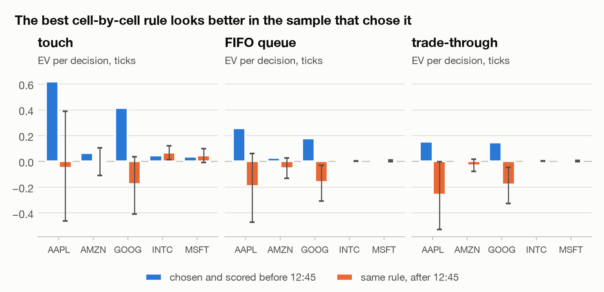
</picture>

| ticker | model | in-sample | out-of-sample | 95% CI | OOS bps | posts | crosses | per trade | net of taker fee | always post | always cross |
|---|---|---|---|---|---|---|---|---|---|---|---|
| AAPL | touch | +0.620 | -0.049 | -0.463 to +0.389 | -0.0085 | 44% | 0% | -0.110 | -0.049 | -0.462 | -6.317 |
| AAPL | fifo | +0.257 | -0.192 | -0.472 to +0.061 | -0.0330 | 24% | 0% | -0.808 | -0.192 | -1.074 | -6.317 |
| AAPL | through | +0.154 | -0.256 | -0.528 to -0.002 | -0.0442 | 24% | 0% | -1.081 | -0.256 | -1.315 | -6.317 |
| AMZN | touch | +0.066 | +0.005 | -0.108 to +0.107 | +0.0022 | 12% | 0% | +0.039 | +0.005 | -0.570 | -5.630 |
| AMZN | fifo | +0.027 | -0.051 | -0.129 to +0.028 | -0.0231 | 9% | 0% | -0.574 | -0.051 | -0.913 | -5.630 |
| AMZN | through | +0.013 | -0.030 | -0.076 to +0.017 | -0.0135 | 2% | 0% | -1.309 | -0.030 | -1.027 | -5.630 |
| GOOG | touch | +0.413 | -0.176 | -0.409 to +0.037 | -0.0310 | 32% | 0% | -0.550 | -0.176 | -0.882 | -10.753 |
| GOOG | fifo | +0.179 | -0.158 | -0.307 to -0.029 | -0.0279 | 11% | 0% | -1.464 | -0.158 | -1.448 | -10.753 |
| GOOG | through | +0.147 | -0.179 | -0.327 to -0.046 | -0.0315 | 11% | 0% | -1.654 | -0.179 | -1.598 | -10.753 |
| INTC | touch | +0.045 | +0.069 | +0.014 to +0.121 | +0.2571 | 80% | 1% | +0.085 | +0.067 | +0.092 | -0.318 |
| INTC | fifo | +0.008 | +0.002 | +0.000 to +0.004 | +0.0066 | 0% | 1% | +0.250 | -0.000 | -0.122 | -0.318 |
| INTC | through | +0.008 | +0.002 | +0.000 to +0.004 | +0.0066 | 0% | 1% | +0.250 | -0.000 | -0.126 | -0.318 |
| MSFT | touch | +0.036 | +0.044 | -0.008 to +0.098 | +0.1465 | 68% | 1% | +0.065 | +0.042 | +0.037 | -0.330 |
| MSFT | fifo | +0.005 | +0.003 | -0.003 to +0.010 | +0.0086 | 0% | 1% | +0.300 | -0.000 | -0.175 | -0.330 |
| MSFT | through | +0.005 | +0.003 | -0.003 to +0.009 | +0.0086 | 0% | 1% | +0.300 | -0.000 | -0.182 | -0.330 |

The in-sample EV exceeds the out-of-sample EV in 13 of 15 ticker × model cases, by +0.197 ticks per decision on average. EV is per share, the CIs come from a block bootstrap over 5-minute blocks, and the bps figures use each decision's own mid.

## Does the signal survive realistic fills?

**No.** Chosen before 12:45 and scored after, the best post-or-cross rule under FIFO fills earns AAPL -0.192, AMZN -0.051, GOOG -0.158, INTC +0.002 and MSFT +0.003 ticks per decision: reliably negative for GOOG; indistinguishable from zero for AAPL, AMZN and MSFT; positive for INTC only because it trades on 1% of decisions for +0.25 ticks each, which a 0.3-tick taker fee wipes out. Touch fills would have said yes: INTC +0.069 ticks per decision, confidence interval above zero. The fee test charges every cross the Reg NMS access-fee cap, $0.003 a share = 0.3 ticks, and credits posts nothing, although a maker would collect a rebate of similar size.

## C++ core

The replay is sequential and keeps state (queues, ids behind us, timeouts), so it cannot be vectorised, and it is the part worth porting; the NumPy analysis around it is not. cProfile on the Python reference (MSFT, fifo) spends 1.96 s in 4,104,345 function calls. The loop body itself is 68% of that; the rest is spread across millions of tiny list, dict and set operations. `cpp/queue_sim.cpp` ports the loop step for step (ordered maps of live orders by price, a min-heap of deadlines, a sorted id set for the orders behind us), and `cpp/bindings.cpp` exposes it to NumPy through pybind11. `fills.simulate(engine="auto")` uses it when it is built. Its output is bit-identical to the Python reference on every run. That is checked here and in `tests/test_cpp_equivalence.py`: the five real days, seeded streams with hundreds of concurrent orders, and random `hypothesis` event streams (halts, crosses, timestamp ties, orders that cross the book or sit outside the visible levels).

Throughput on this machine (arm64, macOS-26.6.2-arm64-arm-64bit), median of 5 timed runs after one warm-up, time.perf_counter around markout.lob.fills.simulate(engine=...); messages replayed = messages from the first placement to the last order's end; the order set of report 02. The C++ speed-up is 26–47× (median 27× for FIFO). Even the Python reference replays a whole day in at most 0.82 s, so the port matters when the same replay runs over many days, parameter grids or much larger order sets.

<picture>
  <source media="(prefers-color-scheme: dark)" srcset="figures/g_throughput_dark.png">
  
</picture>

| ticker | model | orders | messages replayed | Python (ms) | C++ (ms) | Python (M msg/s) | C++ (M msg/s) | speed-up | identical |
|---|---|---|---|---|---|---|---|---|---|
| AAPL | touch | 9,074 | 378,554 | 433.2 | 12.61 | 0.87 | 30.0 | 34× | yes |
| AAPL | fifo | 9,074 | 378,658 | 456.6 | 14.27 | 0.83 | 26.5 | 32× | yes |
| AAPL | through | 9,074 | 378,658 | 449.8 | 13.10 | 0.84 | 28.9 | 34× | yes |
| AMZN | touch | 9,074 | 259,120 | 322.8 | 9.61 | 0.80 | 27.0 | 34× | yes |
| AMZN | fifo | 9,074 | 259,120 | 345.7 | 11.91 | 0.75 | 21.8 | 29× | yes |
| AMZN | through | 9,074 | 259,722 | 331.8 | 10.05 | 0.78 | 25.8 | 33× | yes |
| GOOG | touch | 9,074 | 141,631 | 190.1 | 6.54 | 0.75 | 21.7 | 29× | yes |
| GOOG | fifo | 9,074 | 141,631 | 201.2 | 7.81 | 0.70 | 18.1 | 26× | yes |
| GOOG | through | 9,074 | 141,631 | 193.2 | 6.80 | 0.73 | 20.8 | 28× | yes |
| INTC | touch | 9,074 | 574,518 | 624.2 | 13.62 | 0.92 | 42.2 | 46× | yes |
| INTC | fifo | 9,074 | 575,144 | 824.3 | 32.27 | 0.70 | 17.8 | 26× | yes |
| INTC | through | 9,074 | 575,144 | 644.3 | 13.70 | 0.89 | 42.0 | 47× | yes |
| MSFT | touch | 9,074 | 633,523 | 667.2 | 14.37 | 0.95 | 44.1 | 46× | yes |
| MSFT | fifo | 9,074 | 633,769 | 794.2 | 29.13 | 0.80 | 21.8 | 27× | yes |
| MSFT | through | 9,074 | 633,769 | 697.8 | 15.95 | 0.91 | 39.7 | 44× | yes |

<details><summary>cProfile of the Python reference (top rows by own time)</summary>

```
4104345 function calls (4104339 primitive calls) in 1.962 seconds

   Ordered by: internal time
   List reduced from 68 to 12 due to restriction <12>

   ncalls  tottime  percall  cumtime  percall filename:lineno(function)
        1    1.333    1.333    1.932    1.932 src/markout/lob/fills.py:168(simulate_python)
       15    0.109    0.007    0.109    0.007 {method 'tolist' of 'numpy.ndarray' objects}
   558302    0.070    0.000    0.070    0.000 src/markout/lob/fills.py:295(<listcomp>)
   558302    0.068    0.000    0.068    0.000 src/markout/lob/fills.py:293(<listcomp>)
     9074    0.063    0.000    0.063    0.000 src/markout/lob/fills.py:231(<lambda>)
   508099    0.061    0.000    0.061    0.000 src/markout/lob/fills.py:286(<listcomp>)
   508099    0.060    0.000    0.060    0.000 src/markout/lob/fills.py:288(<listcomp>)
     9074    0.040    0.000    0.040    0.000 src/markout/lob/fills.py:159(_depth)
   633768    0.031    0.000    0.031    0.000 {method 'get' of 'dict' objects}
        1    0.030    0.030    1.962    1.962 src/markout/lob/fills.py:363(simulate)
   557314    0.030    0.000    0.030    0.000 {method 'add' of 'set' objects}
   446756    0.021    0.000    0.021    0.000 {method 'discard' of 'set' objects}
```

</details>

Build: `make cpp` (CMake + pybind11; `-O3 -ffp-contract=off`, no fast-math, so float results cannot drift). Rerun: `make bench`.

## Limitations

- **One day, 2012.** Five stocks on 2012-06-21. Queue dynamics, fees and the tick-size regime of these names have changed since, and one day is a small sample for anything intraday.
- **No impact of our own orders.** Each hypothetical order is replayed alone. Nobody reacts to it, and it takes no liquidity away from anyone else. Real queue position also depends on latency, which is zero here.
- **Queue-model assumptions.** The queue ahead is an aggregate share count, not a list of orders. Any cancel of an id not seen joining after us is assumed to be ahead of us. Every visible execution at our price consumes the queue ahead first, whichever order it hit. A print through our price, or the opposite quote reaching it, fills the whole order. Orders are cancelled when their price leaves the 10 visible levels, because LOBSTER records nothing deeper.
- **Fees, rebates and hidden liquidity.** Exchange fees and maker rebates are excluded. Hidden executions are ignored by FIFO, and nearly all of them print inside the spread (midpoint orders).
- **Level-1 OFI.** Changes behind the best are invisible to e_n, as the flickering-quote window shows.
