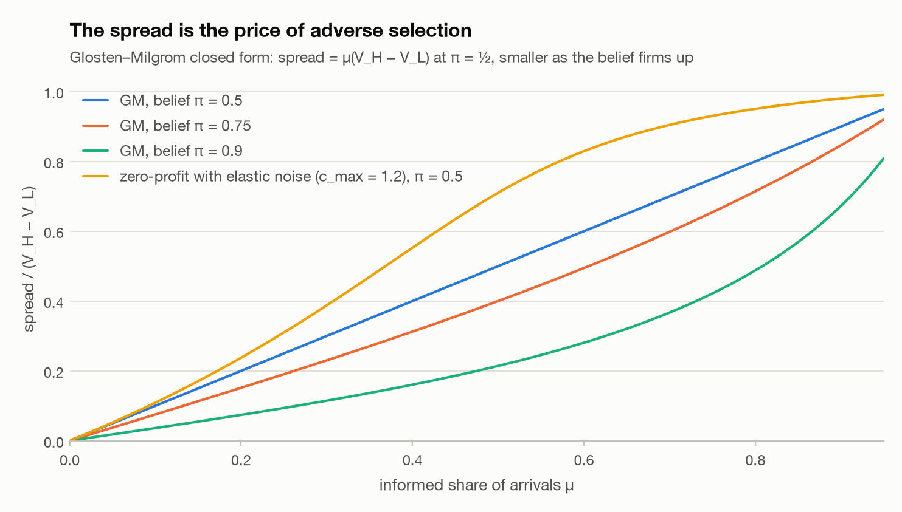
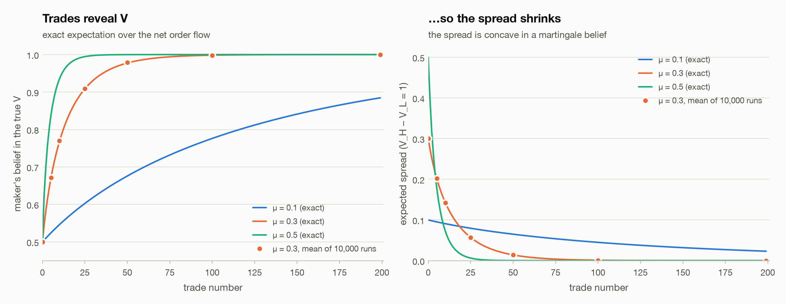
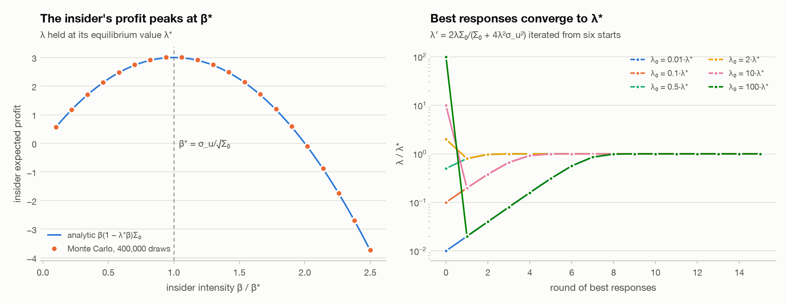
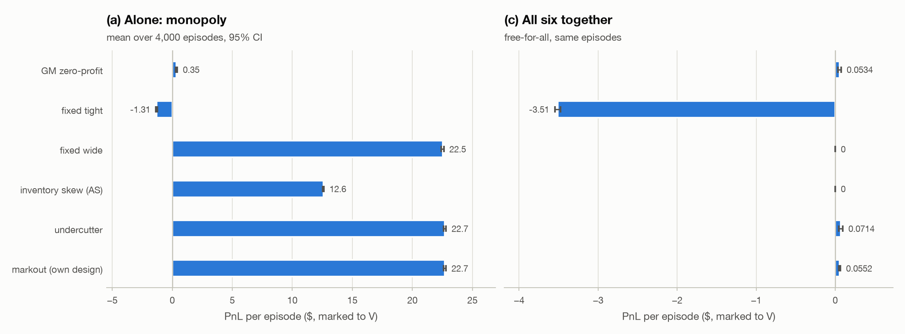
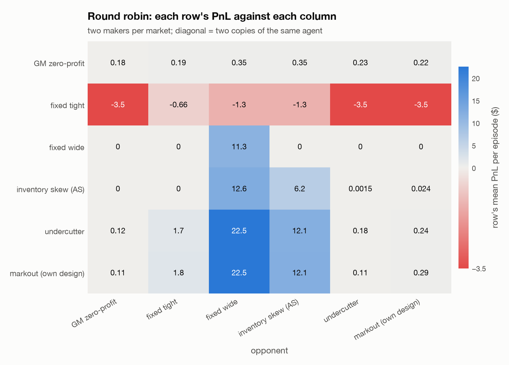
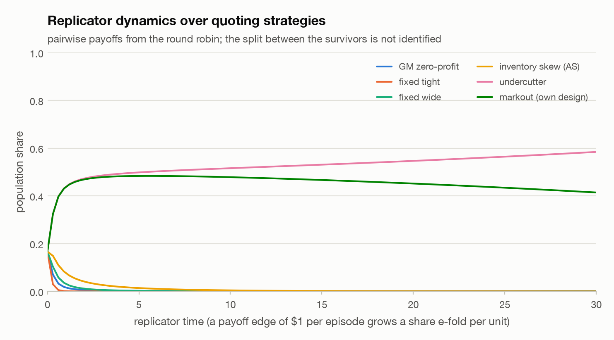
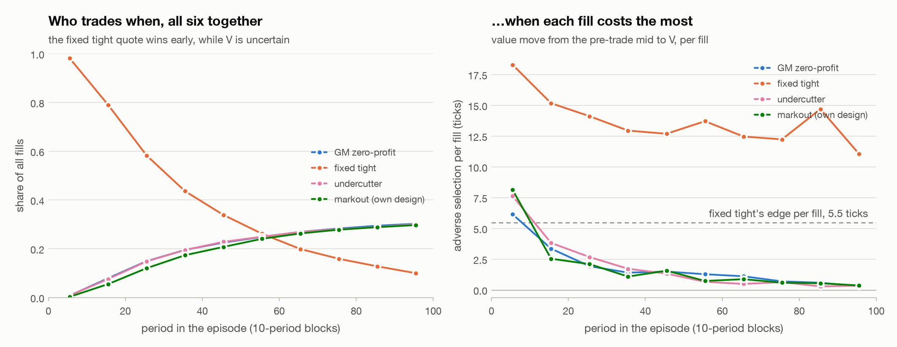
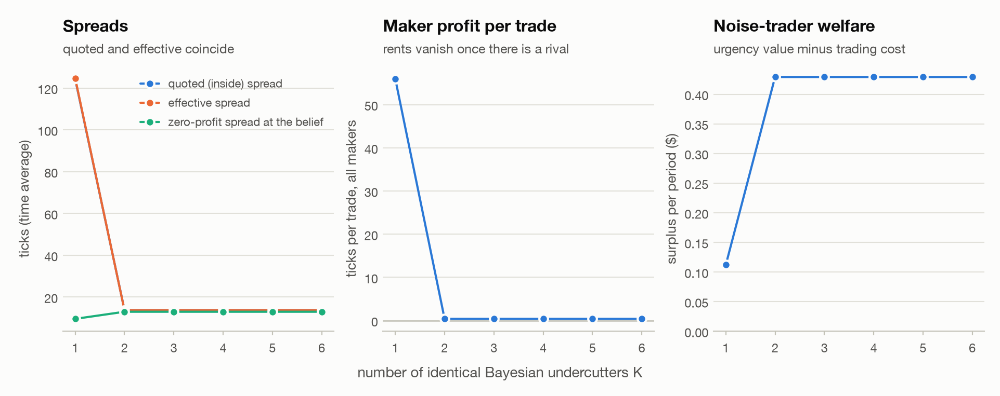
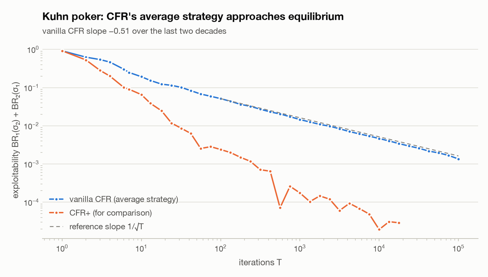
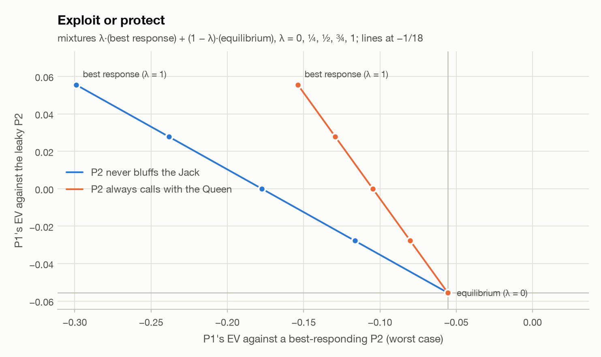

# Arena: game theory under simulated competition

**Competition prices adverse selection; it does not remove it.** In a Glosten–Milgrom market with elastic noise demand, a lone Bayesian undercutter quotes a time-average spread of 124 ticks and earns 22.7 dollars per episode. One identical rival brings the spread down to 13.8 ticks, 0.8 ticks above the zero-profit spread at the same beliefs. Maker profit falls from 55.9 to 0.4 ticks per trade, and noise-trader welfare rises from 0.112 to 0.429 dollars per period. A naive fixed tight quote loses 1.31 dollars per episode alone and 3.51 in the free-for-all. There it wins 98.2% of the fills in the first 10 periods, while V is still uncertain. Each of those fills carries 18.3 ticks of adverse selection against its 5.44-tick edge: the quote that wins the flow is the one that was too cheap. The round-robin winner is the undercutter.

The textbook pieces check out against closed forms. The GM spread at π = ½ equals μ(V_H − V_L) exactly in rational arithmetic, and the maker's mean profit over 10,000 runs is 0.00012 (95% CI -0.016 to 0.016). Kyle's best responses converge to λ* from all 6 starts, and the Monte Carlo insider profit peaks at β/β* = 1.00. After 100,000 iterations CFR's average strategy is worth -0.055555 to player 1 (−1/18 = -0.055556), with exploitability 0.00135.

## 1. Question

SIG's research interns "create strategies to execute on modelling ideas under simulated competition". This module builds that competition and asks the question behind the project's thesis: when makers compete for order flow that is partly informed, what does winning the flow cost? The winner's-curse view predicts that the quote that trades is disproportionately the one that was wrong. Three sub-questions:

- Are the textbook models implemented exactly? Glosten–Milgrom (1985), Kyle (1985) and Kuhn poker are each checked against their closed forms.
- Does a simulated dealer market reproduce the three textbook results? These are monopoly rents, Bertrand compression of spreads to the zero-profit level, and losses for naive tight quoting.
- How much is each fill adversely selected, and who ends up paying for it?

## 2. Models and method

Code: `src/markout/games/` (`glosten_milgrom.py`, `kyle.py`, `arena.py`, `kuhn_cfr.py`, `cardgame.py`). Tests: `tests/test_games_*.py`. All randomness comes from fixed seeds, and every interval below is a 95% CI across independent runs. Ratios such as PnL per fill use the delta method on per-episode totals.

**E1 Glosten–Milgrom (1985).** V ∈ {V_L, V_H} with belief π. Each trader is informed with probability μ; otherwise it buys or sells with probability ½. The maker quotes ask = E[V | buy] and bid = E[V | sell], which gives ask − bid = (V_H − V_L)·4π(1 − π)μ / (1 − μ²(2π − 1)²). The belief updates by Bayes' rule after each trade. The belief depends only on net order flow, so the expected spread and belief paths are also computed exactly, by summing over the binomial distribution of buys.

**E2 Kyle (1985).** v ~ N(p₀, Σ₀) with Σ₀ = 4. Noise flow u ~ N(0, σ_u²) with σ_u = 3. The insider trades x = β(v − p₀) and the maker sets p = p₀ + λ(x + u). The closed form is β* = σ_u/√Σ₀ and λ* = √Σ₀/(2σ_u). It is checked by iterating best responses, λ ← 2λΣ₀/(Σ₀ + 4λ²σ_u²), and by Monte Carlo over β with λ held at λ*.

**E3 The tournament.** Each episode draws a binary V as in GM. That keeps the Bayesian benchmark exact: the zero-profit quote at every belief has a closed form, so "did competition reach the zero-profit spread?" is checked against an exact number each period. An episode is one information event, as in GM and the PIN model. Each period one trader arrives:

- with probability μ it is informed: it knows V and trades one unit if the best quote is profitable;
- otherwise it is a noise trader with a coin-flip direction and urgency c ~ U[0, c_max]. It trades only if the half-spread it pays, measured from the public mid, is below c.

Measuring each side from the mid follows Avellaneda–Stoikov's arrival intensities, and it means a maker cannot tax one side for free by skewing. The elasticity gives a monopolist a finite optimal spread. Makers quote on a tick grid and the trader hits the best price, with ties split at random. All makers see the same tape and share one exact Bayesian belief, so they differ only in quoting policy. PnL is marked to V at the episode end. Each fill's PnL splits exactly into its edge over the pre-trade mid minus its adverse selection, the move from that mid to V (the fill's markout).

Quote revisions are much faster than arrivals. Before each arrival the reactive makers revise until nobody moves; the rule is monotone with a unique fixed point, so this is the Bertrand outcome on the tick grid.

| parameter | value |
|---|---|
| value V | 99 or 101, prior P(V_H) = 0.5 |
| informed share of arrivals μ | 0.2 |
| noise urgency c ~ U[0, c_max] | c_max = 1.2 |
| tick | 0.01 |
| arrivals per episode T | 100 |
| episodes per configuration | 4,000 (same seeds for every line-up) |
| zero-profit half-spread at π = ½ | 0.2377 (GM with inelastic noise: 0.2) |
| monopoly half-spread at π = ½ | 0.75 = c_max/(2(1 − μ)), profit 0.175 per period |
| noise participation at those half-spreads | 80.2% and 37.5% |

| agent | key | rule | parameters |
|---|---|---|---|
| GM zero-profit | `gm` | posts the zero-profit quotes ask = E[V \| buy], bid = E[V \| sell] at the public belief | none |
| fixed tight | `tight` | public mid ± a fixed half-spread | half-spread 0.05 |
| fixed wide | `wide` | public mid ± a fixed half-spread | half-spread 0.6 |
| inventory skew (AS) | `inventory` | Avellaneda–Stoikov reservation price r = mid − q·γ·σ²·(T − t), fixed half-spread around r | half-spread 0.25, γ = 0.02, σ² = Δ²/(4T) |
| undercutter | `undercut` | one tick inside the best rival's last quote on each side, never below zero profit, never above the monopoly quote (which it posts when alone) | none |
| markout (own design) | `markout` | the undercutter's rule, with floors raised or lowered by the AS indifference term (1 ∓ 2q)·γ·Var(V \| tape)/2 and the monopoly quote centred on the reservation price | γ = 0.02, Var = π(1 − π)Δ² |

Runs, each over the same episodes:

- (a) each agent alone;
- (b) all 15 head-to-heads, plus each agent against a copy of itself for the replicator dynamics;
- (c) all six together;
- (d) K = 1…6 identical undercutters.

**E4 Kuhn poker.** Vanilla CFR (Zinkevich et al. 2007; Neller & Lanctot 2013) runs with full-tree traversal of all six deals. The strategy is fixed within each iteration, and the run lasts 100,000 iterations. Exploitability is BR₁(σ₂) + BR₂(σ₁), from an exact best-response routine; the tests check it against brute force over all 2⁶ pure strategies. CFR+ (Tammelin 2014) is run for 20,000 iterations only as a comparison curve.

**E5 Card game.** `python -m markout.games.cardgame`. You make markets, no wider than 4, on the sum of 5 face-down cards. 3 bots trade each round, each informed with probability 0.4; an informed bot knows one face-down card and trades only against a quote that is wrong relative to it. Then one card is turned up. The benchmark is E[S | revealed cards, trades], computed by importance sampling and validated against exact enumeration in the tests.

## 3. Results

### 3.1 Glosten–Milgrom

- **Spread at π = ½.** In exact rational arithmetic the spread equals μ(V_H − V_L) for every case tested (10 cases: all equal). With V ∈ {0, 1}: μ = 1/10: 1/10, μ = 1/5: 1/5, μ = 3/10: 3/10, μ = 1/2: 1/2, μ = 9/10: 9/10.
- **Zero expected profit.** Over 10,000 simulated markets of 200 trades (μ = 0.3), the maker's mean PnL is 0.000121 (95% CI -0.016 to 0.0163), and the interval contains 0. As a check on the interval itself, across 60 further independent batches of 10,000 runs it covered 0 in 98.3% of batches (nominal 95%), and the pooled z-score is 1.2.
- **Zero-sum accounting.** Insiders earn 1.64 (95% CI 1.60 to 1.67) per market and noise traders lose 1.64 (95% CI 1.59 to 1.69). Maker + insiders + noise sum to zero in every run (largest error 7.1e-15), so on average the insiders' gain is the noise traders' loss.
- **Regret-free quotes.** Among first trades that were buys, the mean realized V is 0.6525 (95% CI 0.6393 to 0.6656) against an ask of 0.65. For sells it is 0.3437 (95% CI 0.3305 to 0.3569) against a bid of 0.35.
- **The spread shrinks as trades reveal V.** The exact expected spread falls at every trade (monotone), to 0.00238% of its initial value after 200 trades. The simulation matches the exact path at every checkpoint (table below).

<picture>
  <source media="(prefers-color-scheme: dark)" srcset="figures/e_gm_spread_mu_dark.png">
  
</picture>

| μ | π = 0.5 | π = 0.75 | π = 0.9 | elastic zero-profit, π = 0.5 |
|---|---|---|---|---|
| 0.1 | 0.1000 | 0.0752 | 0.0362 | 0.1089 |
| 0.2 | 0.2000 | 0.1515 | 0.0739 | 0.2377 |
| 0.3 | 0.3000 | 0.2302 | 0.1146 | 0.3877 |
| 0.5 | 0.5000 | 0.4000 | 0.2143 | 0.7101 |
| 0.7 | 0.7000 | 0.5983 | 0.3671 | 0.9046 |
| 0.9 | 0.9000 | 0.8464 | 0.6728 | 0.9800 |

Elastic noise demand widens the zero-profit spread. A wider spread drives away noise traders, which raises the informed share of the flow that remains. With the tournament's c_max = 1.2 the zero-profit spread is wider than GM's μ(V_H − V_L) at every μ in the chart.

<picture>
  <source media="(prefers-color-scheme: dark)" srcset="figures/e_gm_convergence_dark.png">
  
</picture>

| trade t | exact E[spread] | simulated mean | 95% CI | exact E[belief in true V] | simulated |
|---|---|---|---|---|---|
| 0 | 0.30000 | 0.30000 | 0.30000 to 0.30000 | 0.5000 | 0.5000 |
| 5 | 0.20214 | 0.20231 | 0.20073 to 0.20389 | 0.6701 | 0.6717 |
| 10 | 0.14322 | 0.14224 | 0.14030 to 0.14419 | 0.7678 | 0.7697 |
| 25 | 0.05685 | 0.05673 | 0.05504 to 0.05842 | 0.9086 | 0.9086 |
| 50 | 0.01402 | 0.01373 | 0.01283 to 0.01463 | 0.9775 | 0.9788 |
| 100 | 0.00102 | 9.64e-04 | 7.26e-04 to 0.00120 | 0.9984 | 0.9982 |
| 199 | 7.14e-06 | 3.96e-06 | -7.96e-07 to 8.71e-06 | 1.0000 | 1.0000 |

### 3.2 Kyle

With Σ₀ = 4 and σ_u = 3 the closed form gives β* = 1.500, λ* = 0.3333, insider expected profit ½σ_u√Σ₀ = 3.000, and posterior variance Σ₀/2 = 2.000.

- **Best-response iteration.** From all 6 starts (0.01λ* to 100λ*) the map converges to λ*, within 1e-10 in at most 11 rounds. After the first round λ never exceeds λ*, and it rises monotonically from there; near λ* the convergence is quadratic, because the map's slope at λ* is zero.
- **Monte Carlo over β.** With λ fixed at λ* and 400,000 draws of (v, u), the insider's mean profit peaks at β/β* = 1.00 on a grid of step 0.01. Its level at β* is 3.019 ± 0.016 against the analytic 3.000 (z = 2.3). That point misses its 95% interval. The curve is a single set of draws reused for every β (common random numbers), so its errors are strongly correlated along β. The largest deviation anywhere on the grid is 2.6 standard errors, and the location of the peak, which is the claim being tested, is unaffected.
- **The maker's side.** With the insider at β*, the OLS slope of v on order flow is 0.333 (λ* = 0.3333) and the residual variance is 1.994 (Σ₀/2 = 2.000).

<picture>
  <source media="(prefers-color-scheme: dark)" srcset="figures/e_kyle_profit_dark.png">
  
</picture>

| β/β* | analytic | Monte Carlo | 95% CI |
|---|---|---|---|
| 0.25 | 1.3125 | 1.3188 | 1.3126 to 1.3250 |
| 0.5 | 2.2500 | 2.2616 | 2.2506 to 2.2725 |
| 0.75 | 2.8125 | 2.8283 | 2.8141 to 2.8426 |
| 0.9 | 2.9700 | 2.9878 | 2.9723 to 3.0034 |
| 1 | 3.0000 | 3.0190 | 3.0028 to 3.0352 |
| 1.1 | 2.9700 | 2.9900 | 2.9733 to 3.0066 |
| 1.25 | 2.8125 | 2.8336 | 2.8166 to 2.8507 |
| 1.5 | 2.2500 | 2.2722 | 2.2551 to 2.2894 |
| 2 | 0.0000 | 0.0213 | 0.0027 to 0.0400 |
| 2.5 | -3.7500 | -3.7338 | -3.7622 to -3.7053 |

| start λ₀/λ* | rounds to \|λ/λ* − 1\| < 1e-10 | λ₁/λ* | λ₂/λ* | λ₃/λ* |
|---|---|---|---|---|
| 0.01 | 11 | 0.0200 | 0.0400 | 0.0798 |
| 0.1 | 7 | 0.1980 | 0.3811 | 0.6655 |
| 0.5 | 5 | 0.8000 | 0.9756 | 0.9997 |
| 2 | 5 | 0.8000 | 0.9756 | 0.9997 |
| 10 | 7 | 0.1980 | 0.3811 | 0.6655 |
| 100 | 11 | 0.0200 | 0.0400 | 0.0798 |

**Bridge to module D: CKS's β is a cousin of Kyle's λ, not the same object.**

In Kyle's model every order is a trade and the price is an exact linear function of net order flow, p − p₀ = λy. The regression of the price change on flow therefore has R² = 1, and its slope is λ = s.d.(Δp)/s.d.(y). CKS's β is the slope of the mid change on order-flow imbalance (OFI), and OFI also counts limit orders joining and leaving the best quotes, not only trades. That breaks the identity in two ways. First, R² < 1, so the OLS slope √R²·s.d.(Δmid)/s.d.(OFI) is smaller than the Kyle-style ratio s.d.(Δmid)/s.d.(OFI) by a factor √R². Second, OFI is mostly quote traffic rather than trading, so a share of OFI is not a share of Kyle's y. For the same price variance, OFI's larger dispersion makes the impact per share of OFI smaller than a trade-based λ per share would be. That is an expectation, not a measurement here.

Module D's full-day CKS slopes run from 0.0201 (INTC) to 5.29 (GOOG) ticks per 1,000 shares of OFI. Their R² runs from 0.17 to 0.8, so the Kyle-style ratio is larger than β by a factor of 1.1 to 2.4. β × mean depth runs from 0.24 to 0.82 ticks; CKS's stylized book predicts ½, since OFI equal to the depth at the best moves the mid by half a tick.

| stock | CKS β (ticks per 1,000 sh of OFI) | R² | Kyle-style ratio β/√R² | mean depth at best (sh) | β × depth (ticks) |
|---|---|---|---|---|---|
| AAPL | 4.105 | 0.427 | 6.282 | 152 | 0.625 |
| AMZN | 2.501 | 0.331 | 4.351 | 178 | 0.445 |
| GOOG | 5.295 | 0.171 | 12.8 | 155 | 0.822 |
| INTC | 0.02013 | 0.742 | 0.02337 | 13,632 | 0.274 |
| MSFT | 0.02093 | 0.795 | 0.02347 | 11,313 | 0.237 |

A trade-based Kyle λ is not computed: module D reports CKS β per share of OFI; a trade-based Kyle λ would also need the per-bucket s.d. of Δmid and of net traded volume. `kyle_bridge()` computes it automatically if module D adds `sd_dmid_ticks` and `sd_trade_imbalance_k` per stock.

### 3.3 The tournament

#### (a) Each agent alone

Alone, the undercutter earns the most, 22.7 (95% CI 22.6 to 22.8) dollars per episode, with a time-average quoted spread of 124 ticks against a zero-profit spread of 9.59 at the same beliefs. The fixed wide quote comes close, at 22.5: a monopolist earns rents by quoting wide. The GM quoter posts its zero-profit quotes even as a monopolist and earns 0.4 (95% CI 0.31 to 0.49) ticks per fill. That is the rent from rounding quotes away from the mid to the tick grid, bounded by one tick. The fixed tight quote loses 1.31 (95% CI 1.25 to 1.37) per episode. Its adverse selection per fill (6.98 ticks) exceeds its edge (5.46 ticks).

| agent | PnL per episode | PnL s.d. | fill share | fills | PnL per fill (ticks) | edge per fill (ticks) | adverse selection per fill (ticks) | informed share of fills | mean inventory² |
|---|---|---|---|---|---|---|---|---|---|
| GM zero-profit | 0.35 (95% CI 0.273 to 0.427) | 2.48 | 100% | 87.6 | 0.4 | 6.84 | 6.44 | 14.0% | 105 |
| fixed tight | -1.31 (95% CI -1.37 to -1.25) | 1.88 | 100% | 86.3 | -1.52 | 5.46 | 6.98 | 11.6% | 79.8 |
| fixed wide | 22.5 (95% CI 22.4 to 22.6) | 3.45 | 100% | 42.6 | 52.9 | 60.5 | 7.61 | 6.90% | 21.4 |
| inventory skew (AS) | 12.6 (95% CI 12.5 to 12.6) | 1.87 | 100% | 68.4 | 18.4 | 25.3 | 6.94 | 7.94% | 25.4 |
| undercutter | 22.7 (95% CI 22.6 to 22.8) | 3.62 | 100% | 40.6 | 55.9 | 62.3 | 6.38 | 5.01% | 19.8 |
| markout (own design) | 22.7 (95% CI 22.6 to 22.8) | 3.32 | 100% | 40.7 | 55.8 | 62.3 | 6.46 | 5.23% | 17.7 |

<picture>
  <source media="(prefers-color-scheme: dark)" srcset="figures/e_arena_pnl_dark.png">
  
</picture>

#### (b) Round robin

The undercutter wins the round robin, 4–1–0, level on wins with the GM zero-profit quoter and ahead on total PnL by 35.3 (95% CI 35.1 to 35.6) dollars per episode summed over its five matches. My own design, markout, does **not** beat the plain undercutter on mean PnL. It loses their match by 0.132 (95% CI 0.0497 to 0.213) dollars per episode. It also loses to the GM zero-profit quoter, by 0.105 (95% CI 0.0244 to 0.187). What its inventory term buys is risk. In the match with the undercutter, markout's PnL s.d. is 0.459 against 2.53, and its mean inventory² is 8.31 against 71.6. Its fills carry 3.14 ticks of adverse selection each, against 8.38 for the undercutter's; they also earn less edge (3.48 against 8.82 ticks). Skewing lets markout step aside from one-directional flow, which is disproportionately informed, and leaves the risk-neutral maker to absorb it. Scored on mean PnL, as here, that trade costs a little expected profit.

| agent | W–D–L | total PnL over its 5 matches |
|---|---|---|
| undercutter | 4–1–0 | 36.7 (95% CI 36.5 to 36.9) |
| GM zero-profit | 4–1–0 | 1.33 (95% CI 1.05 to 1.62) |
| markout (own design) | 3–0–2 | 36.6 (95% CI 36.4 to 36.7) |
| inventory skew (AS) | 2–0–3 | 12.6 (95% CI 12.5 to 12.7) |
| fixed wide | 1–0–4 | 0 (95% CI 0 to 0) |
| fixed tight | 0–0–5 | -13.2 (95% CI -13.4 to -12.9) |

| match | PnL (first) | PnL (second) | difference, 95% CI | fill share (first) | winner |
|---|---|---|---|---|---|
| GM zero-profit vs fixed tight | 0.185 | -3.51 | 3.69 (95% CI 3.66 to 3.73) | 58.0% | GM zero-profit |
| GM zero-profit vs fixed wide | 0.35 | 0 | 0.35 (95% CI 0.273 to 0.427) | 100% | GM zero-profit |
| GM zero-profit vs inventory skew (AS) | 0.35 | 0 | 0.35 (95% CI 0.273 to 0.427) | 100% | GM zero-profit |
| GM zero-profit vs undercutter | 0.23 | 0.121 | 0.109 (95% CI -0.0351 to 0.254) | 49.9% | draw |
| GM zero-profit vs markout (own design) | 0.218 | 0.113 | 0.105 (95% CI 0.0244 to 0.187) | 63.2% | GM zero-profit |
| fixed tight vs fixed wide | -1.31 | 0 | -1.31 (95% CI -1.37 to -1.25) | 100% | fixed wide |
| fixed tight vs inventory skew (AS) | -1.31 | 0 | -1.31 (95% CI -1.37 to -1.25) | 100% | inventory skew (AS) |
| fixed tight vs undercutter | -3.52 | 1.75 | -5.26 (95% CI -5.31 to -5.21) | 43.7% | undercutter |
| fixed tight vs markout (own design) | -3.51 | 1.76 | -5.27 (95% CI -5.32 to -5.23) | 44.7% | markout (own design) |
| fixed wide vs inventory skew (AS) | 0 | 12.6 | -12.6 (95% CI -12.6 to -12.5) | 0% | inventory skew (AS) |
| fixed wide vs undercutter | 0 | 22.5 | -22.5 (95% CI -22.6 to -22.4) | 0% | undercutter |
| fixed wide vs markout (own design) | 0 | 22.5 | -22.5 (95% CI -22.6 to -22.4) | 0% | markout (own design) |
| inventory skew (AS) vs undercutter | 0.00149 | 12.1 | -12.1 (95% CI -12.2 to -12.0) | 0.0231% | undercutter |
| inventory skew (AS) vs markout (own design) | 0.0236 | 12.1 | -12.1 (95% CI -12.2 to -12.0) | 4.14% | markout (own design) |
| undercutter vs markout (own design) | 0.242 | 0.111 | 0.132 (95% CI 0.0497 to 0.213) | 62.9% | undercutter |

<picture>
  <source media="(prefers-color-scheme: dark)" srcset="figures/e_arena_h2h_dark.png">
  
</picture>

**Replicator dynamics (stretch).** Treat the round-robin payoff matrix, diagonal included, as a population game: strategies that beat the population average grow, x_i ← x_i·exp(dt·(Ax)_i)/Z. Starting from equal shares, by replicator time 30 the loss-making and rent-seeking quoters are gone. Across 200 bootstrap resamples of the episodes, the other three strategies together keep at most 0.0195% of the population, and the zero-profit trio (GM, undercutter, markout) holds the rest. How that share splits among the trio is not identified. The payoff differences that decide it are close to their Monte Carlo error, so the split varies widely across resamples (the 90% intervals below; survivors with more than 1% in some resample: undercutter, markout quoter). The GM quoter is crowded out early because it takes no rent from the wide quoters while they still exist.

<picture>
  <source media="(prefers-color-scheme: dark)" srcset="figures/e_arena_replicator_dark.png">
  
</picture>

| agent | share at the horizon | bootstrap 90% interval | payoff vs itself |
|---|---|---|---|
| GM zero-profit | 0.156% | 0.028% to 0.567% | 0.175 |
| fixed tight | < 0.001% | < 0.001% to < 0.001% | -0.655 |
| fixed wide | < 0.001% | < 0.001% to < 0.001% | 11.3 |
| inventory skew (AS) | 0.0084% | 0.00496% to 0.0125% | 6.23 |
| undercutter | 58.4% | 23.8% to 87.6% | 0.175 |
| markout (own design) | 41.4% | 12.0% to 76.2% | 0.291 |

#### (c) All six together

The fixed tight quote takes 41.1% of all fills and loses 3.51 (95% CI 3.48 to 3.55) dollars per episode. Its adverse selection per fill is 14.9 ticks against an edge of 5.47. When it wins is the point. In periods 1–10 it takes 98.2% of the fills, and each carries 18.3 ticks of adverse selection against a 5.44-tick edge. By periods 51–100 the Bayesian quotes, whose spread falls as V is revealed, sit inside it, and its share is 17.1%. It wins the flow exactly when its quote is too cheap for the information in the flow. The wide and inventory quoters never set the best price and do not trade.

| agent | PnL per episode | PnL s.d. | fill share | fills | PnL per fill (ticks) | edge per fill (ticks) | adverse selection per fill (ticks) | informed share of fills | mean inventory² |
|---|---|---|---|---|---|---|---|---|---|
| GM zero-profit | 0.0534 (95% CI 0.0329 to 0.0739) | 0.661 | 20.1% | 18.2 | 0.294 | 1.43 | 1.14 | 9.88% | 8.87 |
| fixed tight | -3.51 (95% CI -3.55 to -3.48) | 1.18 | 41.1% | 37.2 | -9.45 | 5.47 | 14.9 | 19.8% | 27.4 |
| fixed wide | 0 (95% CI 0 to 0) | 0 | 0% | 0 | n/a | n/a | n/a | n/a | 0 |
| inventory skew (AS) | 0 (95% CI 0 to 0) | 0 | 0% | 0 | n/a | n/a | n/a | n/a | 0 |
| undercutter | 0.0714 (95% CI 0.0474 to 0.0953) | 0.773 | 20.0% | 18.1 | 0.395 | 1.43 | 1.03 | 9.78% | 8.78 |
| markout (own design) | 0.0552 (95% CI 0.0447 to 0.0657) | 0.339 | 18.8% | 17.0 | 0.325 | 1.26 | 0.932 | 8.43% | 5.30 |

Market level: time-average quoted spread 5.80 ticks (zero-profit 14.1), maker profit -3.7 ticks per trade, noise-trader welfare 0.457 per period. The naive quoter subsidizes everyone else: informed traders earn 5.50 per episode.

<picture>
  <source media="(prefers-color-scheme: dark)" srcset="figures/e_arena_curse_dark.png">
  
</picture>

| periods | GM zero-profit: fill share / adverse per fill (ticks) | fixed tight: fill share / adverse per fill (ticks) | undercutter: fill share / adverse per fill (ticks) | markout (own design): fill share / adverse per fill (ticks) |
|---|---|---|---|---|
| 1–10 | 0.756% / 6.14 | 98.2% / 18.3 | 0.782% / 7.62 | 0.268% / 8.13 |
| 11–25 | 9.78% / 3.10 | 73.6% / 15.1 | 9.42% / 3.23 | 7.17% / 2.46 |
| 26–50 | 20.0% / 1.40 | 41.9% / 13.0 | 20.2% / 1.71 | 17.9% / 1.42 |
| 51–100 | 27.9% / 0.773 | 17.1% / 13.0 | 27.7% / 0.474 | 27.3% / 0.609 |

#### (d) K identical Bayesian undercutters

One undercutter alone is a monopolist. It quotes 124 ticks, 13.0 times the zero-profit spread, and makes 55.9 ticks per trade. With K = 2 the spread is 13.8 ticks, 0.8 ± 0.0066 ticks above the zero-profit spread, and profit per trade is 0.4 ± 0.088 ticks: rounding rent only. Adding makers beyond two changes nothing at the market level: every K ≥ 2 reaches the same Bertrand fixed point. The flow is simply split, with fill shares from 16.6% to 16.7% at K = 6. Two is enough for Bertrand. Noise traders gain: welfare rises from 0.112 to 0.429 per period, and participation from 48.2% to 94.3%.

<picture>
  <source media="(prefers-color-scheme: dark)" srcset="figures/e_arena_competition_dark.png">
  
</picture>

| K | quoted spread (ticks) | effective spread (ticks) | zero-profit spread (ticks) | excess (ticks) | maker profit per trade (ticks) | noise welfare per period | noise participation | trades per episode |
|---|---|---|---|---|---|---|---|---|
| 1 | 124 ± 0.073 | 125 ± 0.089 | 9.59 ± 0.19 | 115 ± 0.12 | 55.9 ± 0.18 | 0.112 ± 0.0011 | 48.2% | 40.6 |
| 2 | 13.8 ± 0.25 | 13.7 ± 0.25 | 13.0 ± 0.25 | 0.8 ± 0.0066 | 0.4 ± 0.088 | 0.429 ± 0.0022 | 94.3% | 87.6 |
| 3 | 13.8 ± 0.25 | 13.7 ± 0.25 | 13.0 ± 0.25 | 0.8 ± 0.0066 | 0.4 ± 0.088 | 0.429 ± 0.0022 | 94.3% | 87.6 |
| 4 | 13.8 ± 0.25 | 13.7 ± 0.25 | 13.0 ± 0.25 | 0.8 ± 0.0066 | 0.4 ± 0.088 | 0.429 ± 0.0022 | 94.3% | 87.6 |
| 5 | 13.8 ± 0.25 | 13.7 ± 0.25 | 13.0 ± 0.25 | 0.8 ± 0.0066 | 0.4 ± 0.088 | 0.429 ± 0.0022 | 94.3% | 87.6 |
| 6 | 13.8 ± 0.25 | 13.7 ± 0.25 | 13.0 ± 0.25 | 0.8 ± 0.0066 | 0.4 ± 0.088 | 0.429 ± 0.0022 | 94.3% | 87.6 |

### 3.4 Kuhn poker

After 100,000 iterations (8.5 s), vanilla CFR's average strategy is worth -0.0555547 to player 1. The game value is −1/18 = -0.0555556, a gap of 8.5e-07. Its exploitability is 0.00135. Over the last two decades of iterations exploitability falls with slope -0.508 on log–log axes, the O(1/√T) rate of CFR's regret bound. CFR+ reaches 1.3e-05 in 20,000 iterations. The average strategy lands in Kuhn's equilibrium family. P1 bets the Jack with α = 0.2053 (the family allows [0, 1/3]) and the King with 0.6244 (3α = 0.616). After check–bet it calls with the Queen at 0.5412 (α + 1/3 = 0.5387). P2 bluffs the Jack at 0.3357 and calls with the Queen at 0.3334 (both 1/3 in theory).

<picture>
  <source media="(prefers-color-scheme: dark)" srcset="figures/e_cfr_exploitability_dark.png">
  
</picture>

| iterations | value to P1 | exploitability (CFR) | exploitability (CFR+) |
|---|---|---|---|
| 10 | -0.035193 | 0.192 | 0.0654 |
| 100 | -0.055987 | 0.0513 | 0.00239 |
| 1,000 | -0.055557 | 0.0145 | 0.000175 |
| 10,000 | -0.055546 | 0.00464 | 1.93e-05 |
| 100,000 | -0.055555 | 0.00135 | not run |

| infoset | action | CFR average | Kuhn family at CFR's α |
|---|---|---|---|
| `J` | P1 bets the Jack | 0.2053 | 0.2053 |
| `Q` | P1 bets the Queen | 0.0000 | 0.0000 |
| `K` | P1 bets the King | 0.6244 | 0.6160 |
| `Jpb` | P1 calls a bet with the Jack | 0.0000 | 0.0000 |
| `Qpb` | P1 calls with the Queen | 0.5412 | 0.5387 |
| `Kpb` | P1 calls with the King | 1.0000 | 1.0000 |
| `Jp` | P2 bets the Jack after a check (bluff) | 0.3357 | 0.3333 |
| `Qp` | P2 bets the Queen after a check | 0.0000 | 0.0000 |
| `Kp` | P2 bets the King after a check | 1.0000 | 1.0000 |
| `Jb` | P2 calls with the Jack | 0.0000 | 0.0000 |
| `Qb` | P2 calls with the Queen | 0.3334 | 0.3333 |
| `Kb` | P2 calls with the King | 1.0000 | 1.0000 |

**Exploit versus protect.** Two leaky P2s are the equilibrium P2 with one information set changed. P1's equilibrium strategy (Kuhn's family at CFR's α) earns exactly the game value against both: -0.055556 and -0.055556. The leaks sit at information sets where the equilibrium makes P2 indifferent, so equilibrium play neither punishes nor suffers from them. A best response that departs from equilibrium only where the leak pays gains 0.1111 and 0.1111 per hand, respectively. Once P2 adapts, the same strategies earn -0.2991 and -0.1538, against −1/18 for equilibrium play. Each unit of EV gained is paid for with 2.19 and 0.884 units of worst-case EV. Mixing the two strategies moves along a straight line between them (figure).

<picture>
  <source media="(prefers-color-scheme: dark)" srcset="figures/e_kuhn_exploit_dark.png">
  
</picture>

| leak | equilibrium vs leak | best response vs leak | gain | best response vs its best response | cost if P2 adapts | what changes (bet/call probability) |
|---|---|---|---|---|---|---|
| P2 never bluffs the Jack | -0.0556 | 0.0556 | +0.1111 | -0.2991 | 0.2436 | `K` 0.616 → 1.000; `Qpb` 0.539 → 0.000 |
| P2 always calls with the Queen | -0.0556 | 0.0556 | +0.1111 | -0.1538 | 0.0982 | `J` 0.205 → 0.000; `K` 0.616 → 1.000 |

| leak | λ (weight on BR) | EV vs leak | worst-case EV |
|---|---|---|---|
| P2 never bluffs the Jack | 0 | -0.0556 | -0.0556 |
| P2 never bluffs the Jack | 0.25 | -0.0278 | -0.1164 |
| P2 never bluffs the Jack | 0.5 | 0.0000 | -0.1773 |
| P2 never bluffs the Jack | 0.75 | 0.0278 | -0.2382 |
| P2 never bluffs the Jack | 1 | 0.0556 | -0.2991 |
| P2 always calls with the Queen | 0 | -0.0556 | -0.0556 |
| P2 always calls with the Queen | 0.25 | -0.0278 | -0.0801 |
| P2 always calls with the Queen | 0.5 | 0.0000 | -0.1047 |
| P2 always calls with the Queen | 0.75 | 0.0278 | -0.1292 |
| P2 always calls with the Queen | 1 | 0.0556 | -0.1538 |

### 3.5 Card game

The game is for practice, but it has one computed result. Over 300 deals at the default maximum width of 4, the Bayes quoter (centred on E[S | revealed, trades]) makes 11.9 (95% CI 9.35 to 14.5) per game. A quoter that ignores the trades makes 10.2 (95% CI 7.20 to 13.3) on the same deals and bots, a difference of 1.69 (95% CI 0.622 to 2.76) (significant). The value of reading the trades falls steadily as the allowed width grows: +2.06 at width 2, +1.69 at width 4, +0.759 at width 6, +0.318 at width 8. A wide market lets noise flow pay for everything, while a tight one leaves you exposed to anyone who knows a card.

| max width | Bayes quoter PnL per game | ignore-trades quoter | Bayes minus ignore-trades |
|---|---|---|---|
| 2 | -1.78 (95% CI -4.47 to 0.915) | -3.83 (95% CI -7.06 to -0.608) | 2.06 (95% CI 0.886 to 3.23) |
| 4 | 11.9 (95% CI 9.35 to 14.5) | 10.2 (95% CI 7.20 to 13.3) | 1.69 (95% CI 0.622 to 2.76) |
| 6 | 23.9 (95% CI 21.4 to 26.4) | 23.1 (95% CI 20.2 to 26.1) | 0.759 (95% CI -0.192 to 1.71) |
| 8 | 35.6 (95% CI 33.1 to 38.1) | 35.2 (95% CI 32.4 to 38.1) | 0.318 (95% CI -0.46 to 1.10) |

| round | Bayes quoter \|mid − S\| | ignore-trades \|mid − S\| |
|---|---|---|
| 1 | 6.78 | 6.78 |
| 2 | 5.89 | 6.02 |
| 3 | 4.88 | 5.17 |
| 4 | 3.78 | 4.18 |
| 5 | 2.77 | 3.21 |

An example game played by `--auto` (the Bayes quoter), with the benchmark mid printed next to the quote each round:

```
rnd     bid     ask your mid Bayes mid bots             card     PnL
  1   32.97   36.97    34.97     34.97 buy,buy,buy         3  -24.08
  2   32.55   36.55    34.55     34.55 sell,pass,sell      Q  +24.90
  3   35.54   39.54    37.54     37.54 pass,buy,sell       7   +4.00
  4   35.63   39.63    37.63     37.63 buy,buy,buy        10  -16.10
  5   39.60   43.60    41.60     41.60 sell,sell,sell      K  +16.20
final sum S = 45; total PnL +4.91
```

## 4. What the competition says about adverse selection

- **The fill is the selection event.** A GM quote is unbiased before it trades. Conditional on trading, the value moves against it: alone, the GM quoter's fills carry 6.44 ticks of adverse selection each, against an edge of 6.84 ticks. The spread is exactly the price of that selection, and nothing is left over beyond the rounding rent.
- **The tightest quote is the winner, and it inherits the curse.** In the free-for-all the fixed tight quote wins 98.2% of the fills in the first 10 periods, and each of those fills carries 18.3 ticks of adverse selection against a 5.44-tick edge. It stops winning once the Bayesian quotes, whose spread falls as V is revealed, move inside it. It wins only while it is wrong, and it loses 3.51 per episode. This is the dealer's winner's curse: being the best price is informative, and the information is bad news.
- **Competition removes rents, not adverse selection.** With two Bayesian undercutters the spread falls to within 0.8 ticks of the zero-profit spread and stops there. Quoting tighter than that is quoting below the adverse-selection cost, which is what the naive quoter does.
- **Wider spreads select more toxic flow.** With elastic noise demand, a wider quote drives away noise traders and leaves the informed. At π = ½ the informed share of trades is 23.8% at the zero-profit spread and 40.0% at the monopoly spread (μ = 0.2 among arrivals). This feedback is why the zero-profit spread with elastic noise exceeds GM's μ(V_H − V_L).
- **Exploiting is selecting on a belief about your opponent.** In Kuhn poker the best response to a leaky player gains 0.111 per hand, but it is worth -0.299 if the belief is wrong and the opponent adapts. The equilibrium strategy, which selects on nothing, cannot fall below −1/18.

## 5. Limitations

- **One shared belief.** All makers see the same tape and hold the same exact posterior. The common-value winner's curse, where the dealer with the most optimistic private estimate quotes tightest, is absent by construction; with private signals the tightest quote would also be the most mistaken.
- **A stylized market.** V is binary, drawn once per episode, so adverse selection is concentrated before V is learned. There is one unit-size trader per period and no queue priority beyond random tie-breaks. There is no latency: quotes reach the Bertrand fixed point before every arrival. The Avellaneda–Stoikov σ²(T − t) is a heuristic here, since the binary value does not diffuse.
- **Zero profit means within the tick.** Quotes are rounded away from the mid, so "zero profit" is up to a rounding rent below one tick per fill.
- **Rational expectations.** Every Bayesian agent knows μ and c_max. None has to learn the parameters or detect a change in the informed share.
- **Scoring on mean PnL.** Scoring is risk-neutral. Markout's design goal is lower inventory risk, which this scoring rewards only indirectly (the s.d. columns).
- **Replicator dynamics.** They run on pairwise payoffs, a caricature of a population of market makers. The split among zero-profit strategies is not identified.
- **Kuhn poker is tiny.** CFR's convergence here says little about large games. The exploitation study uses the exact equilibrium at CFR's α, so indifference is well defined.
- **The Kyle bridge is not a measurement of λ.** OFI is not Kyle's order flow, and module D's single 2012 day has its own limits.
- **The card game's bots are simple.** They do not learn from each other, and the benchmark is a Monte Carlo estimate.

## Reproduce

```bash
.venv/bin/python -m markout.games.report          # this report, figures, reports/results/arena.json
.venv/bin/python -m pytest tests/test_games_*.py  # module E tests
.venv/bin/python -m markout.games.cardgame        # play the card game (add --auto to watch the Bayes quoter)
```

References: Glosten & Milgrom (1985), *JFE* 14(1); Kyle (1985), *Econometrica* 53(6); Avellaneda & Stoikov (2008), *Quantitative Finance* 8(3); Zinkevich, Johanson, Bowling & Piccione (2007), *NIPS*; Neller & Lanctot (2013), *An Introduction to Counterfactual Regret Minimization*; Tammelin (2014), arXiv:1407.5042; Kuhn (1950); Cont, Kukanov & Stoikov (2014), *J. Financial Econometrics* 12(1); Easley, Kiefer, O'Hara & Paperman (1996), *J. Finance* 51(4).
