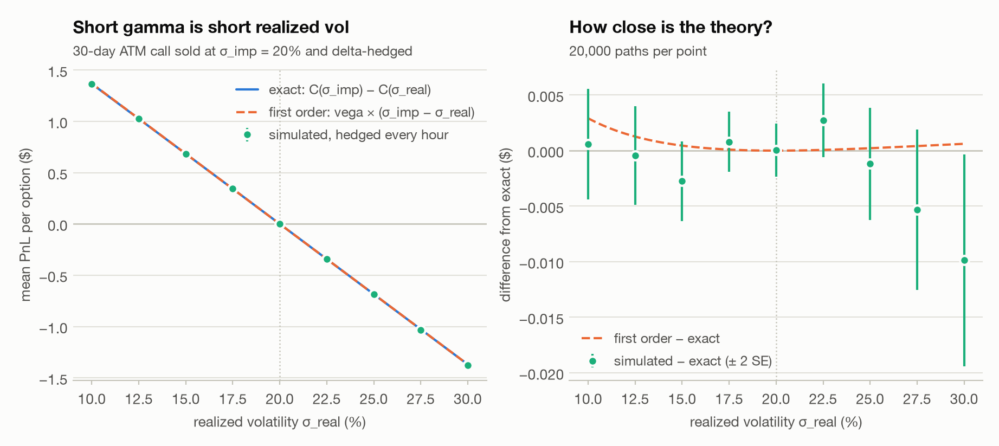
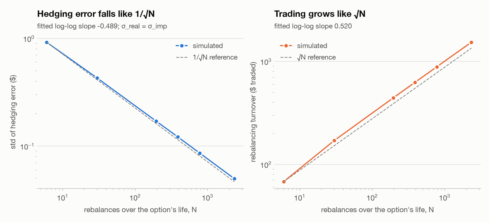
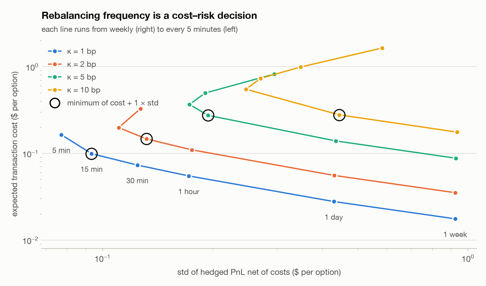
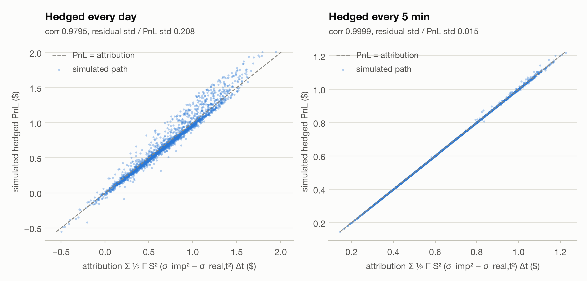
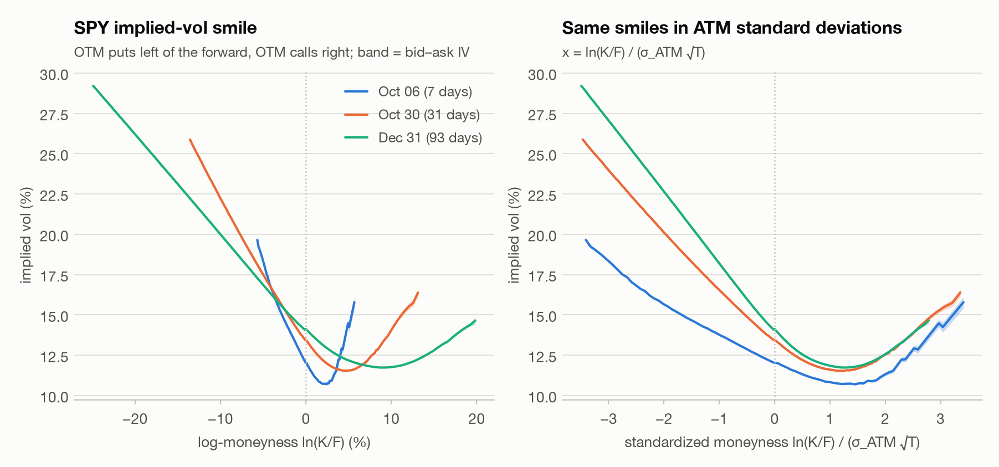
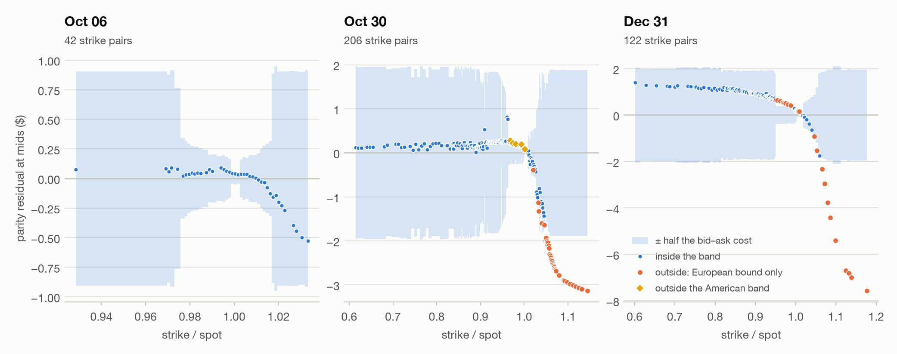
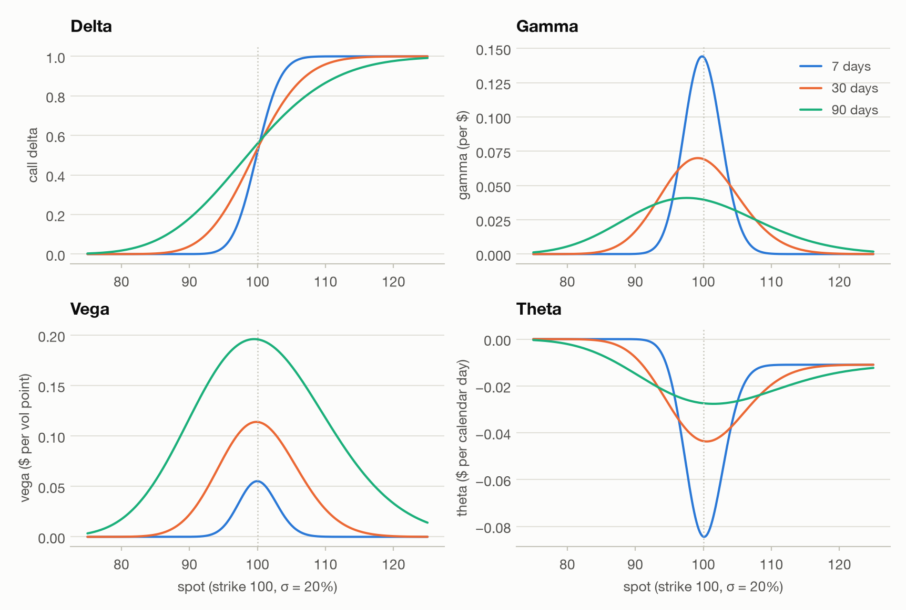

# 04 · Options: Black–Scholes, delta hedging and the SPY smile

*Generated by `python -m markout.options.report` on 2026-09-30 05:47 UTC (fixed seeds; the SPY
section reads the saved snapshot and never refetches). Numbers: `reports/results/options.json`.*

- Pricing engine: put–call parity holds to 4e-16 of the strike, Greeks match finite differences to 2e-06 relative, and IVs round-trip to 2e-10.
- Short 30-day ATM call sold at σ_imp = 20% and hedged every 5 min with σ_real = 15%: mean PnL +$0.6856 ± 0.0016 vs C(σ_imp) − C(σ_real) = +$0.6841. Short gamma earns when realized < implied.
- Hedging-error std falls like N^-0.49 (theory: 1/√N) while turnover grows like N^0.52. The best frequency for cost + 1 × std moves from 5 min (κ = 0 bp) to 1 day (κ = 10 bp).
- The gamma–theta attribution explains 99.98% of hedged-PnL variance path by path at 5 min hedging (corr 0.9999).
- SPY (yfinance, 2026-09-29 16:15 ET): ATM IV 12.0% at 7 days, 13.4% at 31 days, 14.1% at 93 days. Parity 'fails' for 367 of 370 strike pairs at mids, 64 after crossing the spread, and 6 against the American band.

## 1. Pricing engine (`markout.options.bs`)

Black–Scholes–Merton with a continuous dividend yield q: prices, the five Greeks and
implied vol by Brent's method on a bracket (returns NaN when no volatility fits, for
example a price below intrinsic value). The formulas are in the module docstring.
The same checks the tests assert, as numbers:

| check | result |
|---|---|
| put–call parity, 20,000 random parameter sets | max error 3.5e-16 × max(S, K) |
| no-arbitrage bounds on the same sets | 0 violations |
| Greeks vs central finite differences (10 cases) | max relative error 1.8e-06 (gamma) |
| IV round-trip (694 strike × maturity × vol cases) | max |σ̂ − σ| = 1.6e-10 |
| IV of prices outside the no-arbitrage bounds | NaN in 1680 of 1680 cases |

## 2. Delta-hedging a short call (`markout.options.hedging`)

**Setup.** Sell one 30-trading-day at-the-money call (S₀ = K = 100) at
σ_imp = 20%, and delta-hedge it at σ_imp while the stock follows GBM with
realized vol σ_real. Paths are simulated exactly on 5-minute bars (78
per 6.5-hour session, 252 days a year, trading time with no overnight gap), with
r = 4%, q = 0%, drift μ = r − q, and 20,000 paths per
scenario (seed 20260929). Every frequency hedges the *same* paths. Costs are proportional (κ
per dollar of stock traded, including the initial hedge and the final unwind), and PnL is
discounted to t = 0 and quoted per option in dollars. The call is worth $2.990
and has vega $0.1369 per vol point.

### 2a. The mean PnL is the vega-scaled vol difference

<picture>
  <source media="(prefers-color-scheme: dark)" srcset="figures/f_vol_bet_dark.png">
  
</picture>

A short option hedged at σ_imp collects theta and pays ½ΓΔS² on every move, so it is short
realized variance. With μ = r − q its expected PnL in the continuous limit is exactly
C(σ_imp) − C(σ_real), and to first order vega × (σ_imp − σ_real).
The sign comes out as theory says. At σ_real =
15% the short call makes +$0.6856 hedged every 5 min
(5.01 vol points × vega), against an exact +$0.6841. At
σ_real = 25% it loses $0.6845.

The sweep behind the figure (hedged every hour):

| σ_real | simulated mean | exact | vega × Δσ | (simulated − exact) / SE |
|---|---|---|---|---|
| 10.0% | +1.3668 ± 0.0025 | +1.3662 | +1.3691 | +0.2 |
| 12.5% | +1.0252 ± 0.0022 | +1.0256 | +1.0268 | -0.2 |
| 15.0% | +0.6814 ± 0.0018 | +0.6841 | +0.6846 | -1.5 |
| 17.5% | +0.3430 ± 0.0014 | +0.3422 | +0.3423 | +0.6 |
| 20.0% | +0.0000 ± 0.0012 | +0.0000 | +0.0000 | +0.0 |
| 22.5% | -0.3396 ± 0.0017 | -0.3423 | -0.3423 | +1.7 |
| 25.0% | -0.6860 ± 0.0025 | -0.6848 | -0.6846 | -0.5 |
| 27.5% | -1.0326 ± 0.0036 | -1.0273 | -1.0268 | -1.5 |
| 30.0% | -1.3796 ± 0.0048 | -1.3697 | -1.3691 | -2.1 |

Every scenario and frequency:

| σ_real | hedged | N | mean PnL | exact | vega × Δσ | std | 5% … 95% |
|---|---|---|---|---|---|---|---|
| 15% | every week | 6 | +0.6883 ± 0.0051 | +0.6841 | +0.6846 | 0.7202 | -0.454 … +1.911 |
| 15% | every day | 30 | +0.6869 ± 0.0028 | +0.6841 | +0.6846 | 0.3909 | +0.118 … +1.398 |
| 15% | every hour | 195 | +0.6855 ± 0.0018 | +0.6841 | +0.6846 | 0.2549 | +0.296 … +1.131 |
| 15% | every 30 min | 390 | +0.6853 ± 0.0017 | +0.6841 | +0.6846 | 0.2380 | +0.312 … +1.087 |
| 15% | every 15 min | 780 | +0.6852 ± 0.0016 | +0.6841 | +0.6846 | 0.2294 | +0.319 … +1.059 |
| 15% | every 5 min | 2340 | +0.6856 ± 0.0016 | +0.6841 | +0.6846 | 0.2235 | +0.323 … +1.042 |
| 20% | every week | 6 | -0.0036 ± 0.0065 | +0.0000 | +0.0000 | 0.9217 | -1.553 … +1.481 |
| 20% | every day | 30 | +0.0013 ± 0.0030 | +0.0000 | +0.0000 | 0.4284 | -0.697 … +0.698 |
| 20% | every hour | 195 | +0.0013 ± 0.0012 | +0.0000 | +0.0000 | 0.1705 | -0.276 … +0.281 |
| 20% | every 30 min | 390 | +0.0003 ± 0.0009 | +0.0000 | +0.0000 | 0.1214 | -0.198 … +0.196 |
| 20% | every 15 min | 780 | +0.0000 ± 0.0006 | +0.0000 | +0.0000 | 0.0860 | -0.140 … +0.139 |
| 20% | every 5 min | 2340 | +0.0000 ± 0.0004 | +0.0000 | +0.0000 | 0.0498 | -0.080 … +0.081 |
| 25% | every week | 6 | -0.6906 ± 0.0084 | -0.6848 | -0.6846 | 1.1916 | -2.850 … +1.041 |
| 25% | every day | 30 | -0.6850 ± 0.0044 | -0.6848 | -0.6846 | 0.6188 | -1.846 … +0.113 |
| 25% | every hour | 195 | -0.6866 ± 0.0026 | -0.6848 | -0.6846 | 0.3620 | -1.350 … -0.202 |
| 25% | every 30 min | 390 | -0.6841 ± 0.0023 | -0.6848 | -0.6846 | 0.3256 | -1.273 … -0.227 |
| 25% | every 15 min | 780 | -0.6844 ± 0.0022 | -0.6848 | -0.6846 | 0.3076 | -1.230 … -0.235 |
| 25% | every 5 min | 2340 | -0.6845 ± 0.0021 | -0.6848 | -0.6846 | 0.2953 | -1.188 … -0.239 |

Discrete hedging adds noise, not bias: every mean in the table is within 1.1 standard errors
of C(σ_imp) − C(σ_real). But when σ_real ≠ σ_imp the std does not go to zero as hedging gets finer.
At σ_real = 15% it levels off at $0.223, 4.5× the
σ_real = σ_imp value at the same frequency. Hedging at the implied vol leaves the PnL path-dependent:
the vol difference is earned in proportion to ½ΓS², so it depends on how much time the path spent
near the strike.

The drift barely matters. Raising μ from 4% to 15% changes the mean by at most
$0.0139 (2.0%). The PnL depends on realized variance, not on direction, and the small
drop comes from paths drifting away from the strike, where gamma, and so the vol edge earned per day,
is largest:

| hedged | mean, μ = 4% | mean, μ = 15% | change |
|---|---|---|---|
| every day | +0.6869 ± 0.0028 | +0.6729 ± 0.0028 | -2.0% |
| every hour | +0.6855 ± 0.0018 | +0.6734 ± 0.0018 | -1.8% |
| every 5 min | +0.6856 ± 0.0016 | +0.6738 ± 0.0016 | -1.7% |

### 2b. Hedging error vs cost: a decision problem

<picture>
  <source media="(prefers-color-scheme: dark)" srcset="figures/f_hedge_scaling_dark.png">
  
</picture>

With σ_real = σ_imp the hedged PnL is pure replication error (mean ≈ 0). Its std falls with the
number of rebalances N with a fitted log-log slope of -0.489, against −1/2 for the 1/√N law.
Going from every day to every 5 min (78× more rebalances, √78 = 8.8)
cuts the std 8.6×. Rebalancing turnover grows with a slope of 0.520 (√N predicts
+1/2): 9.0× over the same range. With a proportional cost κ per dollar of stock traded, the
expected cost is κ × turnover, so more frequent hedging buys lower risk at a rising price.

| hedged | N | std of hedging error | std × √N | rebalancing turnover ($) |
|---|---|---|---|---|
| every week | 6 | 0.9217 | 2.258 | 68.0 |
| every day | 30 | 0.4284 | 2.346 | 170.5 |
| every hour | 195 | 0.1705 | 2.381 | 441.8 |
| every 30 min | 390 | 0.1214 | 2.397 | 625.7 |
| every 15 min | 780 | 0.0860 | 2.402 | 885.5 |
| every 5 min | 2340 | 0.0498 | 2.409 | 1,533.7 |

<picture>
  <source media="(prefers-color-scheme: dark)" srcset="figures/f_hedge_frontier_dark.png">
  
</picture>

The decision: choose the frequency that minimises E[cost] + k × std(net PnL), where k prices a
dollar of PnL std. Minimising a√N + k·b/√N gives N* = k·b/a, so the optimal number of rebalances
should rise with k and fall with κ. The simulation agrees:
at k = 1 the best frequency goes from every 5 min at κ = 0 bp to
every day at κ = 10 bp. At κ = 10 bp the std of net PnL rises again at high frequency, from $0.247 hedging every hour to $0.582 hedging every 5 min, because the cost itself is random: paths that pin the strike near expiry, where gamma is largest, trade the most.

Best frequency by cost level (columns) and risk weight (rows):

| risk weight k | κ = 0 bp | κ = 1 bp | κ = 2 bp | κ = 5 bp | κ = 10 bp |
|---|---|---|---|---|---|
| 0.5 | 5 min | 30 min | 1 hour | 1 day | 1 day |
| 1 | 5 min | 15 min | 30 min | 1 hour | 1 day |
| 2 | 5 min | 15 min | 30 min | 1 hour | 1 hour |

The frontier's numbers at the lowest and highest nonzero cost:

| κ (bp) | hedged | E[cost] ($) | std net ($) | E[cost] + 1 × std |
|---|---|---|---|---|
| 1 | every week | 0.0176 | 0.9227 | 0.9403 |
| 1 | every day | 0.0279 | 0.4294 | 0.4573 |
| 1 | every hour | 0.0550 | 0.1722 | 0.2272 |
| 1 | every 30 min | 0.0734 | 0.1245 | 0.1979 |
| 1 | every 15 min | 0.0994 | 0.0933 | 0.1926 |
| 1 | every 5 min | 0.1642 | 0.0771 | 0.2413 |
| 10 | every week | 0.1761 | 0.9334 | 1.1095 |
| 10 | every day | 0.2786 | 0.4446 | 0.7232 |
| 10 | every hour | 0.5498 | 0.2467 | 0.7965 |
| 10 | every 30 min | 0.7337 | 0.2709 | 1.0046 |
| 10 | every 15 min | 0.9935 | 0.3488 | 1.3423 |
| 10 | every 5 min | 1.6417 | 0.5823 | 2.2239 |

### 2c. Pathwise attribution

<picture>
  <source media="(prefers-color-scheme: dark)" srcset="figures/f_attribution_dark.png">
  
</picture>

Over each rebalance interval the hedged book earns ½ΓS²(σ_imp² Δt − R²). Γ is the BSM gamma at
σ_imp at the start of the interval, and R² is the squared stock return over it (the realized
σ²_real,t Δt). Summed and discounted, this should reproduce the simulated PnL path by path. At
σ_real = 15% it explains 99.98% of the PnL variance hedging
every 5 min (correlation 0.9999) and 95.7% hedging
every day. The residual comes from third-order Taylor terms, and it shrinks as the interval does:

| hedged | N | corr(PnL, attribution) | R² | mean residual | residual std / PnL std |
|---|---|---|---|---|---|
| every week | 6 | 0.9425 | 0.8803 | +0.0191 | 0.346 |
| every day | 30 | 0.9795 | 0.9567 | +0.0044 | 0.208 |
| every hour | 195 | 0.9968 | 0.9932 | +0.0008 | 0.082 |
| every 30 min | 390 | 0.9987 | 0.9972 | +0.0004 | 0.053 |
| every 15 min | 780 | 0.9995 | 0.9989 | +0.0002 | 0.033 |
| every 5 min | 2340 | 0.9999 | 0.9998 | +0.0001 | 0.015 |

## 3. SPY option chain (`scripts/snapshot_options.py`, `markout.options.smile`)

**Data.** One snapshot, `data/raw/options/SPY_20260929.parquet` (0.36 MB), with 9,815 contracts over
29 expiries from yfinance (Yahoo Finance option chains). It was fetched at 2026-09-29 16:53 ET, after the close, so the
quotes are the 16:15 ET closing quotes (SPY options trade until then).

* **Underlying.** $764.65, taken from the close of the 16:14 ET one-minute bar (yfinance, pre/post-market bars): the last minute of option trading. The 16:00 close was
  $764.20, and the post-market last at fetch time was $764.96.
  Using the 16:00 close would have put the stock $0.45 away from the option quotes,
  7× the median near-the-money option spread of $0.060.
* **Rate.** r = 4.143% continuously compounded, from the 2026-09-29 13-week T-bill
  discount yield (^IRX) of 4.065% (P = 1 - d*91/360, r = -ln(P)*365/91).
  It is not backed out of parity, which is unreliable at these maturities (see the caveats).
* **Dividends.** Discrete and escrowed. SPY last paid $1.889 (ex-date
  2026-09-18); the rule used is ex-dates on the third Friday of Mar/Jun/Sep/Dec; each future amount = last paid amount. Only expiries after the next
  ex-date carry one.
* **Quote quality.** 91.1% of all quotes are two-sided
  (99.4% within 10% of spot at expiries of 5–100 days), so yfinance
  was used and the Cboe fallback was not needed. As a staleness check, Cboe's delayed-quotes JSON (fetched
  2026-09-29 20:53:40 UTC) was merged in by contract: 90.6%
  of the yfinance quotes are identical to Cboe's. The 513 two-sided quotes that are not are dropped
  below. 96% of them are more than 10% from spot, and 195 bid below
  intrinsic value, which a live American quote cannot do.

### 3a. The smile and the skew

<picture>
  <source media="(prefers-color-scheme: dark)" srcset="figures/f_smile_dark.png">
  
</picture>

Implied vols come from the mid, the bid and the ask of out-of-the-money options (puts below the
forward, calls above). That is the liquid side, and it carries little of the early-exercise premium
that would bias a European IV. The forward uses the T-bill r and the escrowed dividend. The slopes
are fitted within 1 ATM standard deviation of the forward.

| expiry | days | strikes | ATM IV | 25Δ put | 25Δ call | 25Δ RR (vol pts) | slope per 10% (vol pts) | slope per σ (vol pts) | IV width ATM / wings (vol pts) |
|---|---|---|---|---|---|---|---|---|---|
| 2026-10-06 | 7 | 86 | 12.0% | 13.3% | 11.1% | -2.15 | -8.64 | -1.51 | 0.08 / 0.22 |
| 2026-10-30 | 31 | 174 | 13.4% | 15.8% | 12.0% | -3.75 | -6.32 | -2.59 | 0.05 / 0.09 |
| 2026-12-31 | 93 | 219 | 14.1% | 17.1% | 12.3% | -4.82 | -4.54 | -3.39 | 0.04 / 0.05 |

The equity skew is there at every expiry: the 25-delta risk
reversal (call IV − put IV) runs from -2.15 vol points at 7 days to
-4.82 at 93 days. Per 10% of moneyness the 7-day smile is the steepest (-8.64 vol points vs -4.54 at 93 days). Measured per ATM standard deviation the order reverses (-1.51 vs -3.39): a short-dated smile looks steep only because its strikes span few standard deviations.
The bid–ask band in IV is thin at the money and wider in the wings (median 0.08 vs 0.22 vol points at 7 days).

### 3b. Put–call parity against the bid and ask

<picture>
  <source media="(prefers-color-scheme: dark)" srcset="figures/f_parity_dark.png">
  
</picture>

For each strike with a two-sided call and put, the residual (C − P)_mid − (S e^{−qT} − K e^{−rT})
counts as an apparent arbitrage when it exceeds one tick ($0.01). Crossing the spread gives the
conversion bound C_bid − P_ask ≤ S_ask e^{−qT} − K e^{−rT} and the reversal bound
C_ask − P_bid ≥ S_bid e^{−qT} − K e^{−rT}, with a stock half-spread of $0.005.
SPY options are American, so the trade is only riskless outside the American band
S e^{−qT} − K ≤ C − P ≤ S − K e^{−rT}.

| expiry | pairs | at mids | after the spread | reversals, K > S | conversions | outside American band | American, stale kept |
|---|---|---|---|---|---|---|---|
| 2026-10-06 | 42 | 41 (98%) | 0 (0%) | 0 | 0 | 0 | 0 of 42 |
| 2026-10-30 | 206 | 205 (100%) | 40 (19%) | 34 | 6 | 6 | 9 of 211 |
| 2026-12-31 | 122 | 121 (99%) | 24 (20%) | 11 | 13 | 0 | 17 of 153 |

At the mids, parity fails for 367 of 370 strike pairs
(99%). After paying the spread, 64 remain against the
European bounds. Of these, 45 are reversals (short stock, buy the call, sell the put),
all of them at strikes above spot, where the put sold is in the money. An ITM American
put is worth more than a European one, because exercising early earns interest on K, so selling it
risks early assignment. The other 19 are conversions (buy stock, sell the call, buy the put). 13 of them are in 2026-12-31, the expiry with an ex-date before it, at strikes from 95% to 101% of spot. They need the dividend to arrive, and the holder of an American call can exercise before the ex-date and keep it, so they are not riskless. The model forward also sits $0.19 below the market's (see the caveats), which on its own shifts every residual in that expiry by +$0.18. The remaining 6 are in expiries without a dividend. Against the American band, 6 remain. With no dividend before expiry the American conversion bound is the same as the European one, so the conversions there are the ones left. The largest is $0.117 per share at the 740 strike (2026-10-30). A conversion is a synthetic loan, and this one lends at 19 bp a year above the T-bill rate used for r, before commissions and exchange fees. That is a financing-rate difference, not a free lunch.
Keeping the stale yfinance quotes would instead have produced 26 American-band "violations",
with edges up to $22.22 per share (against $0.117 on the screened quotes). That is fake
arbitrage from stale data.

This is the backtest's lesson again. An edge measured at the mid mostly disappears once you pay
the spread, and most of what is left is modelling error: European vs American exercise, the dividend,
the financing rate, stale quotes.

**Caveats.**
* *American exercise:* a conversion or reversal that sells an ITM put, or sells a call before an
  ex-date, can be assigned early, so the European bound does not describe a riskless trade.
* *Dividend and financing:* the next dividend is an assumption (the last amount paid). The parity-implied forwards sit above the model forwards at every expiry, by at most 2.4 bp of spot. As a financing rate that is +8 to +26 bp a year relative to the T-bill rate. At one week a few cents of stock-price timing error is enough to produce it. For 2026-12-31 it is equally consistent with a dividend $0.18 smaller than the assumed $1.889.

| expiry | PV of dividends | q (escrowed) | model forward | parity-implied forward | difference | as a rate spread |
|---|---|---|---|---|---|---|
| 2026-10-06 | $0.000 | -0.00% | $765.26 | $765.29 | +$0.04 (+0.5 bp) | +26 bp/yr |
| 2026-10-30 | $0.000 | -0.00% | $767.34 | $767.40 | +$0.05 (+0.7 bp) | +8 bp/yr |
| 2026-12-31 | $1.872 | 0.96% | $770.88 | $771.06 | +$0.19 (+2.4 bp) | +9 bp/yr |

* *Borrow:* a reversal shorts SPY and pays the borrow fee, which this test ignores.
* *Backing r out of parity:* a regression of C − P on K cannot pin down r at these maturities. At
  7 days a slope error of 0.001 is 5.2% of rate, and early exercise
  tilts C − P away from the money.
* *Synchronicity:* the stock and option quotes are matched to the minute, not the millisecond.

## 4. Greeks crib sheet

<picture>
  <source media="(prefers-color-scheme: dark)" srcset="figures/f_greeks_dark.png">
  
</picture>

Worked example: a call with S = K = 100, T = 30 days, σ = 20%,
r = 4%, q = 0% is worth $2.451; the put is worth $2.123.
On the snapshot, a 31-day SPY call struck at 767 (near the forward) at its 13.4% ATM vol is worth $12.10: delta 0.51, vega $0.89 per vol point, theta −$0.24 a day, and gamma 0.0133, so a $7.65 (1%) move changes delta by 0.10.

| Greek | Meaning | Example call | Long call | Short call | Long put | Short put |
|---|---|---|---|---|---|---|
| Delta Δ = ∂V/∂S | shares-equivalent; hedge ratio | 0.534 | + | − | − | + |
| Gamma Γ = ∂²V/∂S² | change in Δ per $1; convexity | 0.0693 | + | − | + | − |
| Vega = ∂V/∂σ | $ per vol point (÷100) | $0.1140 | + | − | + | − |
| Theta Θ = ∂V/∂t | $ per day (÷365); the rent for gamma | −$0.0436 | − | + | − (usually) | + (usually) |
| Rho ρ = ∂V/∂r | $ per rate point (÷100) | $0.0419 | + | − | − | + |

**Rules of thumb (checked on the example).** ATM call ≈ 0.4·S·σ·√T = $2.294 (exact
$2.451: the rule is for a strike at the forward, and K = S is $0.329 in the money
forward). ATM vega ≈ 0.4·S·√T = $0.1147 per
vol point (exact $0.1140). With r = q = 0 the BSM PDE is Θ = −½Γ S²σ²: −$0.0381 vs
−$0.0381 a day. Delta is not the probability of finishing in the money:
the risk-neutral probability is N(d₂) = 0.511, below the delta N(d₁)e^{−qT} = 0.534.

* **Gamma scalping.** Long an option and delta-hedged, you buy the dips and sell the rallies as the
  hedge rebalances. Each move earns ½ΓΔS², and you pay Θ ≈ −½ΓS²σ_imp² per unit time. Net
  ½ΓS²(σ_real² − σ_imp²)dt: you win if the stock moves more than the implied vol you paid (§2).
* **Short gamma = short realized vol.** The hedged short option collects theta and pays ½ΓΔS² on
  every move, so it loses when realized vol beats implied (§2a). The loss is biggest when big moves
  happen near the strike close to expiry, where Γ is largest.
* **Straddle** (long call + put, same K): long vol, about zero delta at the money, maximum gamma
  and vega. **Strangle** (OTM put + OTM call): cheaper, less gamma near spot, pays off only on large moves.
* **Verticals** (buy K₁, sell K₂ > K₁ calls, or the put version): a directional view with capped
  payoff (at most K₂ − K₁), with vega and gamma partly offset. A tight call spread ÷ (K₂ − K₁) ≈ a
  digital, so it prices the risk-neutral probability of finishing above K, skew included.
* **Skew.** For equity indices, OTM puts trade at higher implied vol than OTM calls: crash
  protection is in demand, and vol rises when prices fall (the leverage effect). Quote it as the
  25-delta risk reversal (call IV − put IV, negative for equities: §3a) or as the IV slope per unit
  of moneyness. A long risk reversal (long call, short put) is long skew.
* **Put–call parity** C − P = S e^{−qT} − K e^{−rT}; a conversion (long stock, short call, long put)
  or a reversal is a synthetic loan, and a box spread is a pure rate trade (§3b).
