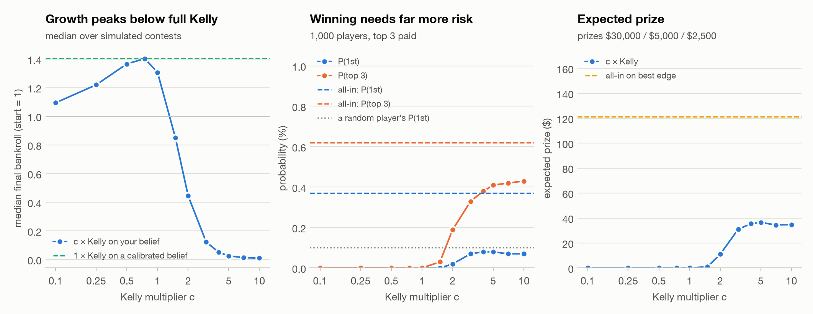
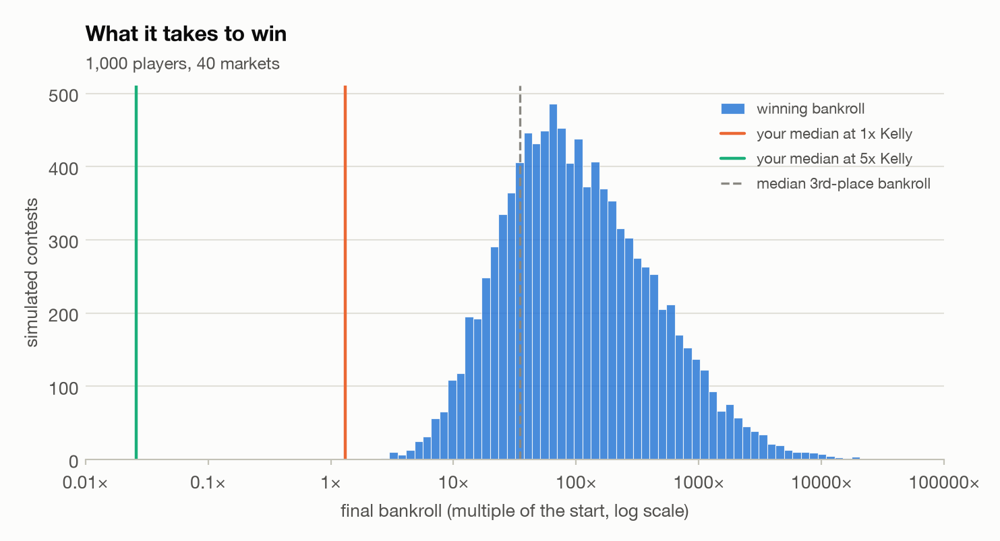
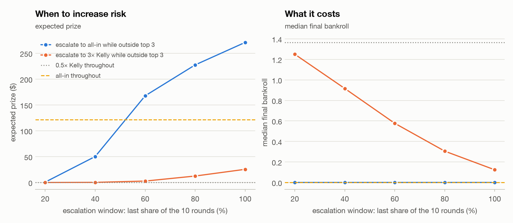
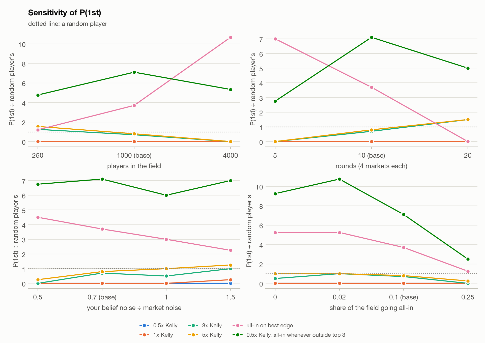

# 05 · SIG Predictions Cup: sizing for a winner-take-most contest

*Part 1 is generated by `python -m markout.decision.contest` (fixed seeds). Part 2 is generated by
`python -m markout.decision.journal score` from `data/journal.csv`. Numbers are in
`reports/results/predictions_cup.json`; none is typed by hand.*

## Part 1 — Pre-registered sizing study (`python -m markout.decision.contest`)

*First generated 2026-09-29 21:37 UTC, before the contest opens (Oct 01, 12:00 ET), so this is the pre-registered analysis. Commit it before the contest starts, so the timestamp can be checked.*

**The question.** Only the top 3 final bankrolls win a prize
($30,000 / $5,000 / $2,500), so the payoff is convex in rank. Kelly sizing
maximises expected log wealth, which is the growth rate and so the median bankroll over many bets.
It does not maximise P(1st). How much more risk should a player with a modest real edge take?

**Kelly for a binary contract** (Kelly 1956; Thorp 2006). Buying YES at price q with belief p and a
fraction f of the bankroll grows it at g(f) = p·ln(1 + f(1 − q)/q) + (1 − p)·ln(1 − f), which is
maximised at f* = (p − q)/(1 − q). For NO it is (q − p)/q. Fractional Kelly bets c·f*; for small
edges g(c·f*) ≈ (2c − c²)·g(f*), so half Kelly keeps about 75% of the growth, and 2× Kelly
0%. The continuous analogue is f* = μ/σ².

**Assumptions.** The real contest's rules, field size and number of markets are not known. Each
number below is a choice, and the sensitivity section varies the ones that matter most.

| assumption | value |
|---|---|
| players (including you) | 1,000 |
| markets | 40: 10 rounds of 4 independent binary markets; each round resolves before the next |
| truth | logit(π) ~ N(0, 1²); outcome Y ~ Bernoulli(π) |
| market price | logit(q) = logit(π) + N(0, 0.35²), clipped to [0.02, 0.98]; everyone trades at q, with no fees, slippage or position limits |
| beliefs | logit(p) = logit(π) + N(0, s²), independent across players and of the price |
| field accuracy | 5% sharper than the market (s = 0.5 × market noise); the rest s = U(1, 3) × market noise |
| field sizing | 10% all-in on their best edge every round; the rest c × Kelly on their own belief with c (share) = 0.5 (30%), 1 (35%), 2 (20%), 4 (15%) |
| you | s = 0.7 × market noise |
| bankroll | equal start, no refills; a round's stakes are scaled down to at most the bankroll |
| prizes | top 3 final bankrolls: $30,000 / $5,000 / $2,500; ties split; a bankrupt player wins nothing |
| leaderboard | visible (the late-escalation rules use it) |
| simulated contests | 10,000 (seed 20261001) |

Your edge in this model: your Brier score beats the market's by 1.2%. An equal stake on the side your belief favours returns +14.8% per unit on average, while your own belief expects +21.0%; weighted by Kelly stakes it is +18.1% realized against +27.2% believed. The ratio (0.70) is the optimizer's curse: you act where your own error is largest. One caveat on the model: because each belief is the truth plus *independent* noise, every disagreement with the price carries some information, even from players noisier than the market. Real players' errors overlap with the market's, so real edges are smaller than the model's.

### Base case

| policy | P(1st) | P(top 3) | expected prize | median bankroll | P(lose > 50%) | P(bust) |
|---|---|---|---|---|---|---|
| 0.25x Kelly | 0.00% ± 0.00% | 0.00% | $0 ± 0 | 1.219 | 0.2% | 0.0% |
| 0.5x Kelly | 0.00% ± 0.00% | 0.00% | $0 ± 0 | 1.366 | 5.5% | 0.0% |
| 1x Kelly | 0.00% ± 0.00% | 0.00% | $0 ± 0 | 1.307 | 24.4% | 0.6% |
| 2x Kelly | 0.02% ± 0.01% | 0.19% | $11 ± 4 | 0.444 | 51.3% | 18.2% |
| 3x Kelly | 0.07% ± 0.03% | 0.33% | $31 ± 8 | 0.123 | 60.8% | 30.3% |
| 5x Kelly | 0.08% ± 0.03% | 0.41% | $36 ± 9 | 0.026 | 64.9% | 37.4% |
| all-in on best edge | 0.37% ± 0.06% | 0.62% | $121 ± 18 | 0.000 | 99.2% | 99.2% |
| 1x Kelly on calibrated belief | 0.00% ± 0.00% | 0.00% | $0 ± 0 | 1.404 | 11.7% | 0.0% |

<picture>
  <source media="(prefers-color-scheme: dark)" srcset="figures/p_sizing_dark.png">
  
</picture>

The curves behind the figure (every c × Kelly policy simulated):

| c | median bankroll | P(1st) | P(top 3) | expected prize | P(lose > 50%) |
|---|---|---|---|---|---|
| 0.1 | 1.094 | 0.00% | 0.00% | $0 | 0.0% |
| 0.25 | 1.219 | 0.00% | 0.00% | $0 | 0.2% |
| 0.5 | 1.366 | 0.00% | 0.00% | $0 | 5.5% |
| 0.75 | 1.403 | 0.00% | 0.00% | $0 | 14.7% |
| 1 | 1.307 | 0.00% | 0.00% | $0 | 24.4% |
| 1.5 | 0.849 | 0.00% | 0.03% | $1 | 40.4% |
| 2 | 0.444 | 0.02% | 0.19% | $11 | 51.3% |
| 3 | 0.123 | 0.07% | 0.33% | $31 | 60.8% |
| 4 | 0.050 | 0.08% | 0.38% | $36 | 63.6% |
| 5 | 0.026 | 0.08% | 0.41% | $36 | 64.9% |
| 7 | 0.013 | 0.07% | 0.42% | $34 | 65.5% |
| 10 | 0.011 | 0.07% | 0.43% | $35 | 65.7% |

The median final bankroll peaks at 0.75× Kelly (1.403 times the start), against 1.307 at full Kelly and 1.404 for full Kelly on a calibrated belief (your belief shrunk to the Bayesian posterior given the price). Full Kelly on a raw belief overbets, because part of every disagreement with the price is your own noise. That is the optimizer's curse again: a fraction below one on a noisy belief does the work of full Kelly on a calibrated one.

The highest P(1st) is 0.5x Kelly, all-in whenever outside top 3: 0.71%, 7.1× a random player's 0.10%, against 0.00% at 1× Kelly. So the sizing that maximises P(1st) is far above Kelly, as the convex payoff predicts. It pays for that with the median: a median bankroll of 0.000, and more than half the bankroll lost 97% of the time. The best expected prize comes from "0.5x Kelly, all-in whenever outside top 3": $271, against $0 at 1× Kelly. For scale, the prize pool split evenly would pay $37.50 per player.

### What it takes to win

<picture>
  <source media="(prefers-color-scheme: dark)" srcset="figures/p_winner_dark.png">
  
</picture>

The winning bankroll has a median of 92× the start (10th–90th percentile 19×–691×), and third place needs a median 35×. 31% of contests were won by a field player going all-in every round, and 2% by one of the sharp players. Your median at 0.75× Kelly is 1.40×, and at 1× Kelly you reach the top 3 in none of the 10,000 simulated contests. In a 1,000-player field over 40 markets, forecasting skill does not move you up the ranking; variance does.

### When to increase risk

Each adaptive rule bets 0.5× Kelly, then escalates in the last part of the contest (a share
of the rounds, so it means the same thing when the number of markets changes), re-checked before every
round.

| policy | P(1st) | P(top 3) | expected prize | median bankroll | P(lose > 50%) | P(bust) |
|---|---|---|---|---|---|---|
| 0.5x Kelly, all-in in the last 20% of rounds if outside top 3 | 0.00% ± 0.00% | 0.02% | $1 ± 1 | 0.000 | 62.7% | 62.6% |
| 0.5x Kelly, 3x Kelly in the last 20% of rounds if outside top 3 | 0.00% ± 0.00% | 0.00% | $0 ± 0 | 1.250 | 26.8% | 7.2% |
| 0.5x Kelly, all-in in the last 40% of rounds if outside top 3 | 0.07% ± 0.03% | 0.86% | $50 ± 9 | 0.000 | 86.1% | 86.1% |
| 0.5x Kelly, 3x Kelly in the last 40% of rounds if outside top 3 | 0.00% ± 0.00% | 0.01% | $0 ± 0 | 0.916 | 39.3% | 13.8% |
| 0.5x Kelly, all-in in the last 60% of rounds if outside top 3 | 0.36% ± 0.06% | 1.92% | $168 ± 19 | 0.000 | 94.0% | 94.0% |
| 0.5x Kelly, 3x Kelly in the last 60% of rounds if outside top 3 | 0.00% ± 0.00% | 0.07% | $3 ± 1 | 0.577 | 48.1% | 19.7% |
| 0.5x Kelly, all-in in the last 80% of rounds if outside top 3 | 0.52% ± 0.07% | 2.39% | $228 ± 22 | 0.000 | 96.2% | 96.2% |
| 0.5x Kelly, 3x Kelly in the last 80% of rounds if outside top 3 | 0.03% ± 0.02% | 0.14% | $12 ± 5 | 0.305 | 55.1% | 25.3% |
| 0.5x Kelly, all-in whenever outside top 3 | 0.71% ± 0.08% | 2.15% | $271 ± 26 | 0.000 | 97.0% | 97.0% |
| 0.5x Kelly, 3x Kelly whenever outside top 3 | 0.05% ± 0.02% | 0.33% | $26 ± 7 | 0.124 | 60.8% | 30.3% |
| 0.5x Kelly, all-in in the last 20% of rounds regardless | 0.00% ± 0.00% | 0.02% | $1 ± 1 | 0.000 | 62.7% | 62.6% |
| 0.5x Kelly | 0.00% ± 0.00% | 0.00% | $0 ± 0 | 1.366 | 5.5% | 0.0% |
| all-in on best edge | 0.37% ± 0.06% | 0.62% | $121 ± 18 | 0.000 | 99.2% | 99.2% |

<picture>
  <source media="(prefers-color-scheme: dark)" srcset="figures/p_adaptive_dark.png">
  
</picture>

The best escalation rule by expected prize is "0.5x Kelly, all-in whenever outside top 3": $271 and P(top 3) 2.15%, against $0 for 0.5× Kelly throughout and $121 for all-in throughout. Short windows do not work. Third place needs a median 35×, and from the 1.37× that 0.5× Kelly typically reaches that is 4.7 doublings at even-money prices, so the gamble has to start with several rounds left. Escalating only while outside the top 3 also beats going all-in from the start: a player who gets lucky early stops gambling and keeps the place. The best window is the whole contest: gamble whenever you are behind, and protect a top-3 place when you have one. The price is the median bankroll, which falls from 1.366 to 0.000, with a bust in 97% of contests.

### Sensitivity

The sweeps vary one assumption at a time, plus one combined scenario. The number of simulated
contests keeps the work per scenario roughly constant, so the probabilities are noisier for large fields.

<picture>
  <source media="(prefers-color-scheme: dark)" srcset="figures/p_sensitivity_dark.png">
  
</picture>

| scenario | contests | your Brier skill | your true edge | best P(1st) | best expected prize | growth-optimal c | median winner |
|---|---|---|---|---|---|---|---|
| base case | 10,000 | 1.2% | +14.8% | 0.5x Kelly, all-in whenever outside top 3 (0.71%) | 0.5x Kelly, all-in whenever outside top 3 ($271) | 0.75 | 92× |
| players in the field = 250 | 16,000 | 1.2% | +14.9% | 0.5x Kelly, all-in whenever outside top 3 (1.91%) | 0.5x Kelly, all-in whenever outside top 3 ($710) | 0.75 | 35× |
| players in the field = 4000 | 1,500 | 0.9% | +14.5% | all-in on best edge (0.27%) | 0.5x Kelly, all-in in the last 80% of rounds if outside top 3 ($97) | 0.5 | 256× |
| rounds (4 markets each) = 5 | 8,000 | 1.3% | +14.9% | all-in on best edge (0.70%) | all-in on best edge ($277) | 0.75 | 39× |
| rounds (4 markets each) = 20 | 2,000 | 1.1% | +14.2% | 0.5x Kelly, all-in whenever outside top 3 (0.50%) | 0.5x Kelly, all-in whenever outside top 3 ($185) | 0.75 | 217× |
| your belief noise ÷ market noise = 0.5 | 4,000 | 2.0% | +16.8% | 0.5x Kelly, all-in whenever outside top 3 (0.68%) | 0.5x Kelly, all-in whenever outside top 3 ($262) | 0.75 | 93× |
| your belief noise ÷ market noise = 1 | 4,000 | 0.2% | +13.9% | 0.5x Kelly, all-in in the last 80% of rounds if outside top 3 (0.80%) | 0.5x Kelly, all-in in the last 80% of rounds if outside top 3 ($306) | 0.5 | 94× |
| your belief noise ÷ market noise = 1.5 | 4,000 | -3.3% | +10.8% | 0.5x Kelly, all-in whenever outside top 3 (0.70%) | 0.5x Kelly, all-in whenever outside top 3 ($258) | 0.25 | 85× |
| share of the field going all-in = 0 | 4,000 | 1.3% | +15.2% | 0.5x Kelly, all-in whenever outside top 3 (0.92%) | 0.5x Kelly, all-in whenever outside top 3 ($361) | 0.75 | 61× |
| share of the field going all-in = 0.02 | 4,000 | 1.2% | +15.0% | 0.5x Kelly, all-in in the last 80% of rounds if outside top 3 (1.15%) | 0.5x Kelly, all-in in the last 80% of rounds if outside top 3 ($425) | 0.75 | 66× |
| share of the field going all-in = 0.25 | 4,000 | 1.3% | +15.7% | 0.5x Kelly, all-in in the last 80% of rounds if outside top 3 (0.30%) | 0.5x Kelly, all-in in the last 80% of rounds if outside top 3 ($121) | 0.75 | 162× |
| cautious field (no all-in, c <= 1) | 4,000 | 1.1% | +15.8% | 0.5x Kelly, all-in in the last 80% of rounds if outside top 3 (1.85%) | 0.5x Kelly, all-in in the last 80% of rounds if outside top 3 ($666) | 0.75 | 36× |

In 12 of 12 scenarios the P(1st)-maximising policy is more aggressive than 1× Kelly. Your edge moves the growth-optimal multiplier, from 0.75× at a Brier skill of 2.0% to 0.25× at -3.3%. Across the same range the expected prize of "0.5x Kelly, all-in whenever outside top 3" runs from $247 to $271: the prize barely depends on skill, so this contest format rewards variance far more than forecasting.

Robustness of expected prize across all 12 scenarios (top six policies):

| policy | worst case (share of the best) | worst scenario | average share | best in |
|---|---|---|---|---|
| 0.5x Kelly, all-in whenever outside top 3 | 49% | rounds (4 markets each) = 5 | 89% | 6 of 12 |
| 0.5x Kelly, all-in in the last 80% of rounds if outside top 3 | 25% | rounds (4 markets each) = 5 | 84% | 5 of 12 |
| 0.5x Kelly, all-in in the last 60% of rounds if outside top 3 | 10% | rounds (4 markets each) = 5 | 70% | 0 of 12 |
| 0.5x Kelly, all-in in the last 40% of rounds if outside top 3 | 1% | rounds (4 markets each) = 5 | 30% | 0 of 12 |
| 5x Kelly | 1% | rounds (4 markets each) = 5 | 17% | 0 of 12 |
| 3x Kelly | 0% | rounds (4 markets each) = 5 | 13% | 0 of 12 |

### The pre-registered policy

- **1.** Log every trade before placing it (`python -m markout.decision.journal add ...`), with the reason. Part 2 scores the beliefs, not the rank.
- **2.** Sizing, re-checked against the leaderboard before each round: unless you hold a top-3 place, go all-in on your single largest Kelly fraction; while you hold one, bet 0.5× the journal's Kelly fraction on every market you trade. At the start nobody holds a top-3 place, so the first round is already all-in. (For comparison, the growth-optimal multiplier on raw beliefs here is 0.75× Kelly.)
- **3.** Why this rule: it is the best policy in 6 of the 12 simulated scenarios and keeps at least 49% of the best policy's expected prize in all of them; its worst case is "rounds (4 markets each) = 5". The runner-up, "0.5x Kelly, all-in in the last 80% of rounds if outside top 3", is within sampling error of it in the base case ($228 ± 22 against $271 ± 26). The objective is prize money, since SUSQies are worth nothing after the close.
- **4.** It busts in 97% of simulated contests. After a bust, keep logging your belief on markets you would have traded, with `--stake 0`, so Part 2 still has a full sample of forecasts to score.
- **5.** Deviations are allowed but logged: start the journal's reason with "DEVIATION:" and say why.
- **6.** What would change it: position limits (all-in becomes impossible, so escalate to the largest stake allowed), a very different field size or market count (see the table), or rules that differ from the assumptions above.

## Part 2 — Results (generated by `journal score` after Nov 4)

**Pending.** 0 trades logged in `data/journal.csv`, none resolved yet. Run `python -m markout.decision.journal score` once markets resolve; this section is regenerated from the journal and nothing in it is typed by hand.
