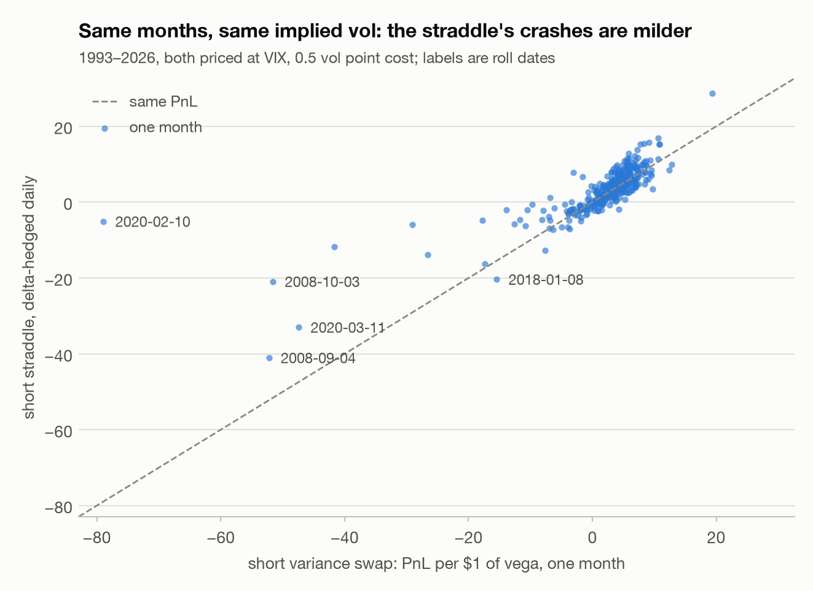

# 06 · The volatility risk premium: when does selling S&P volatility pay?

*Generated by `python -m markout.vol.report` from saved Yahoo Finance data (S&P 500, VIX and VIX3M daily closes); the data itself is not committed.*

**Question.** Options on the S&P 500 are usually priced for more movement than actually follows. How large is that premium, how often does collecting it go badly wrong, and does timing or sizing make it safe enough to trade?

**Answer.** From 1990 to 2026, VIX exceeded the volatility the S&P then realized over the next 21 trading days 85.9% of the time, by 4.10 vol points on average (median 4.71). Selling one month of variance every month since 2006 earned an annualized Sharpe of 0.551 with a skew of -4.36: its worst month (2008-10-01) lost 66.6 per $1 of vega, against an average gain of 1.56. The best of 5 timing rules, *har + contango*, raises the Sharpe to 1.07 (95% CI 0.408 to 2.30) and cuts the maximum drawdown from 136 to 60.9, and it survives the deflation for the 5 rules tried (Deflated Sharpe 0.965). Sizing matters more than timing: the textbook Kelly fraction mu/sigma^2 asks for 2.96x the growth-optimal size on these fat-tailed outcomes, 2.55x the size at which the worst month wipes out the account. Collected with a delta-hedged straddle instead, the worst month of 1993–2026 loses 41.1 rather than 78.9 per $1 of vega, because the straddle's exposure fades once the index leaves the strike. But at-the-money options trade below VIX, and at a 2-point discount the straddle's Sharpe (0.752) is below the variance swap's over the same months (0.898).

## Data and method

- Daily closes of the S&P 500 index, VIX (implied volatility of 30-day S&P options, from 1990) and VIX3M (93-day, from July 2006), from Yahoo Finance.
- Implied variance is VIX squared: VIX is built by replicating a 30-day variance swap, so VIX^2 is that swap's fair strike. Realized variance is the annualized sum of squared daily log returns over the next 21 trading days.
- The strategy sells one month of variance every 21 trading days. Per $1 of vega notional, a short variance swap struck at K that realizes R pays (K^2 - R^2) / (2K): at most K/2, unbounded below. A cost of 0.5 vol points is charged on every trade (varied below).
- Timing rules use only what is known at the roll: the VIX/VIX3M term structure (sell only in contango), and a HAR forecast of realized variance (Corsi 2009), refitted every month on samples whose 21-day window had already ended.
- Every rule is compared over the same 241 monthly rolls from 2006-08.

<picture>
  <source media="(prefers-color-scheme: dark)" srcset="figures/h_vix_vs_realized_dark.png">
  
</picture>

## Results

| rule | traded | Sharpe | 95% CI | skew | worst month | max drawdown | total |
|---|---|---|---|---|---|---|---|
| always | 241/241 | 0.55 | 0.00841 to 1.67 | -4.36 | -66.6 | -135.5 | 375.8 |
| contango | 219/241 | 0.90 | 0.298 to 2.29 | -5.63 | -60.4 | -60.4 | 440.6 |
| har (premium > 0) | 185/241 | 0.73 | 0.186 to 1.74 | -4.67 | -56.6 | -58.1 | 370.1 |
| har (premium > 25%) | 106/241 | 0.61 | 0.0898 to 1.62 | -5.11 | -56.6 | -64.4 | 254.2 |
| har + contango | 169/241 | 1.07 | 0.408 to 2.30 | -5.61 | -56.6 | -60.9 | 410.8 |

PnL is per $1 of vega sold each month; annualized Sharpe uses 12 rolls a year.

<picture>
  <source media="(prefers-color-scheme: dark)" srcset="figures/h_cumulative_dark.png">
  
</picture>

<picture>
  <source media="(prefers-color-scheme: dark)" srcset="figures/h_pnl_hist_dark.png">
  
</picture>

**The months that hurt.** The five worst months for the always-sell rule, and whether the best rule was in the market:

| roll date | VIX at roll | realized vol | PnL | har + contango traded |
|---|---|---|---|---|
| 2008-10-01 | 39.8 | 82.7 | -66.6 | no |
| 2020-02-06 | 15.0 | 44.9 | -60.4 | no |
| 2008-09-02 | 22.0 | 54.3 | -56.6 | yes |
| 2020-03-09 | 54.5 | 91.6 | -50.2 | no |
| 2011-08-02 | 24.8 | 47.6 | -33.8 | no |

**Costs.** Annualized Sharpe by trading cost (vol points of strike per trade):

| cost | always | contango | har + contango |
|---|---|---|---|
| 0 | 0.73 | 1.12 | 1.28 |
| 0.5 | 0.55 | 0.90 | 1.07 |
| 1 | 0.37 | 0.67 | 0.86 |

**Selection.** Five rules were tried; the best one's Sharpe is deflated against the best of five tries by luck (SR* = 0.254 annualized). Deflated Sharpe 0.965, from 241 monthly observations with skew -5.64 and kurtosis 56.7: the negative skew is part of why the deflation is severe.

## Sizing: Kelly with a fat left tail

On 1993–2026 monthly outcomes of the always-sell rule, the growth-optimal size is 1.09 dollars of vega per $100 of capital, computed exactly by maximizing the mean log growth. The worst month caps any survivable size at 1.27. The familiar formula mu/sigma^2, which assumes small, roughly normal outcomes, says 3.23: far past the point of ruin.

Estimation risk makes it worse. Fitted on 1993–2007 alone, full Kelly is 5.35 per $100: that history had no month like the ones to come. Every fraction of it down to a quarter is wiped out after 2008. The worst month after 2007 (2020-02-10) lost 78.9 per $1 of vega, so only sizes below 1.27 per $100, 23.7% of the pre-2008 Kelly size, would have survived it.

| sizing (fitted on 1993–2007) | $ vega per $100 | final wealth 2008– | max drawdown |
|---|---|---|---|
| continuous mu/sigma^2 | 19.76 | bust | -100% |
| full Kelly | 5.35 | bust | -100% |
| half Kelly | 2.67 | bust | -100% |
| quarter Kelly | 1.34 | bust | -100% |

<picture>
  <source media="(prefers-color-scheme: dark)" srcset="figures/h_kelly_dark.png">
  
</picture>

## Collecting the premium with options instead

Variance swaps trade over the counter between institutions. Most traders collect the premium by selling listed options and delta-hedging them, so the same 404 months (1993–2026) were also run through a short at-the-money straddle. It is priced at the same implied vol (VIX), hedged at every close with Black–Scholes deltas at that vol, and charged the same 0.5 vol point cost plus 1 bp per unit of index traded for the hedge (0.144 vol points a month on average). Dividing by the straddle's vega at the roll puts both in PnL per $1 of vega.

A hedged option is still a bet on realized variance, but each day counts in proportion to the option's dollar gamma, which peaks near the strike and collapses once the index runs away from it; the variance swap counts every day the same. On these real paths the gamma–theta attribution explains 87.2% of the variance of the straddle's monthly PnL, against 95.7% for the same daily hedge on the lognormal paths of report 04. The gap comes from large daily moves, which real prices have far more of.

| instrument | Sharpe | skew | worst month | worst 5% (mean) | max drawdown | Kelly | ruin at | mu/sigma^2 |
|---|---|---|---|---|---|---|---|---|
| short variance swap | 0.90 | -5.39 | -78.9 | -23.9 | -131.4 | 1.09 | 1.27 | 3.23 |
| short straddle, delta-hedged | 1.97 | -2.02 | -41.1 | -12.1 | -80.6 | 2.33 | 2.43 | 9.93 |

PnL is per $1 of vega a month. Kelly (exact), ruin and mu/sigma^2 are dollars of vega per $100 of capital; ruin is the size at which the worst month takes the whole account.

<picture>
  <source media="(prefers-color-scheme: dark)" srcset="figures/h_straddle_dark.png">
  
</picture>

The two move together (correlation 0.767) until the index runs. The five worst months for the variance swap:

| roll date | VIX | realized vol | gamma-weighted vol | gamma exposure | variance swap | straddle |
|---|---|---|---|---|---|---|
| 2020-02-10 | 15.0 | 50.9 | 23.7 | 0.52 | -78.9 | -5.1 |
| 2008-09-04 | 24.0 | 55.4 | 58.5 | 0.94 | -52.2 | -41.1 |
| 2008-10-03 | 45.1 | 81.5 | 84.0 | 0.36 | -51.6 | -20.9 |
| 2020-03-11 | 53.9 | 89.2 | 75.3 | 1.22 | -47.4 | -33.0 |
| 2025-03-17 | 20.5 | 45.9 | 34.6 | 0.80 | -41.6 | -11.8 |

Gamma-weighted vol weights each day's move by the straddle's dollar gamma that day. Gamma exposure is the month's total dollar gamma relative to the average for a path that moves at the implied vol: about 2 if the index sat on the strike all month, below 1 if it spent more of the month far from the strike.

In the month from 2020-02-10, VIX was 15.0 and the index then realized 50.9. The variance swap lost 78.9 and the straddle 5.09, because the big days came after the index had left the strike (gamma-weighted vol 23.7). The straddle is not always the safer side: from 2018-01-08 the big days came while its gamma was high (gamma-weighted vol 28.6 against 19.4 realized), and it lost 20.4 to the variance swap's 15.5.

The milder tail raises the growth-optimal size 2.14x, to 2.33 dollars of vega per $100 against 1.09. Fitted on 1993–2007 alone, the straddle's quarter Kelly lives through 2008 onward, with a 91% drawdown on the way; full Kelly and half Kelly are wiped out, as is every fraction of the variance swap's.

The catch is the price. VIX averages the whole smile, including the expensive downside puts, so an at-the-money straddle trades below it: on the SPY chain saved for report 04 (2026-09-29), 31-day at-the-money implied vol was 13.4% against a VIX close of 16.0, 2.62 points lower. Pricing the straddle below VIX leaves its tail about where it was and takes the premium away:

| priced at | Sharpe | mean PnL | worst month | Kelly |
|---|---|---|---|---|
| VIX | 1.97 | 3.27 | -41.1 | 2.33 |
| VIX -1 | 1.37 | 2.25 | -42.4 | 2.18 |
| VIX -2 | 0.75 | 1.23 | -43.8 | 1.89 |
| VIX -3 | 0.13 | 0.21 | -45.2 | 0.60 |

By a 2-point discount its Sharpe (0.752) is below the variance swap's (0.898) over the same months. What the straddle buys is a milder worst month, not a bigger premium.

## What this says

- The premium is persistent and large, which is why selling index options is a real business. It is paid for carrying a crash, and the crashes are the whole story of the risk.
- Timing helps mainly by being out of the market when the term structure inverts, which is exactly when the next month is most dangerous; it does not remove the left tail (the worst months still arrive from calm starts).
- Kelly sizing on a payoff like this has to use the actual distribution, not mean and variance, and it still depends on the worst month you have seen. Fractional Kelly is the price of not knowing the tail.
- The instrument shapes the tail. A delta-hedged straddle's exposure fades as the index runs away from the strike, which cuts the worst month to 52.0% of the variance swap's and raises the size Kelly allows 2.14x. But at-the-money options trade below VIX, and a 2-point discount uses up the straddle's Sharpe advantage.

## Limitations

- VIX^2 is close to, not equal to, a tradable variance-swap strike: real strikes include a convexity and skew adjustment and a dealer margin, which the cost line only approximates.
- Realized variance uses daily closes (no intraday data), and index dividends are ignored (they barely move variance).
- Trading this means SPX options or VIX futures, with their own margin, liquidity and roll costs; the study measures the premium, not an executable strategy.
- Five rules were tried on the same history; the Deflated Sharpe above accounts for that, not for the wider literature this design draws on.
- The straddle is priced at VIX (or a fixed discount to it) and hedged once a day at the close with Black–Scholes deltas, with r = q = 0. A real book would hedge futures during the day, and option spreads widen in exactly the months that hurt.

## Reproduce

```bash
python -m markout.vol.data     # download once
python -m markout.vol.report
```
